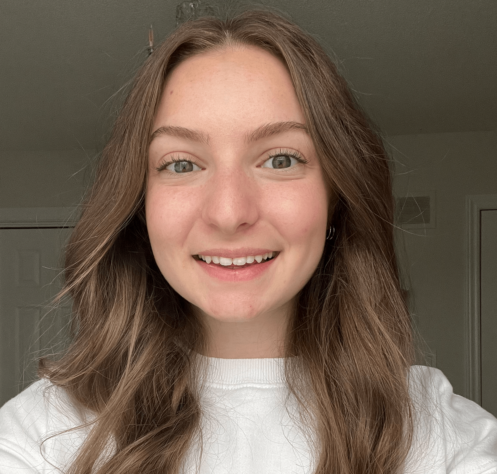

```{r setup, include=FALSE}
options(htmltools.dir.version = FALSE)
```

```{r libraries, echo=FALSE, include = FALSE}
library(kableExtra)
library(tidyverse)
```

```{r xaringanExtra, echo=FALSE}
xaringanExtra::use_xaringan_extra(c("clipboard",
                                    "freezeframe",
                                    "panelset",
                                    "scribble",
                                    "tachyons", 
                                    "tile_view"))
```

class: title-slide-section-gold, center, middle

# this course is about...

### how do we *control* motor skills?

### how do we *acquire* motor skills?

---

## What is motor control?

- the study of the **neural, behavioural, environmental, and synergistic** mechanisms responsible for human **movement and stability (posture)**

<ins>Example research questions studied by motor control scientists</ins>:

1. How do our many different systems collectively organize to accomplish a task?

2. How are reflexes involved in the control of movement?

3. How do people maintain their balance when spinning around?

4. How do humans match perceptual information to appropriate motor commands?

5. How and why does alcohol or marijuana affect movement control?

6. Why do most people find it difficult to pat their hand while rubbing their stomach?

---

## What is motor learning?

- the study of the **processes** involved in acquiring motor skills and of the **variables** that **promote *or* inhibit** such acquisition

<ins>Example research questions studied by motor learning scientists</ins>:

1. Are there recognizable stages in the process of skill learning?

2. How frequently should learners be provided with corrective feedback?

3. Is the use of mirrors in teaching skills such as dance effective for learning?

4. Should instructors demonstrate only how to perform skills correctly?

5. How can a therapist or coach estimate a client's potential for (re)learning a skill?

6. Should a performer focus attention on their bodily movement?

---

class: title-slide-section-gold, center, middle

# Meet the Fall 2022 KINESIOL 1E03 team

---

## Your teaching assistants

.pull-left[.center[


.black[Stephen Toepp] | Ph.D Candidate


.black[Stephanie Mattina] | M.Sc. Candidate
]]

.pull-right[.center[


.black[Nour Al Afif] | M.Sc. Student



.black[Mikayla Lalli] | M.Sc. Student
]]

---

.left-column[


]

.right-column[
## Laura St. Germain, Ph.D(c)


___

.black[Action, Cognition & Metascience Lab]
- The role of motivation in motor learning
- Human-robot and human-human interactions
- Metascience and motor learning
- Research design and statistics
]

---

class: inverse, middle, center

# So why study motor control and learning?

---

background-image: url(imgs/challenges-of-control.png)
background-size: contain

.footnote[Source: Wolpert and Bastian 2021]

---

class: inverse, middle, center

## yet, our movements must be...

#### *fast, accurate, smooth*

#### *adaptable/flexible*

#### *relatively "automatic"*

#### *learned*

---

# So why study motor control and learning?

.footnote[Source: https://youtu.be/l9U8X6I1vow?t=43]

.center[
<iframe width="1000" height="465" src="https://www.youtube.com/embed/l9U8X6I1vow?start=43" title="YouTube video player" frameborder="0" allow="accelerometer; autoplay; clipboard-write; encrypted-media; gyroscope; picture-in-picture" allowfullscreen></iframe>
]

---

class: title-slide-section-gold, center, middle

# Course outline

---

## Content-based learning objectives

1) Explain the distinction between behaviour that is goal-directed and behaviour that is not goal-directed.

2) Identify and describe different taxonomies used to classify motor skills.

3) List, explain, and calculate common variables used to measure motor performance.

4) Describe sensory systems that support human motor behaviour.

5) Compare and constrast different classes of control.

6) Describe processes underlying motor preparation and factors that influence preparation.

7) Describe and explain the interaction between attention and motor performance.

---

## Content-based learning objectives

8) Describe the relationship between speed and accuracy in aiming tasks.

9) Define and distinguish between the terms performance and learning.

10) Identify and describe different methods to assess motor skill learning.

11) Compare and contrast different models of skill acquisition.

12) Identify, describe, and compare different conditions of practice for learning.

13) Explain why some conditions of practice are more effective than other conditions.

14) Interpret, summarize, and discuss data from common tasks used in the study of motor control and learning.

---

## Skill-based learning objectives

1) Locate, synthesize, and critically appraise relevant research.

2) Differentiate scientific and non-scientific sources of information.

3) Develop effective strategies to work independently and collaboratively in small teams.

4) Successfully navigate unforeseen challenges as they arise through collaborative problem-solving.

6) Apply effective time management techniques to deliver required products on time.

---

## Materials and Fees

### Required Materials / Resources

There is no required textbook for this course. Relevant chapters from the supplemental textbook are included for those interested in additional information beyond that covered in the lectures.

### Supplementary Materials / Resources
Magill, R., & Anderson, D. (2017). *Motor learning and control: Concepts and applications*

- You can access the textbook for free through the McMaster Library

- You will need to login using your MacID and password to access the textbook.

---

## Course delivery and communication

- Class occurs 3 days per week in JHE 376:
    - Monday 9:30-10:20
    - Tuesday 10:30-11:20
    - Thursday 9:30-10:20

- Lecture slides will be posted on Avenue 

- All communication with me **MUST** be through email. There will be **NO COMMUNICATION THROUGH MICROSOFT TEAMS**
    - Use your McMaster email
    - Include 1E03 in the email subject line

---

## Contacting me

.pull-left[**Expectations of you**  
Questions to ask yourself before you contact me:
- Have I checked the syllabus?
- Have I asked a friend?
- Can I find this information on Google?


If you've taken these steps and still need support, email me!]


.pull-right[**Expectations of me**  
- Unless I am out of office, you can expect to hear back from me within 2 business day
- I will answer emails in the mornings (~8:30) and at the end of the work day (~4:00)
- I will answer thoughtfully and with compassion 
]

---

## Student hours

- I will host student hours (office hours) twice per week in IWC 214
    - Mondays 10:30-11:30
    - Wednesdays 11:00-12:00
    
- This is a great opportunity to ask content-related questions or get support

- There must be mutual respect between students and instructor 

- TAs will have test-review sessions after test grades get posted

---

## Evaluation

```{r echo=FALSE}
eval <- tibble::tibble(
    c1 = c(
        "Test 1",
        "Test 2",
        "Test 3",
        "In-class assignments",
        "Reading quizzes",
        "Total"
    ),
    c2 = c("20%",
           "20%",
           "20%",
           "30%",
           "10%",
           "100%"),
    c3 = c(
        "Sept 27 & 29",
        "Nov 1 & 3",
        "Nov 29 & Dec 1",
        "Sept 19, Oct 20, Nov 14, Dec 15",
        "Due at 11:59pm on Friday the week the reading is assigned",
        ""
    )
)

kbl(eval,
    col.names = c("Assessment method",
                  "Weight",
                  "Due date"),
    align = c("l", "l", "l")
) %>%
    kable_paper(c("hover", "condensed", "responsive"), html_font = "Roboto Condensed") %>%
    row_spec(0, bold = TRUE, font_size = 32) %>% 
    row_spec(6, bold = TRUE)
```

---

## Tests

- Tests will be completed during 3  **test weeks**

- During test weeks:
    - Monday: in-class office hours
    - Tuesday: multiple choice
    - Thursday: short answer

- Tests will be 40 minutes long

---

## In class assignments 

- There are 4 in class assignments worth 7.5% each

- In-class assignments will be completed in pairs and will consist of a few short answer questions

- You will be allowed a cheat sheet that is no larger than 8.5 x 11 inches and one-sided

- In class assignments will be 40 minutes long

- There will be a fifth bonus in-class assignment on December 8th that can replace your lowest in-class assignment grade

---

## Reading quizzes

- There are 5 reading quizzes worth 2% each

- You can work on these quizzes with your fellow classmates **but** everyone must submit their own quiz

- Reading quizzes will be multiple choice and submitted through Avenue

- You **must** submit the quiz, quizzes that are completed but not submitted will not be graded and will result in a 0

---

## Course bonus

- This is an opportunity to earn a 5% bonus towards your lowest test grade

- You are invited to participate in a motor control/learning experiment in the Action, Cognition, & Metascience Lab

- You will be able to choose whether your data are collected and included in the final analysis or not

- Neither I nor the TAs will be aware of which option you choose until all evaluations have been completed

- You have until December 8th 2022 to complete the bonus

- You can contact the research assistants at **motorlab [at] mcmaster [dot] ca** to receive the letter of information and schedule your lab visits

---

## COVID-19

- All McMaster community members are strongly encouraged to wear masks indoors, particularly in congregated settings such as classrooms
    - For all of our safety, please wear a mask when coming to office hours or test review sessions

- Absences from tests or in-class assignments require the use of an MSAF (see resources module on the left size of the course Avenue page)

- Lectures will be recorded using Echo360 for those who can not attend due to illness

---

## Various University policies

Be sure to familiarize yourself with the following sections in the course outline:

- Requests for Relief for Missed Academic Term Work
- Academic Accommodation of Students with Disabilities
- Academic Accommodation for Religious, Indigeneous or Spiritual Observances (RISO)
- Courses with an Online Element
- Academic Integrity
- Conduct Expectations
- Copyright and Recording
- Additional Copyright Information
- Extreme Circumstances

---

class: middle

.pull-left[.center[

]]

.pull-right[
<br><br>
> .large[Why do we, and other animals, have brains?]
.tr[
&mdash;*Daniel M. Wolpert, Ph.D*
]

<br>

.center[Watch this video to find out: https://youtu.be/_DdU4ehCzUM]
]

---

class: title-slide-final, middle, center
background-image: url(https://raw.githubusercontent.com/cartermaclab/mackin-xaringan/main/imgs/logos/mcmaster-stack-color.png)
background-size: 95px
background-position: 9% 15%

# What questions do you have?


|                                                                                                                |                                   |
| :------------------------------------------------------------------------------------------------------------- | :-------------------------------- |
| <a href="https://twitter.com/cartermaclab">.mackinred[<i class="fa fa-twitter fa-fw"></i>]                          | @_LauraStGermain                         |
| <a href="https://cartermaclab.org">.mackinred[<i class="fa fa-link fa-fw"></i>]                                       | www.cartermaclab.org                        |
| <a href="https://github.com/cartermaclab">.mackinred[<i class="fa fa-github fa-fw"></i>]                              | @cartermaclab                           |
