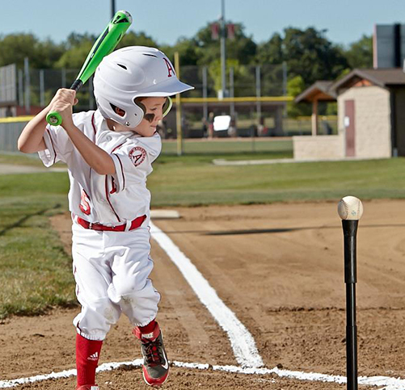
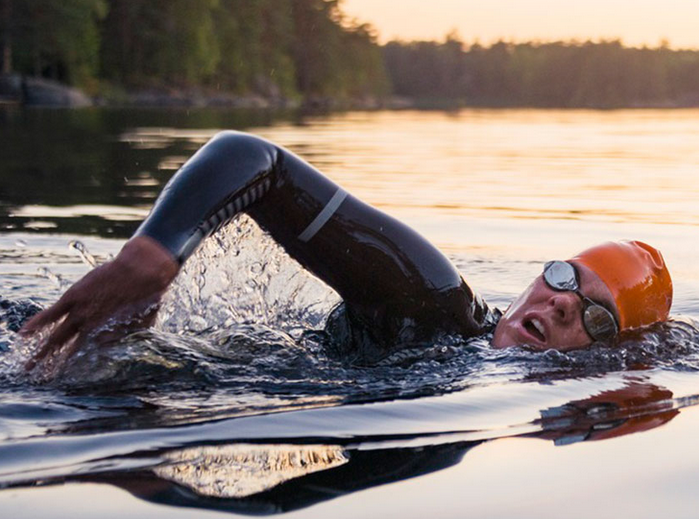
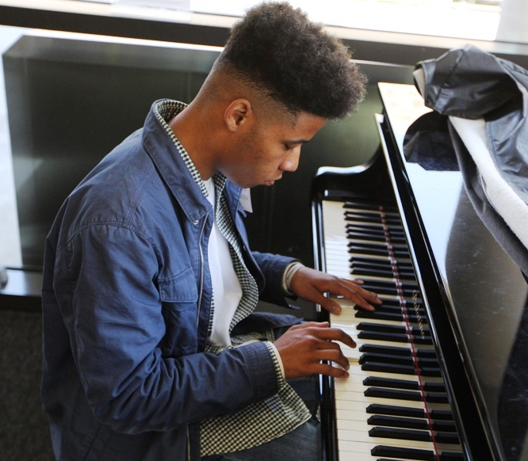
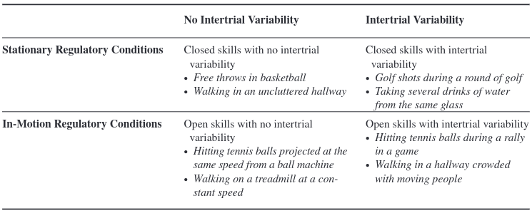
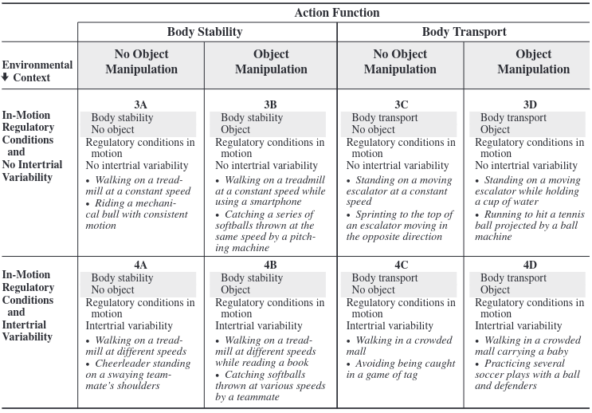

```{r setup, include = FALSE}
options(htmltools.dir.version = FALSE)
```

```{r additional, echo = FALSE, include = FALSE}
library(kableExtra)
library(tidyverse)
```

```{r xaringanExtra, echo = FALSE}
xaringanExtra::use_xaringan_extra(c("clipboard",
                                    "freezeframe",
                                    "panelset",
                                    "scribble",
                                    "tachyons", 
                                    "tile_view"))
```


class: title-slide-section-gold, bottom

# Review from last lecture

---

## Motor skills are...

- goal-directed and performed voluntarily
- require movements of joints and body segments via muscular contractions
- need to be learned (or relearned)

--

<br>
### Motor skills...

- vs reflexes
- vs abilities
- vs movements
- == actions

---

## Four characteristics of motor skills

1. Motor equivalence

2. Motor variability

3. Motor consistency

4. Motor modifiability

---

class: inverse, middle, center

# Any questions?

---

## How would you describe this?

.footnote[Source: https://thumbs.gfycat.com/ScholarlyDelightfulItaliangreyhound-size_restricted.gif]

.center[

]

---

# Learning objectives

1. Identify and describe **a key challenge** for any theory of motor control.

2. Define and describe **different taxonomies** for classifying motor skills.

3. Apply **Gentile's 2-dimensional** taxonomy in relevant settings.

--

.bg-gold.b--mid-gray.ba.bw2.br3.shadow-5.ph4.mt5[
.tc[
.black[Take-home message:

There are many ways of classifying motor skills into categories that identify common characteristics of various skills. Skill classifications help us alter performance by providing a framework to understand what aspects are important.
]]]

---

## The .grey[*Degrees of Freedom*] problem

.black[DEGREES OF FREEDOM]: refers to the number of **individual components** in a system and the **number of ways** each component can **vary**

--

.pull-left[.center[

]]

.pull-right[
- **Shoulder**: 3 degrees of freedom at joint level (+10 muscles)

- **Elbow**: 2 degrees of freedom at joint level (+10 muscles)

- **Wrist**: 2 degrees of freedom at joint level (+6 muscles)
]

--

.center[
.black[*3 x 10 x 2 x 10 x 2 x 6 = 7200 possible combinations*]
]

---

class: inverse

background-image: url(imgs/different-skills.png)
background-size: contain

---

## We can .grey[classify] motor skills using .grey[1 dimension] and .grey[2 dimensions] systems

### 1D classifications

- **Size** of the musculature (or movement precision)

- **Temporal** predictability (or where task begins and ends)

- **Stability** of the environment

---

## 1D classification: .grey[Size] of musculature

.footnote[
Left: https://cnib.ca/sites/default/files/inline-images/threading_needle_x2_0.jpg; Right: https://crossfithavoc.files.wordpress.com/2014/11/extension.jpg
]
.center[
### Fine $\longleftrightarrow$ Gross
]

.pull-left[.center[

]]

.pull-right[.center[

]]

---

## 1D classification: .grey[Temporal] predictability

.footnote[Left: https://dsgmedia.blob.core.windows.net/pub/2016/01/How-to-swing-a-baseball-bat.jpg; Right: https://blog.mapmyrun.com/wp-content/uploads/2017/07/6-Things-to-Know-Before-Swimming-in-Open-Water.jpg]

.center[
### Discrete $\longleftrightarrow$ Continuous
]

.pull-left[.center[

]]

.pull-right[.center[

]]

---

## 1D classification: .grey[Temporal] predictability

.footnote[Left: https://scopeblog.stanford.edu/wp-content/uploads/2016/05/student-playing-piano.jpg; Right: https://www.mastermechanic.ca/blog/wp-content/uploads/2017/04/1280px-Opel_KARL_6_Interior.jpg]

.center[
### Discrete $\longleftarrow$ **Serial** $\longrightarrow$ Continuous
]

.pull-left[.center[

]]

.pull-right[.center[

]]

---

## 1D classification: .grey[Stability] of the environment

.footnote[Left: https://bloximages.chicago2.vip.townnews.com/qctimes.com/content/tncms/assets/v3/editorial/4/3e/43ef0202-0a6f-58d0-8e8c-9efc6e35b288/570d6f722b328.image.jpg?resize=1200%2C800; Right: https://www.thehockeypaper.co.uk/wp-content/uploads/2020/08/Hockey.jpg]
.center[
### Closed $\longleftrightarrow$ Open
]

.pull-left[.center[

]]

.pull-right[.center[

]]

---

## Gentile's .grey[two-dimensions] taxonomy

.footnote[<sup>1</sup>Gentile 2000; Gordon et al. 2016 *In Memoriam: Antoinette M. Gentile (1936–2016)* (https://doi.org/10.1080/00222895.2016.1198193)]

- 1D systems **does not always** capture the complexity of many skills that a practioner must take into account when making decisions **instruction**, **practice routines**, or **therapy regimens**

- Gentile<sup>1</sup> proposed a 2D classification system based on **two general characteristics** of all motor skills:
  1. **The environmental context** an individual performs the skill
  
  2. **The function of the action** characterizing the skill

--

- There are multiple levels within each of these levels, resulting in **16 skill categories**

---

## Gentile's .grey[two-dimensions] taxonomy

### Environmental context

1. .black[REGULATORY CONDITIONS]: features of the environmental context to which movements must conform if they are to achieve the action goal

--

  - i.e., *the relevant environmental context features*

  - they regulate **spatial** and **temporal** aspects of the movement

--
  
  - **do not** refer to the characteristics of a person's movements **BUT** only to characteristics in the environment in which a skill is executed

---

## Gentile's .grey[two-dimensions] taxonomy

### Environmental context

&nbsp;&nbsp;<span>2.</span> .black[INTERTRIAL VARIABILITY]: whether the regulatory conditions during performance are the same or &nbsp;&nbsp;&nbsp;&nbsp;&nbsp;&nbsp;different from one attempt to perform the skill to another

--

  - is either **absent** or **present**
  
  - is **almost always** present when the environment is in motion
  
  - only time motion variability is absent from one trial to the next is when the motion is caused by a machine (e.g., treadmill)

---

## We can extended the 1D environmental context classification by including intertrial variability

.footnote[Magill & Anderson 2017, p. 18]

.center[

]

---

## Gentile's .grey[two-dimensions] taxonomy

### Function of the action

1. .black[BODY ORIENTATION]: refers to whether or not the performance of the skill involves moving the body from one location to another

--

  - is either **body stability** or **body transport**
  
  - change in body location can be achieved either **actively** or **passively**
  
  - e.g., walking from point A to B would be active transport
  
  - e.g., moving from point C to D on a moving escalator would be passive transport

---

## Gentile's .grey[two-dimensions] taxonomy

### Function of the action

&nbsp;&nbsp;<span>2.</span> .black[OBJECT MANIPULATION]: refers to maintaining or changing the position of an object

--

  - skills that **involve** object manipulation are **more challenging** to perform
  
  - must manipulate or control the object successfully **AND** make the appropriate postural adjustments to offset any imbalances created by the object
  
  - this will **interact** with the individual performing the action

---

## Gentile's .grey[two-dimensions] taxonomy

.footnote[Magill & Anderson 2017, p. 14]

.center[

]

---

## Gentile's .grey[two-dimensions] taxonomy

.footnote[Magill & Anderson 2017, p. 15]

.center[

]

---

## We can use .grey[Gentile's taxonomy] for at least .grey[3 key reasons] in real-world settings

1. **Evaluate** the learner's movement capabilities and limitations

2. **Select** a progression of functionally appropriate activities for a learner

3. **Record** the learner's progress

---

## Putting it into .grey[practice]...

.pull-left[
.black[A physiotherapist working with a client that suffered a stroke]

- Stands without assistance (*Category 1A*)

- Stands without assistance while holding a laptop (*Category 1B*)

- Walks without assistance a specified distance in an uncluttered walkway (*Category 1C*)

- Walks without assistance a specified distance in an uncluttered walkway while holding a laptop (*Category 1D*)
]

.pull-right[.center[

.tiny[Source: https://cdn.nohat.cc/thumb/f/720/43b3f862448a4e808cab.jpg]
]]

---

## Putting it into .grey[practice]...

.pull-left[
.black[A physical education teacher working on catching skills with a student]

- Catches a ball thrown from the same distance at the same speed (*Category 3B*)

- Catches a ball thrown from various distances at various speeds (*Category 4B*)

- Catches a ball while running along a specified path with ball thrown the same distance and speed (*Category 3D*)

- Catches a ball while running along a specified path with ball thrown from different distance and speeds (*Category 4D*)
]

.pull-right[.center[

.tiny[Source: https://kiddipedia.com.au/wp-content/uploads/2019/08/iStock-907598788-e1567131167213.jpg]
]]

---

# Learning objectives

1. Identify and describe **a key challenge** for any theory of motor control.

2. Define and describe **different taxonomies** for classifying motor skills.

3. Apply **Gentile's 2-dimensional** taxonomy in relevant settings.

.bg-gold.b--mid-gray.ba.bw2.br3.shadow-5.ph4.mt5[
.tc[
.black[Take-home message:

There are many ways of classifying motor skills into categories that identify common characteristics of various skills. Skill classifications help us alter performance by providing a framework to understand what aspects are important.
]]]

---

class: title-slide-final, middle, center
background-image: url(https://raw.githubusercontent.com/cartermaclab/mackin-xaringan/main/imgs/logos/mcmaster-stack-color.png)
background-size: 95px
background-position: 9% 15%

# What questions do you have?


|                                                                                                                |                                   |
| :------------------------------------------------------------------------------------------------------------- | :-------------------------------- |
| <a href="https://twitter.com/cartermaclab">.mackinred[<i class="fa fa-twitter fa-fw"></i>]                     | @_LauraStGermain                  |
| <a href="https://github.com/LauraStGermain">.mackinred[<i class="fa fa-github fa-fw"></i>]                     | @LauraStGermain                   |
| <a href="https://cartermaclab.org">.mackinred[<i class="fa fa-link fa-fw"></i>]                                | www.cartermaclab.org              |

