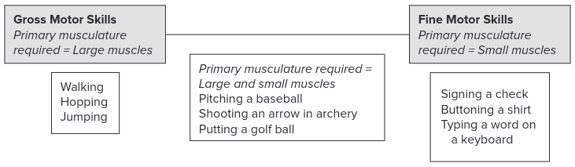
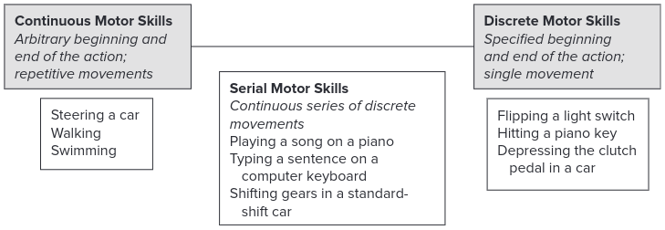
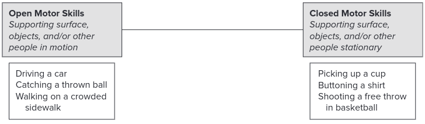
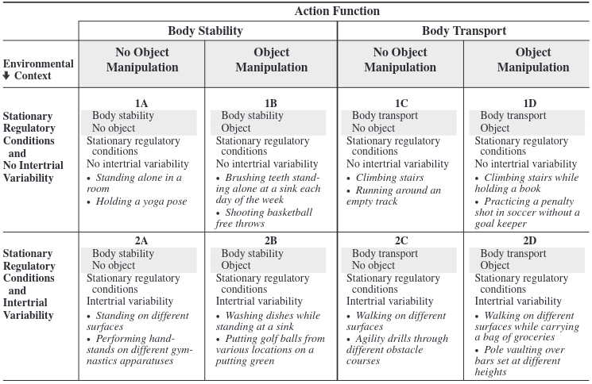
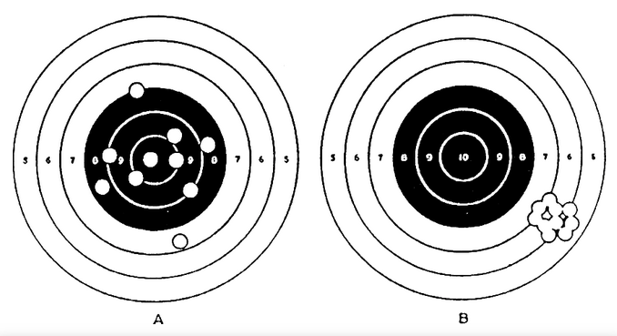
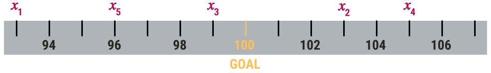
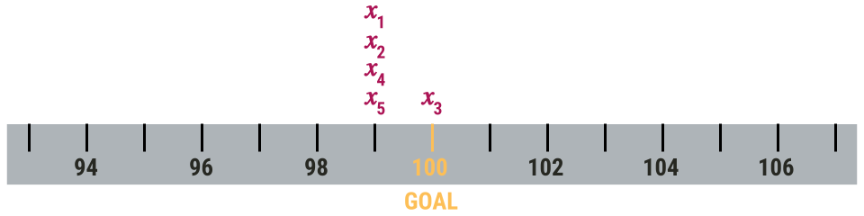
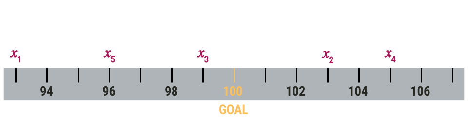
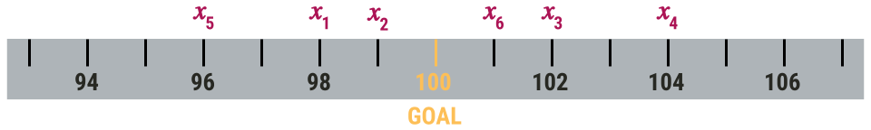

```{r setup, include = FALSE}
options(htmltools.dir.version = FALSE)
```

```{r additional, echo = FALSE, include = FALSE}
library(kableExtra)
library(tidyverse)
```

```{r xaringanExtra, echo = FALSE, include = FALSE}
xaringanExtra::use_xaringan_extra(c("clipboard",
                                    "freezeframe",
                                    "panelset",
                                    "scribble",
                                    "tachyons", 
                                    "tile_view"))
```


class: title-slide-section-gold, bottom

# Review from last lecture

---

## .grey[1D] classification systems

.footnote[Magill & Anderson 2017, p. 10]

### Size of primary musculature required

.center[

]

---

## .grey[1D] classification systems

.footnote[Magill & Anderson 2017, p. 10]

### Specificity of where actions begin and end

.center[

]

---

## .grey[1D] classification systems

.footnote[Magill & Anderson 2017, p. 10]

### Stability of the environmental context

.center[

]

---

## Gentile's .grey[two-dimensions] taxonomy

.footnote[Magill & Anderson 2017, p. 14]

.center[

]

---

## Gentile's .grey[two-dimensions] taxonomy

.footnote[Magill & Anderson 2017, p. 15]

.center[

]

---

class: inverse, middle, center

# Any questions?

---

class: inverse

background-image: url(imgs/how-to-measure.png)
background-size: contain

---

# Learning objectives

1. Describe the differences between and give examples of **performance outcome** and **performance production** measures.

2. Describe and compute **common error score measures** for different types of motor skills.

--

.bg-gold.b--mid-gray.ba.bw2.br3.shadow-5.ph4.mt5[
.tc[
.black[<ins>Take-home message</ins>:

There are many ways we can measure motor performance. Often the appropriate measure depends on the individual, task/skill, and/or environment. Valid conclusions about motor behaviour depend on the use of appropriate measures.
]]]

---

## We can broadly classify .grey[performance measures] using .grey[2 categories]

.black[PERFORMANCE OUTCOME MEASURES]: measures that indicate the result of an action

  - **may or may not** be relative to some **task goal**
  
  - e.g., how fast a person ran 100 m; how far away a missed putt was from the hole

--

<br>

.black[PERFORMANCE PRODUCTION MEASURES]: measure that indicate how the nervous, muscular, and/or skeletal systems function during an action

  - capture the **performance characteristics** that resulted in a given performance outcome
  
  - e.g., limb kinematics; feedback-related negativity potential 

---

## Some ways to measure performance

.pull-left[
.black[Performance outcome measures]
- Time to complete a task
- Reaction time
- Amount of error in performing criterion movement
- Time on target / Time in balance
- Trials or repetitions to completion
- Number or percentage of errors
- Number of successful attempts
- etc...
]

--

.pull-right[
.black[Performance production measures]
- Displacement, velocity, and/or acceleration
- Joint angle and/or joint torque
- Electromyography
- Electroencephalogram
- Functional magnetic resonance imaging
- Positron emission topography
- Transcranial magnetic stimulation
- Functional near-infrared spectroscopy
- etc...
]

---

## *Q: Is .grey[Person A] or .grey[Person B] better?*

.center[

]

---

## *Q: Would you rather .grey[coach] Person A or Person B?*

.center[

]

---

background-image: url(https://www.frontiersin.org/files/Articles/115780/fpsyg-05-01325-HTML/image_m/fpsyg-05-01325-g001.jpg)
background-position: 92% 28%
background-size: 35%

## Consider the following scenario

A person is tasked with learning to project a slider down  
a fixed track to a specified goal distance of 100 cm using  
their non-dominant hand. The person performs 5 trials of  
this task. On each trial you record the distance the slider  
traveled from the starting point (a wooden barrier). The  
result for each trial is shown below:

.center[

]

--

.black[*Q1: How should we measure performance on this task?*]  
.black[*Q2: What type of measure would this be?*]  
.black[*Q3: How would you classify this task?*]

---

## Constant error measures the .grey[bias] in responding

.center[

]

.pull-left[
We can calculate using:

$CE = x_{i} - T$

$Mean \,CE = \sum(x_{i} - T)/n$
]

--

.pull-right[
```{r}
# Calculate CE
((93 - 100) + (103 - 100) + (99 - 100) + (105 - 100) + (96 - 100)) / 5
```

Mean CE = -0.8 cm

.black[*How do we interpret this?*]
]

---

## Consider the following scenario

.pull-left[
What is the mean CE for this block of trials?



```{r}
# Calculate CE
((99 - 100) + (99 - 100) + (100 - 100) + (99 - 100) + (99 - 100)) / 5
```

Mean CE = -0.8 cm
]

--

.pull-right[
Here's the first block of 5 trials again...



```{r}
# Calculate CE
((93 - 100) + (103 - 100) + (99 - 100) + (105 - 100) + (96 - 100)) / 5
```

Mean CE = -0.8 cm
]

--

.center[
### .black[*What do we learn from this?*]
]

---

## Variable error measures the .grey[inconsistency] in responding

.center[

]

.pull-left[
We can calculate using:

$Mean \,VE = \sqrt{\sum(x_{i} - M)^2/n}$

```{r}
# Calculate M for VE
(93 + 103 + 99 + 105 + 96) / 5
```

]

--

.pull-right[
```{r}
# Calculate VE
sqrt(((93 - 99.2)^2 + (103 - 99.2)^2 + (99 - 99.2)^2 + (105 - 99.2)^2 + (96 - 99.2)^2) / 5)
```

Mean VE = 4.4 cm

.black[*How do we interpret this?*]
]

---

## Let's return to this scenario

.pull-left[
Second block of 5 trials...


```{r}
# Calculate VE
sqrt(((99 - 99.2)^2 + (99 - 99.2)^2 + (100 - 99.2)^2 + (99 - 99.2)^2 + (99 - 99.2)^2) / 5)
```

Mean VE = 0.4 cm
]

.pull-right[
First block of 5 trials...


```{r}
# Calculate VE
sqrt(((93 - 99.2)^2 + (103 - 99.2)^2 + (99 - 99.2)^2 + (105 - 99.2)^2 + (96 - 99.2)^2) / 5)
```

Mean VE = 4.4 cm
]

--

.center[
### .black[*What do we learn from this?*]
]

---

## What is the .grey[mean CE] for this block of 6 outcomes?

.center[

]

.pull-left[.center[

.tiny[Source: https://i.gifer.com/4yu.gif]
]]

--

.pull-right[
```{r}
# Calculate CE
((98 - 100) + (99 - 100) + (102 - 100) + (104 - 100) + (96 - 100) + (101 - 100)) / 6
```
Mean CE = 0 cm
]

---

name: ae

## Absolute error measures .grey[overall accuracy] in responding

.center[

]

.pull-left[
We can calculate using:

$AE = |x_{i} - T|$

$Mean \,AE = \sum|x_{i} - T|/n$
]

--

.pull-right[
```{r}
# Calculate AE
(abs(93 - 100) + abs(103 - 100) + abs(99 - 100) + abs(105 - 100) + abs(96 - 100)) / 5
```

Mean AE = 4 cm

.black[*How do we interpret this?*]
]

---

## Let's return to this 6 trial block

.center[

]

```{r}
# Calculate CE
((98 - 100) + (99 - 100) + (102 - 100) + (104 - 100) + (96 - 100) + (101 - 100)) / 6

# Calculate AE
round((abs(98 - 100) + abs(99 - 100) + abs(102 - 100) + abs(104 - 100) + abs(96 - 100) + abs(101 - 100)) / 6, 1)
```

.center[
### .black[*What do we learn from this?*]
]

---

## What is the relationship among CE, VE, and AE?

.footnote[Schmidt & Lee 2011; Schutz & Roy 1973 (https://doi.org/10.1080/00222895.1973.10734959)]

```{r echo=FALSE}
tibble::tibble(
  c1 = c("Jae", "Diane"),
  c2 = c(80, 95),
  c3 = c(90, 105),
  c4 = c(85, 100),
  c5 = c(82, 97),
  c6 = c(87, 102)
) %>% 
  kableExtra::kbl(
    col.names = c("Person", "Trial 1", "Trial 2", "Trial 3", "Trial 4", "Trial 5")
  ) %>%
  kable_paper("hover")
```

--

.black[*What are the mean CE, VE, and AE scores for Jae and Diane?*]

--

<br>
```{r echo=FALSE}
tibble::tibble(
  c1 = c("Jae", "Diane"),
  c2 = c(-15.2, -0.2),
  c3 = c(3.54, 3.54),
  c4 = c(15.2, 3)
) %>% 
  kableExtra::kbl(
    col.names = c("Person", "CE", "VE", "AE")
  ) %>%
  kable_paper("hover")
```

---

## We can transform CE into .grey[absolute constant error]

.center[

]

.pull-left[
We can calculate using:

$Mean \,CE = \sum(x_{i} - T)/n$

$Mean \,ACE = |CE|$
]

--

.pull-right[
```{r}
# Calculate CE
abs(((93 - 100) + (103 - 100) + (99 - 100) + (105 - 100) + (96 - 100)) / 5)
```

Mean ACE = 0.8 cm

Recall AE = 4 cm ([See Slide 21](#ae))

.black[*How do we interpret this?*]
]

---

# Learning objectives

1. Describe the differences between and give examples of **performance outcome** and **performance production** measures.

2. Describe and compute **common error score measures** for different types of motor skills.

.bg-gold.b--mid-gray.ba.bw2.br3.shadow-5.ph4.mt5[
.tc[
.black[<ins>Take-home message</ins>:

There are many ways we can measure motor performance. Often the appropriate measure depends on the individual, task/skill, and/or environment. Valid conclusions about motor behaviour depend on the use of appropriate measures.
]]]

---

class: title-slide-final, middle
background-image: url(https://raw.githubusercontent.com/cartermaclab/mackin-xaringan/main/imgs/logos/mcmaster-stack-color.png)
background-size: 95px
background-position: 9% 15%

# What questions do you have?


|                                                                                                                |                                   |
| :------------------------------------------------------------------------------------------------------------- | :-------------------------------- |
| <a href="https://twitter.com/cartermaclab">.mackinred[<i class="fa fa-twitter fa-fw"></i>]                     | @_LauraStGermain                  |
| <a href="https://github.com/LauraStGermain">.mackinred[<i class="fa fa-github fa-fw"></i>]                     | @LauraStGermain                   |
| <a href="https://cartermaclab.org">.mackinred[<i class="fa fa-link fa-fw"></i>]                                | www.cartermaclab.org              |
