```{r setup, include = FALSE}
options(htmltools.dir.version = FALSE)
```

```{r additional, echo = FALSE}
library(kableExtra)
library(tidyverse)
```

```{r xaringanExtra, echo = FALSE}
xaringanExtra::use_xaringan_extra(c("clipboard",
                                    "freezeframe",
                                    "panelset",
                                    "scribble",
                                    "tachyons", 
                                    "tile_view"))
```


class: title-slide-section-gold, bottom

# Review from last lecture

---

## Some ways to .grey[measure] performance

.pull-left[
.black[Performance outcome measures]
- Time to complete a task
- Reaction time
- Amount of error in performing criterion movement
- Time on target / Time in balance
- Trials or repetitions to completion
- Number or percentage of errors
- Number of successful attempts
- etc...
]

.pull-right[
.black[Performance production measures]
- Displacement, velocity, and/or acceleration
- Joint angle and/or joint torque
- Electromyography
- Electroencephalogram
- Functional magnetic resonance imaging
- Positron emission topography
- Transcranial magnetic stimulation
- Functional near-infrared spectroscopy
- etc...
]

---

## What is the .grey[relationship] among CE, VE, and AE?

.footnote[Schmidt & Lee 2011; Schutz & Roy 1973 (https://doi.org/10.1080/00222895.1973.10734959)]

```{r echo=FALSE}
tibble::tibble(
  c1 = c("Jae", "Diane"),
  c2 = c(80, 95),
  c3 = c(90, 105),
  c4 = c(85, 100),
  c5 = c(82, 97),
  c6 = c(87, 102)
) %>% 
  kableExtra::kbl(
    col.names = c("Person", "Trial 1", "Trial 2", "Trial 3", "Trial 4", "Trial 5")
  ) %>%
  kable_paper("hover")
```

.black[*What are the mean CE, VE, and AE scores for Jae and Diane?*]

```{r echo=FALSE}
tibble::tibble(
  c1 = c("Jae", "Diane"),
  c2 = c(-15.2, -0.2),
  c3 = c(3.54, 3.54),
  c4 = c(15.2, 3)
) %>% 
  kableExtra::kbl(
    col.names = c("Person", "CE", "VE", "AE")
  ) %>%
  kable_paper("hover")
```

---

## We can transform CE into .grey[absolute constant error]

.center[

]

.pull-left[
We can calculate using:

$Mean \,CE = \sum(x_{i} - T)/n$

$Mean \,ACE = |CE|$
]

.pull-right[
```{r}
# Calculate CE
abs(((93 - 100) + (103 - 100) + (99 - 100) + (105 - 100) + (96 - 100)) / 5)
```

Mean ACE = 0.8 cm

Recall AE = 4 cm

.black[*How do we interpret this?*]
]

---

class: inverse, middle, center

# Any questions?

---

## Learning objectives

1. Describe error scores for **continuous** and **2D motor** tasks, and **temporal** measures of performance.

2. Describe the differences between **simple, choice, and go/no-go** reaction time tasks and be able to provide **research** and **real-world** examples of each.

3. Describe three **kinematic** measures of motion and how **electromyography** can be used to provide information about human movement.

4. Identify and describe different techniques for determining **the functions of brain regions** during motor performance.

--

.bg-gold.b--mid-gray.ba.bw2.br3.shadow-5.ph4.mt5[
.tc[
.black[<ins>Take-home message</ins>:

Valid conclusions about motor behaviour depend on the use of appropriate measures.
]]]

---

## Root mean square error is a measure of .grey[overall accuracy]

.footnote[Franks & Wilberg 1982 (https://doi.org/10.1016/0167-9457(82)90015-X) as cited in Magill & Anderson 2017]

.center[
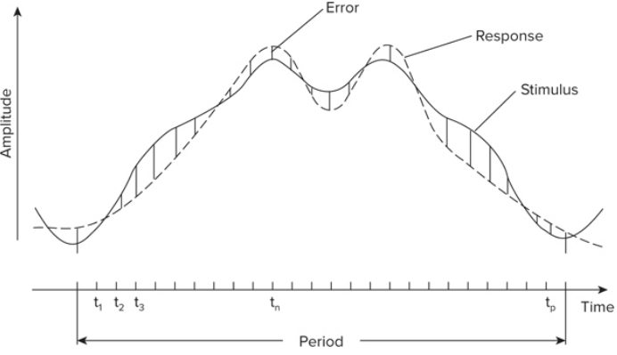
]

- use displacement curve (response) and target curve (stimulus) to calculate amount of error at predefined points to get RMSE

---

## Let's return to this targets

.center[

]

---

## Motor tasks that with outcomes that vary in 2 dimensions need to be measured .gray[appropriately]

.footnote[Reeve et al. 1994 (https://doi.org/10.1207/s15327043hup0704_6); Hancock et al. 1995 (https://doi.org/10.1080/00222895.1995.9941714); Fischman 2015 (https://doi.org/10.1016/j.humov.2015.05.011)]

.black[Radial error]

$$RE = (x^{2} + y^{2})^{\frac{1}{2}}$$

.black[Subject centroid radial error]

$$SRE = (x_{c}^2 + y_{c}^2)^\frac{1}{2}$$

.black[Bivariate variable error]

$$BVE = \{(1/k)\sum_{i=1}^{k}[(x_{i} - x_{c})^{2} + (y_{i} - y_{c})^{2}]\}^{\frac{1}{2}}$$
---

## Reaction time is a measure of the time required to .grey[prepare and initiate] a movement

.footnote[Magill & Anderson 2017 (pg. 29)]

.center[
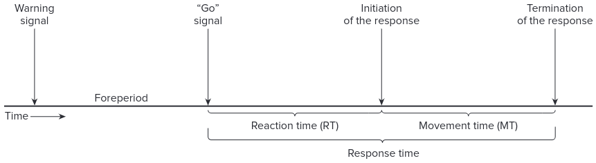
]

--

.black[MOVEMENT TIME]: the interval of time between the initiation and completion of a movement

.black[RESPONSE TIME]: the sum of reaction time and movement time

---

## Reaction time and movement time are .grey[relatively independent] performance measures

.footnote[Source: https://upload.wikimedia.org/wikipedia/commons/d/d2/London_2012_Olympic_100m_final_start.jpg]

.left-column[

]

.right-column[
- Reaction time **does not** predict movement time

- Movement time **does not** predict reaction time

- The person with the **fastest reaction time** in a race may not be the person with the **fastest race time**

- Reaction time and movement time **measure different aspects** of human performance
]

---

## There are .grey[three] main types of reaction time tasks

.center[
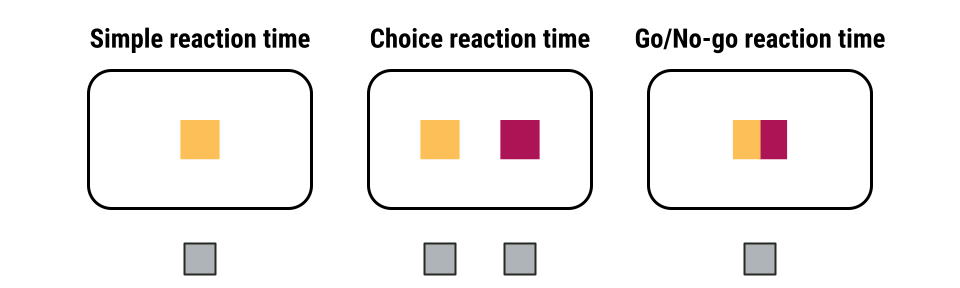
]

- **Simple reaction time**: 1 choice and 1 response

- **Choice reaction time**: 2 or more choices each with a corresponding response

- **Go/No-go reaction time**: 2 or more choices but only 1 is associated with a response

---

class: inverse

background-image: url(imgs/how-to-measure.png)
background-size: contain

---

## Measuring .grey[movement characteristics]

.footnote[Fig: Tresilian 2012]

.center[
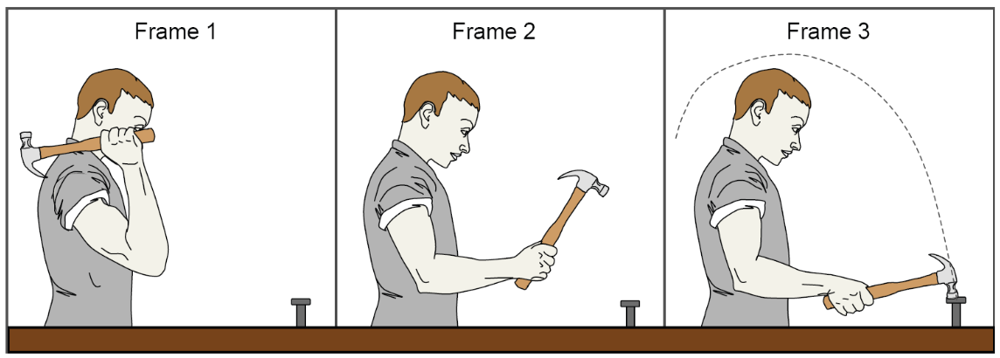
]

.black[KINEMATICS]: the study and description of movement without consideration of the forces that cause the movement (e.g., position, displacement, distance, speed, velocity, acceleration)

.black[DYNAMICS (or KINETICS)]: the study and description of the causal processes that produce movement (e.g., force and torque)

---

## We can record someone performing an action and perform a .grey[kinematic analysis] on their movements

.footnote[Left: https://www.redalyc.org/journal/5516/551662868010/551662868010_gf2.png; Right: https://beforesandafters.com/wp-content/uploads/2019/08/Xsens-mvn-animate18a.jpg]

.pull-left[.center[
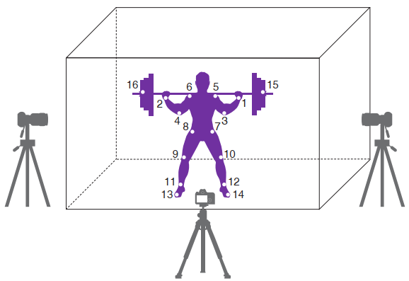
]]

--

.pull-right[.center[

]]

---

## Let's see .grey[motion capture] in action...

.footnote[Source: https://youtu.be/CJ-ehBIfXEg]

.center[
<iframe width="800" height="450" src="https://www.youtube.com/embed/CJ-ehBIfXEg" title="YouTube video player" frameborder="0" allow="accelerometer; autoplay; clipboard-write; encrypted-media; gyroscope; picture-in-picture" allowfullscreen></iframe>
]

---

## Displacement is the .grey[change in spatial position] of a limb, joint, or object during a movement

.footnote[Magill & Anderson 2017 (p. 39)]

.center[
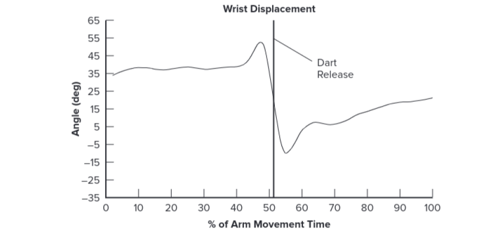
]

---

## Velocity describes .grey[rate of change] in spatial position .grey[relative to time]

.footnote[Magill & Anderson 2017 (p. 39)]

.center[
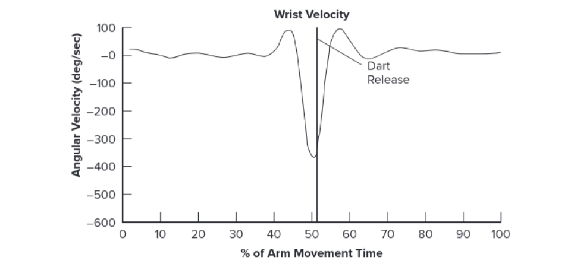
]

---

## Acceleration describes the .grey[change in velocity] during a movement

.footnote[Magill & Anderson 2017 (p. 39)]

.center[
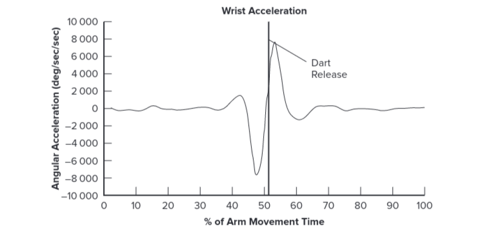
]

---

## Motor unit .grey[activity in a muscle] can be recorded using electrodes placed on the skin

.pull-left[
- A typical method involves placing two small electrodes on the skin directly over the muscle of interest (this arrangement is referred to as a **bipolar** configuration)

- A third electrode is placed on the body surface (usually a bone) and is the **ground** electrode

- The recorded signal is a combination of the propagated action potentials from all the underlying muscle fibres that are sufficiently close to the electrodes
]

.pull-right[.center[
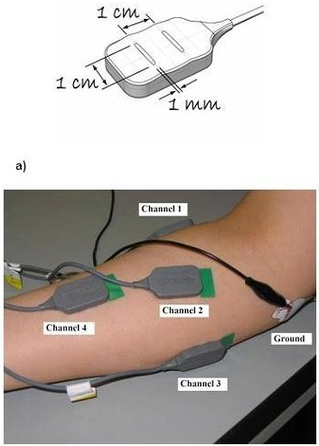

]]

---

## Motor unit .grey[activity in a muscle] can be recorded using electrodes placed on the skin

.footnote[Fig: Tresilian 2012]

.center[
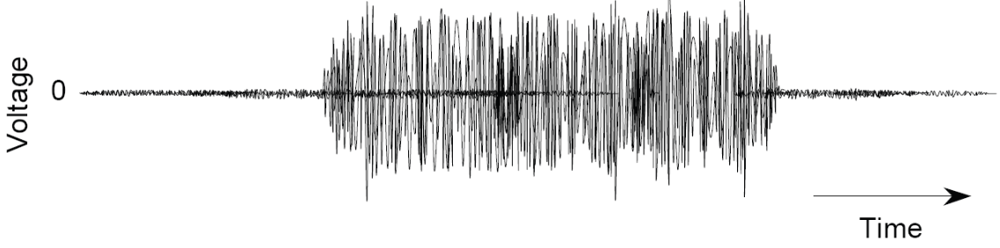
]

- The amplitude of the electrical signal is very **small** (usually in the order of hundreds of microvolts $\mu$V, a millionth of a volt)

- This signal is known as an **electromyographic signal** and the technique of recording these signals is called **electromyography** (EMG)

---

## Processed EMG signals can be used to obtain measures of muscle activity

.pull-left[
Multiple factors can affect the **quality of an EMG signal**:
  - the motor units contributing to the recorded signal
  
  - quality of the i) connection between the skin and the electrodes and/or ii) ground connection
  
  - presence of electromagnetic noise in the recording environment
  
  - size of muscle being recorded from and thickness of subcutaneous fat
]

--

.pull-right[
If **a good EMG signal** is obtained, it can be used to make various measures of muscle activity:
  - when a muscle becomes **active** and **inactive**
  
  - when its activity **changes**
  
  - how **long** it is active for
  
  - how its **level** of activity depends on different conditions
]

---

background-image: url(imgs/fractionate-reaction-time.jpg)
background-position: 50% 90%
background-size: 78%

## We can gain further insight into the reaction time interval using .grey[electromyography]

---

## Different parts of the brain are .grey[specialized for different] functions

This **localization of function** concept can tempt people into making 3 types of assumptions without evidence:

  1. .black[LOCALIZATION ASSUMPTION]: if there is a neural mechanism that controls or produces some behavioural attribute, then that mechanism is localized to some specific region or structure

--
  
  2. .black[STRUCTURE = FUNCTION ASSUMPTION]: an anatomically identifiable component of the nervous system (structural component) is also a functional component (it has one or more identifiable functions)

--
  
  3. .black[FIXED FUNCTION ASSUMPTION]: any neural structure or identifiable region that has a particular function (or set of functions) always performs this function (or set of functions) when it is active

--
<br>
.center[
.big[*Q: How can the functions of brain regions be determined?*]
]

---

## Lesion methods can be either .grey[destructive] or .grey[non-destructive]

Lesions can occur **naturally** or be **produced by a researcher**

- Naturally occurring
  - Destructive: death of cells due to loss of blood supply (e.g., stroke), mechanical damage or disease processes
  
  - Non-destructive: May not exist

- Produced by researcher
  - Destructive: removing or cutting tissue, destroying tissue with chemical agents or heat
  
  - Non-destructive: cooling tissue, applying repetitive magnetic stimulation

---

## Electromagnetic activity of living brains can be recorded

.footnote[Fig: https://media.springernature.com/original/springer-static/image/chp%3A10.1007%2F978-3-319-47653-7_1/MediaObjects/419678_1_En_1_Fig1_HTML.gif]

.pull-left[
- Electrical activity of neurons in the brain generates **changing electrical fields** that penetrate through the skull

- Small variations in electrical potential can be recorded using electrodes placed on the scalp. 

- This technique is called **electroencephalography** (EEG)

- EEG has **good temporal resolution** but **poor spatial resolution**
]

.pull-right[.center[

]]

---

## Metabolic activity of living brains can be recorded 

.pull-left[
- We can measure the metabolic demand of nervous tissue as an **indirect** way of measuring its functional activity

- **More active** the neurons are, the **greater** their metabolic demand (i.e., increased oxygenated blood flow into active region)

- From the radio waves received, a **blood-oxygen level dependent** (BOLD) signal is derived that is a measure of the **ratio** of oxygenated to deoxygenated blood in each **voxel**

- fMRI has **good spatial resolution**, but **poor temporal resolution**
]

.pull-right[.center[
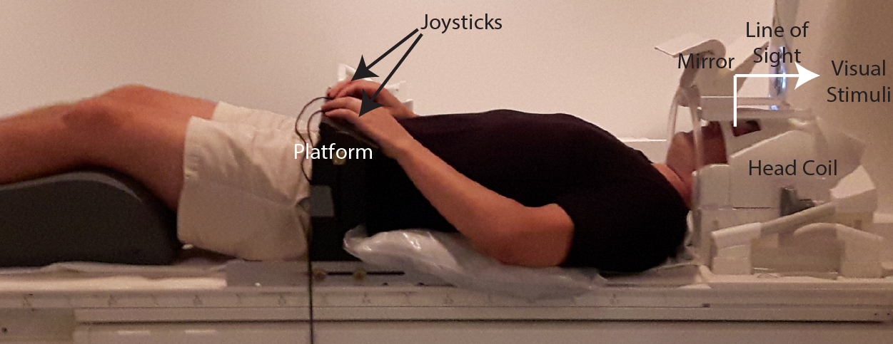

]]

---

## The brain can be stimulated through the scalp

.footnote[Fig: Tresilian 2012]

.left-column[.center[
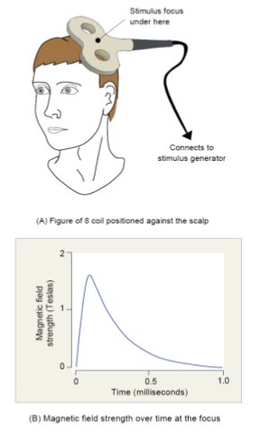
]]

.right-column[
- A popular stimulation technique is **transcranial magnetic stimulation** (TMS)

- Pass a **very brief pulse** of electrical current through tightly wound coils of wire

- When the pulse of electrical current flows through the coil, a **transient but intense** magnetic field is generated

- If coil is held close enough to the scalp, induced currents **depolarize** neurons in the cortical tissue exposed to the changing magnetic field and **causes them to fire**

- Various stimulation protocols exist: single-pulse, paired-pulse, repetitive, etc
]

---

## Let's see .grey[brain stimulation] in action...

.footnote[Left video: https://youtu.be/cqMTvmLIuGg; Right video: https://youtu.be/gp8KnAHkwdo]

<br>

.pull-left[.center[
<iframe width="560" height="315" src="https://www.youtube.com/embed/cqMTvmLIuGg" title="YouTube video player" frameborder="0" allow="accelerometer; autoplay; clipboard-write; encrypted-media; gyroscope; picture-in-picture" allowfullscreen></iframe>
]]

.pull-right[.center[
<iframe width="560" height="315" src="https://www.youtube.com/embed/gp8KnAHkwdo" title="YouTube video player" frameborder="0" allow="accelerometer; autoplay; clipboard-write; encrypted-media; gyroscope; picture-in-picture" allowfullscreen></iframe>
]]

---

## Learning objectives

1. Describe error scores for **continuous** and **2D motor** tasks, and **temporal** measures of performance.

2. Describe the differences between **simple, choice, and go/no-go** reaction time tasks and be able to provide **research** and **real-world** examples of each.

3. Describe three **kinematic** measures of motion and how **electromyography** can be used to provide information about human movement.

4. Identify and describe different techniques for determining **the functions of brain regions** during motor performance.

.bg-gold.b--mid-gray.ba.bw2.br3.shadow-5.ph4.mt5[
.tc[
.black[<ins>Take-home message</ins>:

Valid conclusions about motor behaviour depend on the use of appropriate measures.
]]]

---

class: title-slide-final, middle
background-image: url(https://raw.githubusercontent.com/cartermaclab/mackin-xaringan/main/imgs/logos/mcmaster-stack-color.png)
background-size: 95px
background-position: 9% 15%

# What questions do you have?


|                                                                                                                |                                   |
| :------------------------------------------------------------------------------------------------------------- | :-------------------------------- |
| <a href="https://cartermaclab.org">.mackinred[<i class="fa fa-link fa-fw"></i>]                                       | www.cartermaclab.org                        |
| <a href="https://twitter.com/cartermaclab">.mackinred[<i class="fa fa-twitter fa-fw"></i>]                          | @cartermaclab                         |
| <a href="https://github.com/cartermaclab">.mackinred[<i class="fa fa-github fa-fw"></i>]                              | @cartermaclab                           |
