```{r setup, include = FALSE, include = FALSE}
options(htmltools.dir.version = FALSE)
```

```{r additional, echo = FALSE, include = FALSE}
library(kableExtra)
library(tidyverse)
```

```{r xaringan, echo = FALSE, include = FALSE}
xaringanExtra::use_xaringan_extra(c("clipboard",
                                    "freezeframe",
                                    "panelset",
                                    "scribble",
                                    "tachyons", 
                                    "tile_view"))
```

## Announcements

- Next week's schedule:
    - Monday: In-class office hours
    - Tuesday: Multiple choice portion of test
    - Thursday: Fill in the blank and short answer portion of test
    
- Students whose names begin with the letters **N-Z** will be writing in building **T13** room **123** on BOTH DAYS

---

class: title-slide-section-gold, bottom

# Review from last lecture

---

## Reponses of individual sensory receptors may carry .grey[four different kinds of information] about their stimulation

1. .black[Information about stimulus **strength**]: the size of the receptor potential (and consequently the firing rate of the afferent axon) carries information about the strength of stimulation

2. .black[Information about the **timing** of stimulus]: the length of time for which the receptor responds carries information about the length of time for which stimulation is present

3. .black[Information about stimulus **type**]: due to its selectivity, when a receptor responds, its response carries the information that that type of stimulation is present

4. .black[Information about stimulus **location**]: a particular receptor is located at a particular place and responds to stimulation applied at that location

---

## Characteristics of .grey[skin stimulation] to which the cutaneous mechanoreceptors are .grey[thought most likely to be responsive]

- **Merkel disks**: sustained skin contact and pressure, slowly changing skin deformations (frequencies less than ~5 Hz)

- **Meissner corpuscles**: lateral movement, vibration and fairly rapid changes in skin deformation (~5 to 50 Hz)

- **Ruffini end organs**: sustained and slow changes in skin stretch or tension

- **Pacinian corpuscles**: high frequency vibration (~40 to 400 Hz), contact events and rapid skin deformations

---

background-image: url(imgs/reaching-velocity-profiles.png)
background-size: contain

---

## Golgi tendon organs are .grey[muscle force] sensors

.footnote[Fig: Tresilian 2012]

.pull-left[
- It is an encapsulated bundle of collagen strands innervated by afferent axons that branch into numerous fine terminals within the organ capsule and intermesh with the collagen strands

- Not actually located in the tendon but at the **junctions** between muscle and tendon

- The axons innervating tendon organs are referred to as **Type Ib** afferents

- Force will only be applied when muscle fibres are actively developing force
]

.pull-right[.center[
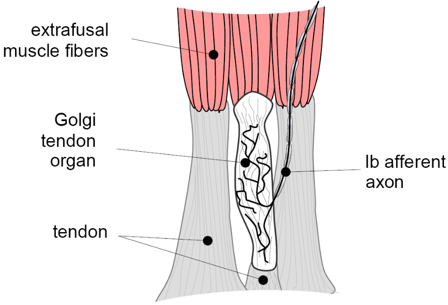
]]

---

## Assessing .grey[kinesthetic] and .grey[proprioceptive] abilities

.footnote[Fig: Tresilian 2012 based on Allen & Proske 2006 (https://doi.org/10.1007/s00221-005-0174-z)]

.pull-left[
.black[Matching tasks]
- try to match position or movement of a body segment (the target) with something else
- another body segment or a moveable device
- can be **simultaneous** or **successive**

.black[Discrimination tasks]
- try to tell the difference between two or more situations
- e.g., set joint angles for right and left elbow, ask to judge whether left elbow is more flexed/extended
- can be used to establish the **discrimination threshold**
]

.pull-right[.center[
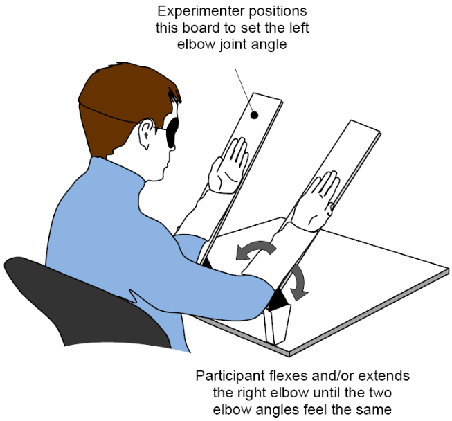
]]

---

class: inverse, middle, center

# Any questions?

---

class: inverse

background-image: url(imgs/sensory-feedback.png)
background-size: contain

---

## We tend to give vision a .grey[predominant] role when we perform motor skills

.pull-left[.center[
<iframe width="500" height="315" src="https://www.youtube.com/embed/F4xenIulg_8" title="YouTube video player" frameborder="0" allow="accelerometer; autoplay; clipboard-write; encrypted-media; gyroscope; picture-in-picture" allowfullscreen></iframe>
.tiny[Source: https://youtu.be/F4xenIulg_8]
]]

.pull-right[.center[
<iframe width="500" height="315" src="https://www.youtube.com/embed/FupiZi-HuQ4" title="YouTube video player" frameborder="0" allow="accelerometer; autoplay; clipboard-write; encrypted-media; gyroscope; picture-in-picture" allowfullscreen></iframe>
.tiny[Source: https://youtu.be/FupiZi-HuQ4]
]]

---

# Learning objectives

1. Identify and describe key **anatomical components** of the eye.

2. Describe how **visual information** is transmitted.

3. Identify and describe **different types** of eye movements.

4. Describe our **two visual systems** and how motor behaviour is affected when **damage** occurs in them.

--

.bg-gold.b--mid-gray.ba.bw2.br3.shadow-5.ph4.mt5[
.tc[
.black[<ins>Take-home message</ins>:

Sensory feedback is critical for skilled voluntary actions.
]]]

---

## Images projected onto the retina stimulate an array of .grey[photoreceptors]

.footnote[Fig: Tresilian 2012]

.pull-left[
- The retina contains photoreceptors: the **rod** and **cone** cells

- Rods contribute to **scotopic vision** (i.e., *night vision*)

- Cones contribute to **photopic vision** 

]

.pull-right[.center[
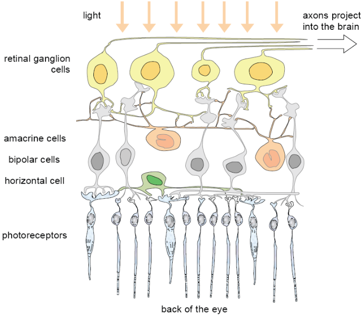
]]

---

## Rods and cones detect .grey[different] types of sensory information

.pull-left[
.black[Rods]
- ~100-120 million in each eye and found in the **periphery** of the retina outside the fovea

- Respond to **low levels** of light

- Critical for **peripheral** vision (due to location)

- **Cannot** distinguish color

- Provide greater discernment concerning **movement** in visual field
]

--

.pull-right[
.black[Cones]
- ~6-7 million in each eye and predominantly found in the **fovea**

- Respond only to **bright** light (i.e., require high levels of illumination)

- Critical for **central** vision and **visual acuity** (due to location)

- **Can** distinguish color

- Provide better information about **details** in visual field
]

---

## The human retina has a .grey[small blind region] and a .grey[small acute region]

.footnote[Fig: Tresilian 2012]

.pull-left[
- There is a small region with no photoreceptors called the **optic disk**

- There is another small spot in the retina called the **macula**

- The **fovea** is a roughly circular depression in the center of the macula

- The fovea is very small (~ 1 to 1.5 mm across; corresponds to ~ 3 to 4 degs of visual field)
]

.pull-right[.center[
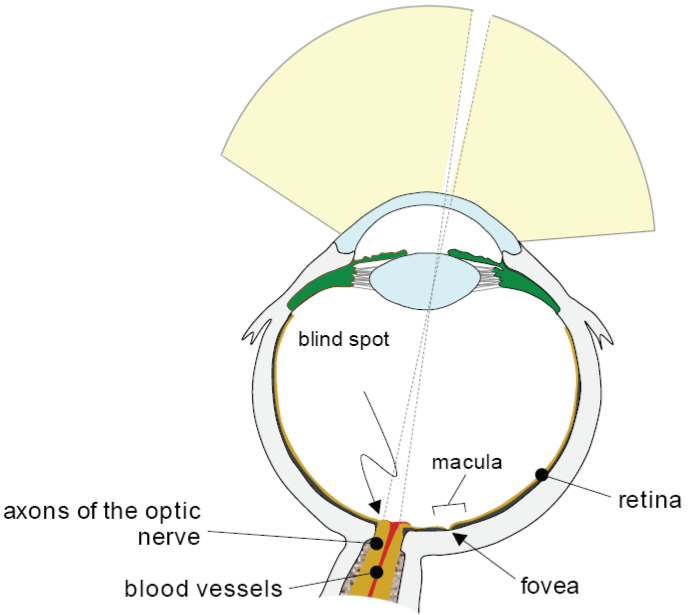
]]

---

.footnote[Fig: Tresilian 2012]

.center[
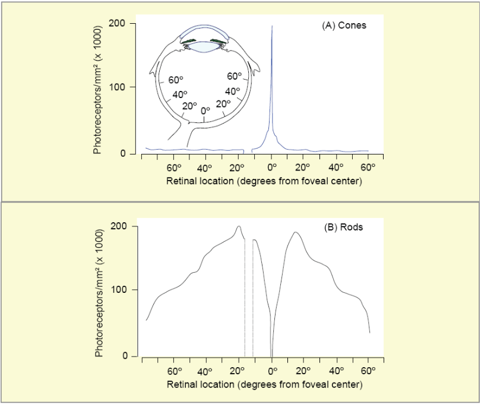
]

---

## Foveal vision has .grey[high acuity]; peripheral vision has .grey[low acuity]

.footnote[Fig: Tresilian 2012]

.pull-left[
- **Fine details** can only be discriminated in the central part of the visual field

- Vision mediated by the fovea is **foveal vision** (the central 3 or 4 degs of visual field)

- The part outside the macula (~95% of total retinal area) is **peripheral retina**

- Vision mediated by the peripheral retina is called **peripheral vision**
]

.pull-right[.center[

]]

---

## Foveal vision has .grey[high acuity]; peripheral vision has .grey[low acuity]

.footnote[Fig: Tresilian 2012]

.center[
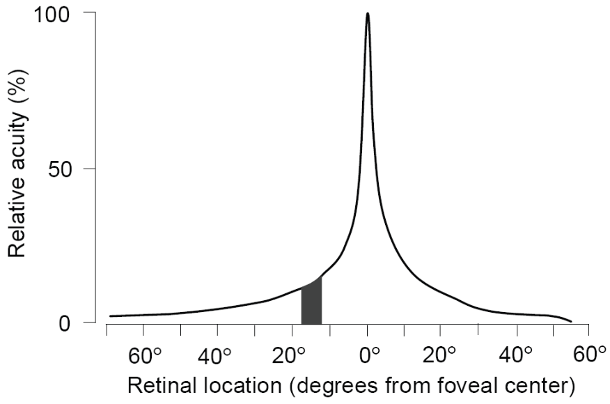
]

---

background-image: url(https://media.springernature.com/full/springer-static/image/art%3A10.1038%2Fnrn1630/MediaObjects/41583_2005_Article_BFnrn1630_Fig4_HTML.jpg)
background-position: 92% 50%
background-size: 45%

.pull-left[
- The **visual field** refers to the image or scene being viewed

- Light waves pass through the **cornea and lens** and hits the rods and cones within the retinas (**nasal** versus **temporal**)

- The light waves are **refracted** (i.e., bent) such that observed image is **inverted** and **reversed** on the retina

- Axons of neurons in the retina called ganglion cells form the **optic nerve** (CN II) which is the means of information transmission from the eye to the brain

- Information reaches the **optic chiasm** where nerve fibres either continue within the same hemisphere or cross over the the opposite hemisphere
]

---

background-image: url(https://media.springernature.com/full/springer-static/image/art%3A10.1038%2Fnrn1630/MediaObjects/41583_2005_Article_BFnrn1630_Fig4_HTML.jpg)
background-position: 92% 50%
background-size: 45%

.pull-left[
- Optic nerve fibres associated with the **nasal part cross over** at the optic chiasm to the opposite hemisphere whereas optic nerve fibres of the **temporal part remain** in the same hemisphere

- Information arrives at the **lateral geniculate nucleus** before continuing to the left and right **primary visual cortices (V1)**

- V1 unites the images in a way that allows us to see 3D images (i.e., the spatial organization of the visual scence is determined)

- Information is then sent to the **superior colliculus** where it is integrated with other incoming sensory inputs (allows head/eye coordination and involved in attention and visual perception)
]

---

## There are .grey[2 basic types] of coordinated movement of the two eyes

.footnote[Fig: Tresilian 2012]

.pull-left[
.black[CONJUGATE (OR VERSION) EYE MOVEMENT]: a coordinated movement of the two eyes in which both eyes move in the same direction at the same time through the same angle

.black[DISCONJUGATE (OR VERGENCE) EYE MOVEMENT]: a coordinated movement of the two eyes in which the eyes move in opposite direction at the same time through the same angle
]

.pull-right[.center[
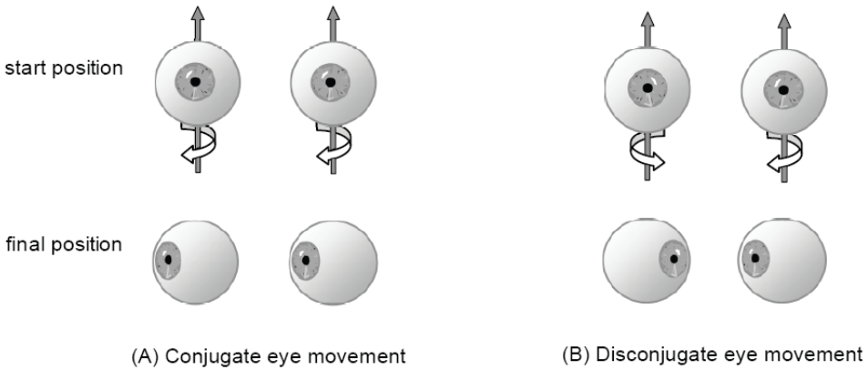
]]

---

## The eyes move for two basic reasons: to keep them .grey[steady] and to bring .grey[images onto the foveas]

.footnote[Fig: Tresilian 2012]

.center[
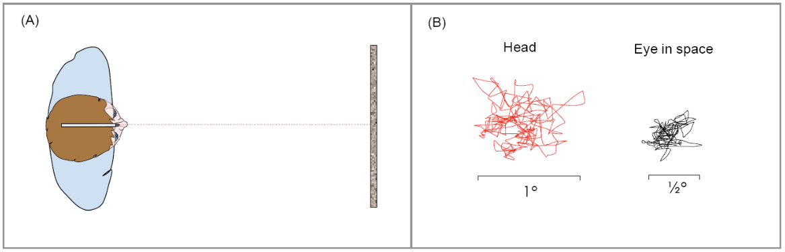
]

---

## Two eye movement systems .grey[keep images stable] when the head moves

.pull-left[
.black[Vestibular and Cervical Reflex System]
- **Function**: Keep the whole image steady on the retina when the head jiggles, bobs, nods, rolls, or sways

- **Movement type**: Conjugate

- **Process**: Eye movements generated in response to stimulation of vestibular organs (vestibular-occular reflexes). Eye movements in response to stimulation of neck proprioceptors (cervico-ocular reflexes) exist, but normally contribute very little
]

.pull-right[
.black[Optokinetic Reflex System]
- **Function**: Keep the whole image steady on the retina during smooth, sustained movements of the head

- **Movement type**: Conjugate

- **Process**: Eye movements generated in response to wide-field image flow stimulation of the retinal photoreceptors
]

---

## Animals with foveate eyes have .grey[4 systems] to bring images onto the foveas and hold them there

1. **Saccadic system**: rapidly shift gaze from one location in the visual field to another (Movement type = conjugate)

2. **Fixation system**: maintain the direction of gaze so that the images of an object remain on the foveas (Movement type = variable)

3. **Smooth pursuit system**: shift gaze so that the images of a laterally moving object remain on the foveas (Movement type = conjugate)

4. **Vergence system**: align the eyes so that images of an object fall on corresponding foveal locations in the two eyes (Movement type = disconjugate)

---

## Saccadic eye movements are .grey[always] much the same


.footnote[Fig: Tresilian 2012]

.center[
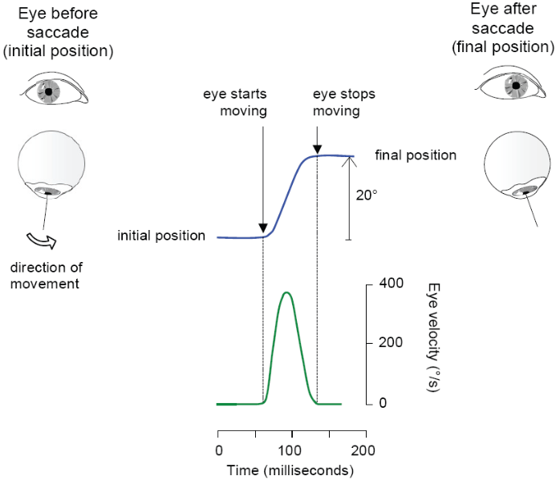
]

---

## Fixation involves .grey[tiny eye movements]

.footnote[Fig: Tresilian 2012]

.pull-left[
- **Fixational eye movements** are composed of three distinct components: *physiological tremor*, *slow drift*, and *small, rapid jumps in position*

- Looking at the figure we can see that during the fixation, the gaze direction remains within a range of ~0.25 deg
]

.pull-right[
- We can see the 3 movements:
  - sudden changes in position where the trace steps abruptly (**microsaccades**)
  - more gradual changes (positional drift)
  - very rapid, very small wiggles in the trace itself (physiological tremor)
]

.center[
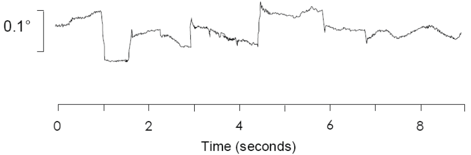
]

---

background-image: url(imgs/pursuit-constant-velocity.png)
background-position: 8% 65%
background-size: 50%

## Pursuit eye movements are used to .grey[follow] a moving object

.footnote[Fig: Tresilian 2012]

.pull-right[.center[
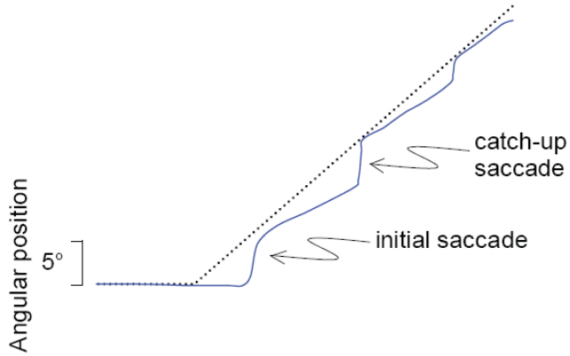
]]

---

## Cortical processing of visual information proceeds along .grey[two primary streams]

.footnote[Fig: Tresilian 2012]

.pull-left[
- **Visual area 1 (V1)** receives information that underlies our conscious visual perception and is part of a larger area called **visual cortex**

- The region outside of V1 is the **extrastriate visual cortex** and is made up of many individual areas based on type of visual information primarily respond to:
  - e.g., cells in **V4** primarily involved with color information
  - e.g., cells in **V5** primarily involved with processing motion information
]

.pull-right[.center[

]]

---

## What are the .grey[functions] of the two visual streams?

.footnote[Fig: Tresilian 2012; Goodle & Milner 1992]

.pull-left[
We can **distinguish** the two streams based on the **use to which the information is put**

.black[Ventral stream]
- underlies what we normally think of as **seeing**
- i.e., *vision-for-perception*

.black[Dorsal stream]
- underlies the **visual control of voluntary action**
- i.e., *vision-for-action*
]

.pull-right[.center[

]]

---

## Brain damage can .grey[impair conscious vision] but leave visuomotor skill intact

.footnote[Fig: Milner & Goodale 1998]

.center[
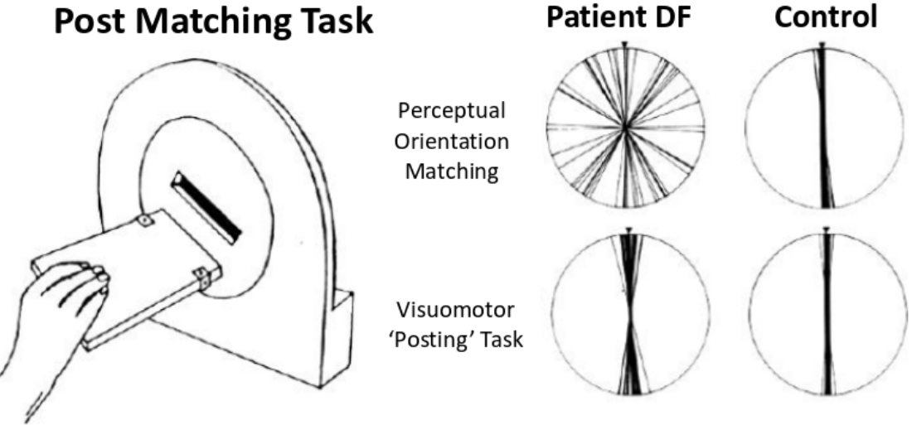
]

---

## Brain damage can .grey[impair visuomotor skill] but leave conscious vision intact

.footnote[Fig: Milner & Goodale 1998]

.center[
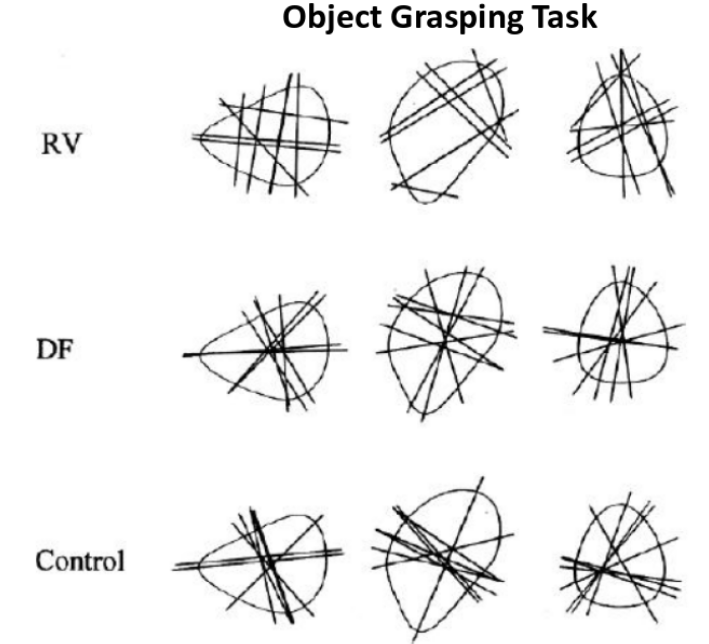
]

---

# Learning objectives

1. Identify and describe key **anatomical components** of the eye.

2. Describe how **visual information** is transmitted.

3. Identify and describe **different types** of eye movements.

4. Describe our **two visual systems** and how motor behaviour is affected when **damage** occurs in them.

.bg-gold.b--mid-gray.ba.bw2.br3.shadow-5.ph4.mt5[
.tc[
.black[<ins>Take-home message</ins>:

Sensory feedback is critical for skilled voluntary actions.
]]]

---

class: title-slide-final, middle
background-image: url(https://raw.githubusercontent.com/cartermaclab/mackin-xaringan/main/imgs/logos/mcmaster-stack-color.png)
background-size: 95px
background-position: 9% 15%

# What questions do you have?


|                                                                                                                |                                   |
| :------------------------------------------------------------------------------------------------------------- | :-------------------------------- |
| <a href="https://twitter.com/cartermaclab">.mackinred[<i class="fa fa-twitter fa-fw"></i>]                     | @_LauraStGermain                  |
| <a href="https://github.com/LauraStGermain">.mackinred[<i class="fa fa-github fa-fw"></i>]                     | @LauraStGermain                   |
| <a href="https://cartermaclab.org">.mackinred[<i class="fa fa-link fa-fw"></i>]                                | www.cartermaclab.org              |
