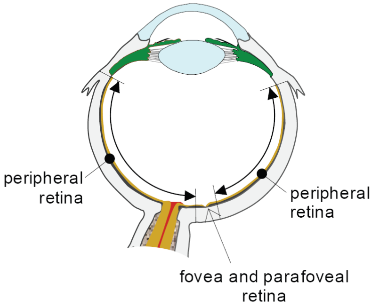
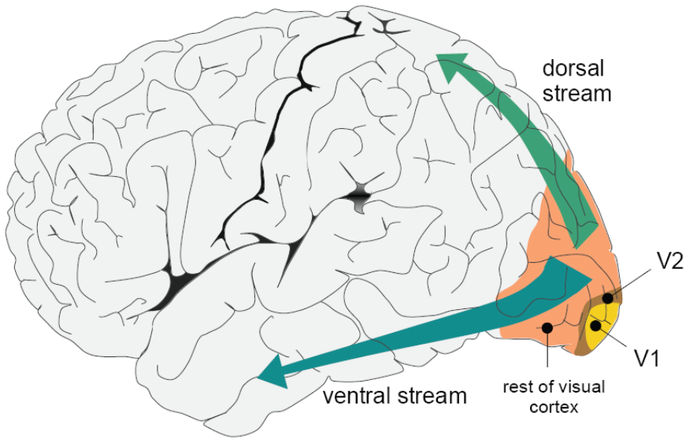
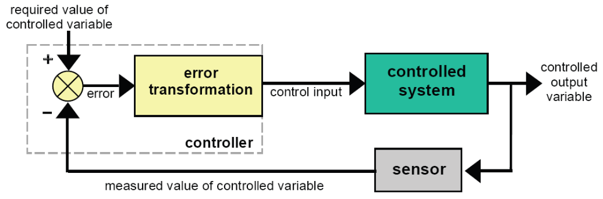
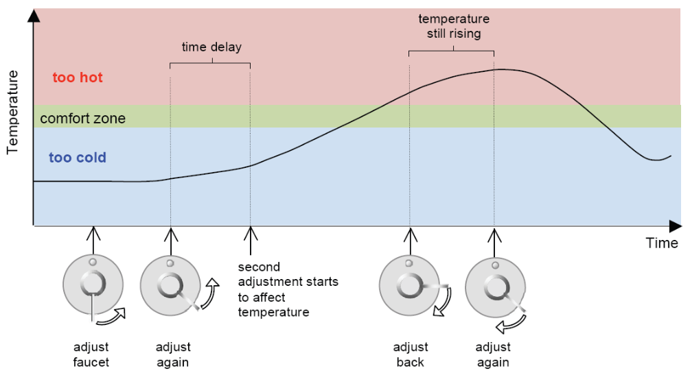
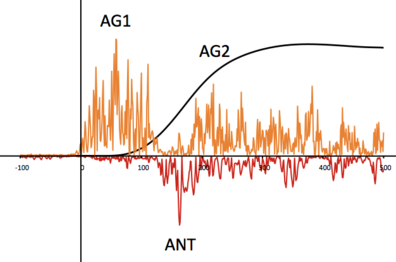
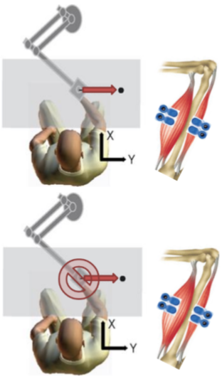
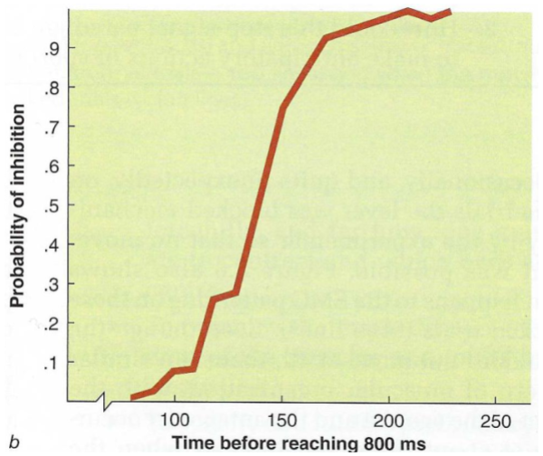

```{r setup, include = FALSE}
options(htmltools.dir.version = FALSE)
```

```{r additional, echo = FALSE, include = FALSE}
library(kableExtra)
library(tidyverse)
```

```{r xaringanExtra, echo = FALSE, include = FALSE}
xaringanExtra::use_xaringan_extra(c("clipboard",
                                    "freezeframe",
                                    "panelset",
                                    "scribble",
                                    "tachyons", 
                                    "tile_view"))
```


class: title-slide-section-gold, bottom

# Review from last lecture

---

## Foveal vision has .grey[high acuity]; peripheral vision has .grey[low acuity]

.footnote[Fig: Tresilian 2012]

.pull-left[
- **Fine details** can only be discriminated in the central part of the visual field

- Vision mediated by the fovea is **foveal vision** (the central 3 or 4 degs of visual field)

- The part outside the macula (~95% of total retinal area) is **peripheral retina**

- Vision mediated by the peripheral retina is called **peripheral vision**

- The **parafoveal retina** lies between the fovea and peripheral retina
]

.pull-right[.center[

]]

---

background-image: url(https://media.springernature.com/full/springer-static/image/art%3A10.1038%2Fnrn1630/MediaObjects/41583_2005_Article_BFnrn1630_Fig4_HTML.jpg)
background-position: 50% 50%
background-size: 45%

---

## What are the .grey[functions] of the two visual streams?

.footnote[Fig: Tresilian 2012; Goodle & Milner 1992]

.pull-left[
We can **distinguish** the two streams based on the **use to which the information is put**

.black[Ventral stream]
- underlies what we normally think of as **seeing**
- i.e., *vision-for-perception*

.black[Dorsal stream]
- underlies the **visual control of voluntary action**
- i.e., *vision-for-action*
]

.pull-right[.center[

]]

---

class: inverse, middle, center

# Any questions?

---

## What are some .grey[similarities and differences] between these two motor skills?

.pull-left[.center[

.tiny[Source: https://media.giphy.com/media/J4IdNvA7mT4f6/giphy.gif]
]]

.pull-right[.center[

.tiny[Source: https://baseballrebellion.com/wp-content/uploads/2019/06/EZ-Gif-Barnhill-LHH.gif]
]]

---

# Learning objectives

1. Define and discuss **mechanistic concepts** from control engineering to help us understand goal-directed behaviour.

2. Compare and contrast an **open-loop control** system and a **closed-loop control** system

3. Identify and describe **actions governed** by these classes of control.

4. Describe **limitations** of these classes of control.

--

.bg-gold.b--mid-gray.ba.bw2.br3.shadow-5.ph4.mt5[
.tc[
.black[<ins>Take-home message</ins>:

Some actions allow us to use sensory feedback to make online corrections whereas other actions leave little time for corrections based on sensory feedback.
]]]

---

## There are .grey[two basic control systems] that guide action

.black[CLOSED-LOOP CONTROL]: a class of control in which, **during** the course of an action, feedback is **compared** against a standard (or reference) to enable an action to be carried out as planned

.black[OPEN-LOOP CONTROL]: a class of control in which **all** the information needed to initiate and carry out an action as planned is contained in the **initial instructions** to the effectors

---

## The .grey[principal] objective of control is to make a system's .grey[behaviour meet] a set of requirements

- A **system** is anything composed of **linked and interacting** parts

- A block diagram represents a system as something that produces outputs in response to inputs

<br>
.center[

]

---

## Controlling a .grey[system output] requires adjustment of relevant inputs

.footnote[Fig: https://i.gifer.com/1fCK.gif]

.black[CONTROLLED VARIABLES]: a system output quantity whose value can be influenced (i.e., controlled) by applying particular types of input to the system

.black[CONTROL VARIABLE]: an input to a controlled system (or actuating device) that can be altered to make an associated controlled variable take the value(s) required

--

.pull-left[
*Let's put it all together with a driving example:*
  - Pressing the brake pedal (**control variable**) causes frictional forces to develop between the wheel and brake pads, which slows the vehicle down (**controlled variable**)
]

.pull-right[.center[

]]

---

## A control system is a .grey[set of components that work together] to achieve control

.footnote[<sup>1</sup>A commonly used alternative name is **plant**]

.black[CONTROLLED SYSTEM]<sup>1</sup>: a system that is being **controlled** (having inputs applied to it) to make it **behave** in a way that meets the requirement(s)

.black[CONTROLLER]: a system that **generates** the control inputs that **affect the behaviour** of the controlled system (usually through actuating systems)

.black[CONTROL SYSTEM]: a system comprised of a controller, a controlled system, and possibly other components that **work together to achieve some required behaviour**

<br>
.center[

]

---

## Feedback provides a means for .grey[achieving] control objectives

- *Our driving example again*:

  - Speed limit is 50 km/h
  - Your speed is 60 km/h
  - Error is -10 km/h (50 - 60)

--

- A common alternative term for closed-loop control is **error-correcting feedback control**

- Fundamental objective of this class of control is to **reduce errors to 0** or **as close to 0** as makes no practical difference

---

## Feedback provides a means for .grey[achieving] control objectives

.footnote[Fig: Tresilian 2012]

.center[

]

---

## Errors arise for .grey[three main] reasons

1. .black[Disturbances]

  - inputs **external** to the control system can affect the controlled variable(s) to produce errors
  - e.g., a hill, road, wind, etc

--

2. .black[Controller mistakes]

  - the controller could make a change in the control variable **when it is not needed** or could **respond to an error with an incorrect change** of the control variable
  - e.g., push wrong pedal, oversteering a turn in the road, etc

--

3. .black[Changes to the requirements]

  - if the **required value** of the controlled variable **changes**, an error is likely to be created
  - e.g., enter a new zone where speed limit changes, etc

---

## Two types of control problems are .grey[regulation] and .grey[tracking] 

.pull-left[
.black[Regulation problem]
  - when the control objective is to bring a controlled variable to a specific, fixed value (i.e., set-point) and maintain that value in the face of disturbances
.center[

]]

.pull-right[
.black[Tracking problem]
  - when the control objective is to make the controlled variable follow (i.e., track) changes in the required value
.center[

]]

---

## Closed-loop control can be .grey[ineffective] when there are .grey[time delays]

.footnote[Tresilian 2012]

.center[

]

---

## In the .grey[absence of disturbances], control may be possible .grey[without] using feedback

.footnote[Tresilian 2012]

.pull-left[
.black[Open-loop control]: a style of control in which the output of the controlled system is not fed back to the controller. What the controlled system is actually doing has no effect on the control inputs supplied by the controller

Open-loop control **requires detailed knowledge** about the controlled system
]

.pull-right[.center[

]]

---

## Errors in open-loop systems can arise for .grey[2 basic] reasons

1. .black[Disturbances] that cannot be taken into account in the **formation** of the control signal

2. .black[Incomplete or inaccurate knowledge] of the **controlled system** that is **being used** to determine the control signals

--

.pull-left[
- This control is characterized by **centrally** determined, **pre-structured commands** with **minimal** role of sensory feedback

- Sometimes, once the commands are sent they **cannot** be stopped!
]

.pull-right[.center[

]]

---

## What happens to .grey[muscle activity] if a target-directed reach is .grey[prevented unexpectedly]?

.pull-left[.center[
<br>

]]

--

.pull-right[.center[

]]

---

background-image: url(imgs/wadman-etal.png)
background-size: contain

.footnote[Wadman et al. 1979]

---

## Is there a .grey[point of no return]?

.pull-left[.center[


]]

--

.pull-right[.center[


]]

---

## Lift finger to .grey[stop] sweep hand at .grey[10 o'clock] position

.pull-left[.center[

]]

--

.pull-right[.center[

]]


---

# Learning objectives

1. Define and discuss **mechanistic concepts** from control engineering to help us understand goal-directed behaviour.

2. Compare and contrast an **open-loop control** system and a **closed-loop control** system

3. Identify and describe **actions governed** by these classes of control.

4. Describe **limitations** of these classes of control.

.bg-gold.b--mid-gray.ba.bw2.br3.shadow-5.ph4.mt5[
.tc[
.black[<ins>Take-home message</ins>:

Some actions allow us to use sensory feedback to make online corrections whereas other actions leave little time for corrections based on sensory feedback.
]]]

---

class: title-slide-final, middle
background-image: url(https://raw.githubusercontent.com/cartermaclab/mackin-xaringan/main/imgs/logos/mcmaster-stack-color.png)
background-size: 95px
background-position: 9% 15%

# What questions do you have?


|                                                                                                                |                                   |
| :------------------------------------------------------------------------------------------------------------- | :-------------------------------- |
| <a href="https://twitter.com/cartermaclab">.mackinred[<i class="fa fa-twitter fa-fw"></i>]                     | @_LauraStGermain                  |
| <a href="https://github.com/LauraStGermain">.mackinred[<i class="fa fa-github fa-fw"></i>]                     | @LauraStGermain                   |
| <a href="https://cartermaclab.org">.mackinred[<i class="fa fa-link fa-fw"></i>]                                | www.cartermaclab.org              |
