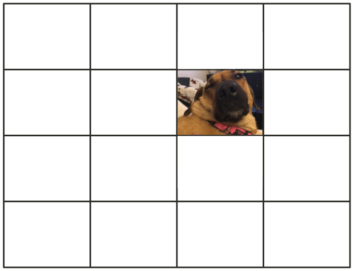
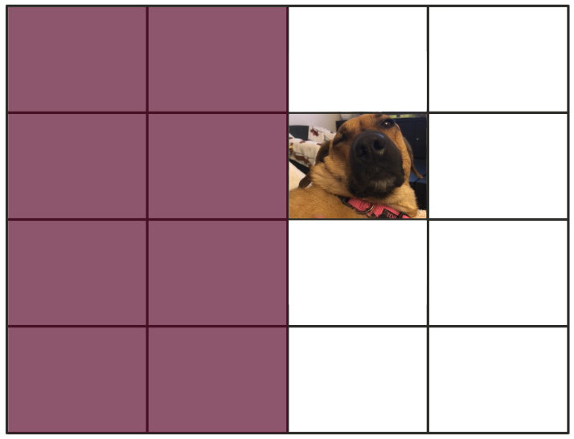
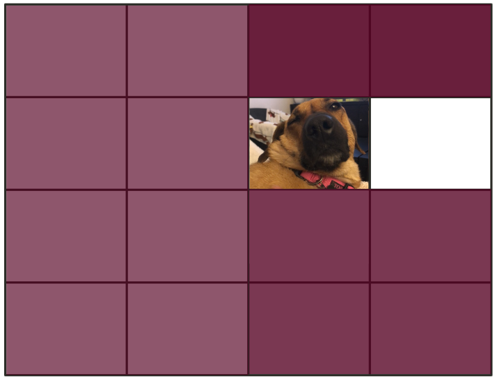
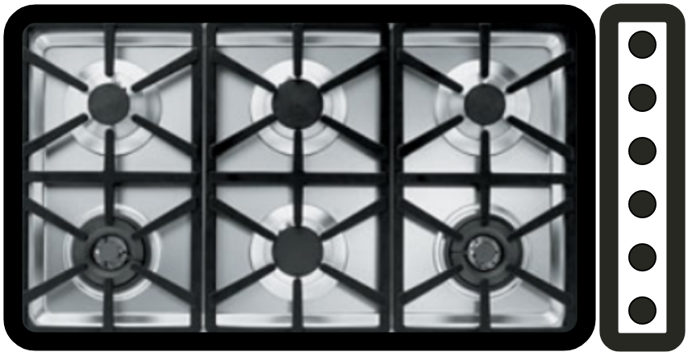
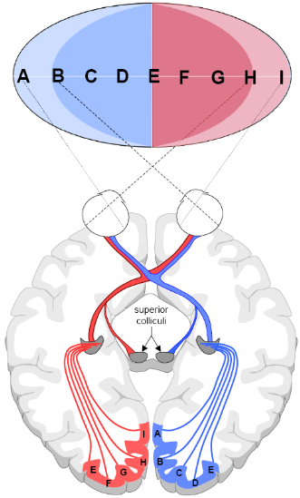

```{r setup, include = FALSE}
options(htmltools.dir.version = FALSE)
```

```{r additional, echo = FALSE, include = FALSE}
library(kableExtra)
library(tidyverse)
```

```{r xaringanExtra, echo = FALSE, include = FALSE}
xaringanExtra::use_xaringan_extra(c("clipboard",
                                    "freezeframe",
                                    "panelset",
                                    "scribble",
                                    "tachyons", 
                                    "tile_view"))
```


class: title-slide-section-gold, bottom

# Review from last lecture

---

## A key .grey[assumption] of the information-processing model is that the stages are .grey[non-overlapping]

.center[

]

---

## Studying the impact of the number of .grey[stimulus-response alternatives] on reaction time in the lab

.pull-left[.center[

]]

.pull-right[.center[

]]

---

## Reaction time .grey[increases] with the number of stimulus-response alternatives

.footnote[Approximate data from Merkel 1885 through plot digitization]

```{r echo=FALSE}
# Create tibble from digitizing a plot of the data from Merkel 1885
merkel <- tibble::tibble(
  choices = c(seq(1, 10)),
  rt = c(174.67, 311.15, 372.96, 427.03, 493.99, 546.78, 585.40, 616.30, 630.47, 639.48)
)
```

.pull-left[
```{r echo=FALSE, fig.align='center', fig.height=5.75}
ggplot2::ggplot(merkel, aes(x = choices, y = rt)) +
  geom_line(size = 1) +
  geom_point(size = 4, color = "#ac1455") +
  scale_y_continuous(name = "Reaction time (ms)",
                     limits = c(100, 700),
                     breaks = seq(100, 700, 100)) +
  scale_x_continuous(name = "Number of S-R alternatives",
                     limits = c(1, 10),
                     breaks = seq(1, 10, 1)) +
  theme(
    axis.title = element_text(face = "bold", size = 20),
    axis.text = element_text(size = 18)
  )
```
]

.pull-right[
```{r echo=FALSE, message=FALSE, fig.align='center', fig.height=5.75}
ggplot2::ggplot(merkel, aes(x = choices, y = rt)) +
  geom_line(size = 0.75, linetype = "dashed") +
  geom_smooth(method = "lm", se = FALSE, color = "#fdbf57", size = 2) +
  geom_point(size = 4, color = "#ac1455") +
  scale_y_continuous(name = "Reaction time (ms)",
                     limits = c(100, 700),
                     breaks = seq(100, 700, 100)) +
  scale_x_continuous(name = "Number of S-R alternatives",
                     trans = "log2",
                     limits = c(1, 14)) +
  theme(
    axis.title = element_text(face = "bold", size = 20),
    axis.text = element_text(size = 18)
  ) +
  annotate(geom = "text", x = c(1, 2, 4, 8), y = c(rep(115, 4)), label = c("0", "1", "2", "3"), size = 6) +
  annotate(geom = "segment", x = 10, y = 112, xend = 8.5, yend = 112, arrow = arrow(length = unit(2, "mm")), size = 1) +
  annotate(geom = "text", x = 10.1, y = 112, label = "Log[2](N)", hjust = "left", size = 6.5, parse = TRUE)
```
]

---

## The number of choice and reaction time can be capture with a .grey[log-linear] equation

### $$RT = a + b\log_{2}(N)$$

where:
- *a* = y-intercept
- *b* = slope
- *N* = number of S-R alternatives
- log<sub>2</sub>(*N*) = **bits** of information

<br>
**One bit** = the amount of information needed to reduce the original uncertainty in half

Information is related to **uncertainty** and the amount of uncertainty **reduced** by a stimulus

---

## Meet .grey[Ginger]<sup>1</sup>...the MAClab mutt

.footnote[<sup>1</sup>Voted the **cutest dog** of the lab 2022]

.pull-left[.center[

]]

--

.pull-right[.center[

]]

---

## Amount of information

.middle[
.pull-left[

.black[*Q1: Is Waldo in the left half?*]
]

.pull-right[.center[

]]
]

---

## Amount of information

.middle[
.pull-left[

.black[*Q1: Is Waldo in the left half?*]
- NO...uncertainty reduced by half
]

.pull-right[.center[

]]
]

---

## Amount of information

.middle[
.pull-left[

.black[*Q1: Is Waldo in the left half?*]
- NO...uncertainty reduced by half

.black[*Q2: Is Waldo in the top half?*]
- YES...uncertainty reduced by half
]

.pull-right[.center[

]]
]

---

## Amount of information

.middle[
.pull-left[

.black[*Q1: Is Waldo in the left half?*]
- NO...uncertainty reduced by half

.black[*Q2: Is Waldo in the top half?*]
- YES...uncertainty reduced by half

.black[*Q3: Is Waldo in the top half?*]
- NO...uncertainty reduced by half
]

.pull-right[.center[

]]
]

---

## Amount of information

.middle[
.pull-left[

.black[*Q1: Is Waldo in the left half?*]
- NO...uncertainty reduced by half

.black[*Q2: Is Waldo in the top half?*]
- YES...uncertainty reduced by half

.black[*Q3: Is Waldo in the top half?*]
- NO...uncertainty reduced by half

.black[*Q4: Is Waldo in the right half?*]
- NO...uncertainty reduced by half
]

.pull-right[.center[

]]
]

---

## Amount of information

.middle[
.pull-left[

.black[*Q1: Is Waldo in the left half?*]
- NO...uncertainty reduced by half

.black[*Q2: Is Waldo in the top half?*]
- YES...uncertainty reduced by half

.black[*Q3: Is Waldo in the top half?*]
- NO...uncertainty reduced by half

.black[*Q4: Is Waldo in the right half?*]
- NO...uncertainty reduced by half
]

.pull-right[.center[

$$Log_{2}(N) = Log_{2}(16) = 4$$
.black[OR]
$$2*2*2*2 = 16$$
(i.e., 4 binary decisions)
]]
]

---

class: inverse, middle, center

# Any questions?

---

class: inverse

background-image: url(imgs/compatibility.png)
background-size: cover

---

# Learning objectives

1. Describe what is meant by stimulus-response **compatibility** and how it affects action preparation.

2. Describe the **spatial** and **anatomical** accounts for stimulus-response compatibility effects in the lab.

3. Discuss the how an **irrelevant** stimulus feature can influence action preparation.

4. Explain how response **complexity** influences action preparation.
--

.bg-gold.b--mid-gray.ba.bw2.br3.shadow-5.ph4.mt5[
.tc[
.black[<ins>Take-home message</ins>:

Although reaction time is one of the simplest performance measures, its use has had a profound influence on the development of motor behaviour research. 
]]]

---

## Stimulus-response .grey[compatibility]

.pull-left[.center[



]]

--

.pull-right[
- refers to the **naturalness** of the mapping between the **stimulus** and the **required response**

- when compatibility is **high**...
  - **faster** learning
  - **faster** reaction times
  - **fewer** errors
  - **lower** mental workload
  - **higher** user satisfaction

- most common type is **spatial** compatibility
]

---

background-image: url(imgs/stoves.png)
background-size: contain

---

background-image: url(imgs/fitts-seeger.png)
background-size: contain

.footnote[Fitts & Seeger 1953 (https://doi.org/10.1037/h0062827)]

.pull-left[
## S-R compatibility .grey[decreases] reaction time and errors
]

---

## A .grey[simple setup] to study S-R compatibility in the lab

<br>
.center[

]

---

## Stimulus-response compatibility: .grey[Normal] hands

.footnote[*Hypothetical data for illustrative purposes*]

```{r echo=FALSE}
# Create tibble of hypothetical normal hands S-R compatibility data
normal_hands <- tibble::tibble(
  stimulus = c("Left stimulus", "Left stimulus", "Right stimulus", "Right stimulus"),
  response = c("Left key", "Right key", "Left key", "Right key"),
  rt = c(325, 380, 382, 331)
)
```

```{r echo=FALSE, fig.align='center', fig.width=12}
ggplot2::ggplot(normal_hands, aes(x = response, y = rt, group = stimulus, color = stimulus, shape = stimulus)) +
  geom_line(size = 1.5) +
  geom_point(size = 5) +
  scale_y_continuous(name = "Reaction time (ms)",
                     limits = c(250, 500),
                     breaks = seq(250, 500, 25)) +
  scale_x_discrete(name = "Normal hand placement") +
  scale_color_manual(values = c("#ac1455", "#fdbf57")) +
  theme(
    legend.text = element_text(size = 18),
    legend.title = element_blank(),
    axis.title = element_text(face = "bold", size = 20),
    axis.text = element_text(size = 18)
  )
```


---

.pull-left[.center[

]]

.pull-right[.center[

]]

.footnote[Left: Tresilian 2012 ; Right: Kandel et al. 2013]

---

## How can we .grey[dissociate] between the spatial and anatomical explanations?

.center[

]

---

## Which explanation is .grey[supported] by this data?

.footnote[*Hypothetical data for illustrative purposes*]

.pull-left[
```{r echo=FALSE, fig.align='center', fig.height=6.5}
ggplot2::ggplot(normal_hands, aes(x = response, y = rt, group = stimulus, color = stimulus, shape = stimulus)) +
  geom_line(size = 1.5) +
  geom_point(size = 5) +
  scale_y_continuous(name = "Reaction time (ms)",
                     limits = c(250, 500),
                     breaks = seq(250, 500, 25)) +
  scale_x_discrete(name = "Normal hand placement") +
  scale_color_manual(values = c("#ac1455", "#fdbf57")) +
  theme(
    legend.text = element_text(size = 18),
    legend.title = element_blank(),
    legend.position = c(0.8, 0.9),
    axis.title = element_text(face = "bold", size = 20),
    axis.text = element_text(size = 18)
  )
```
]

.pull-right[
```{r echo=FALSE}
# Create tibble of hypothetical normal hands S-R compatibility data
crossed_hands <- tibble::tibble(
  stimulus = c("Left stimulus", "Left stimulus", "Right stimulus", "Right stimulus"),
  response = c("Left key", "Right key", "Left key", "Right key"),
  rt = c(362, 489, 476, 359)
)
```

```{r echo=FALSE, fig.align='center', fig.height=6.5}
ggplot2::ggplot(crossed_hands, aes(x = response, y = rt, group = stimulus, color = stimulus, shape = stimulus)) +
  geom_line(size = 1.5, linetype = "dotted") +
  geom_point(size = 5) +
  scale_y_continuous(name = "Reaction time (ms)",
                     limits = c(250, 500),
                     breaks = seq(250, 500, 25)) +
  scale_x_discrete(name = "Crossed hand placement") +
  scale_color_manual(values = c("#ac1455", "#fdbf57")) +
  theme(
    legend.text = element_text(size = 18),
    legend.title = element_blank(),
    legend.position = "none",
    axis.title = element_text(face = "bold", size = 20),
    axis.text = element_text(size = 18)
  )
```
]

---

## What is the .grey[spatial locations] of the stimuli are .grey[not relevant] to the task?

.center[

]

---

## A compatibility effect occurs even when stimulus location is .grey[irrelevant] to the task?

.footnote[Approximate data from Simon and Ruddell 1967 through plot digitization]

```{r echo=FALSE}
# Create tibble of hypothetical Simon effect data
simon <- tibble::tibble(
  stimulus = c("Press left key", "Press left key", "Press right key", "Press right key"),
  ear = c("Left", "Right", "Left", "Right"),
  rt = c(384.96, 424.11, 433.32, 390.43)
)
```

```{r echo=FALSE, fig.align='center', fig.width=12, fig.height=6}
ggplot2::ggplot(simon, aes(x = ear, y = rt, group = stimulus, color = stimulus, shape = stimulus)) +
  geom_line(size = 1.5, linetype = "dotted") +
  geom_point(size = 5) +
  scale_y_continuous(name = "Reaction time (ms)",
                     limits = c(250, 500),
                     breaks = seq(250, 500, 25)) +
  scale_x_discrete(name = "Ear presented with message") +
  scale_color_manual(values = c("#ac1455", "#fdbf57")) +
  theme(
    legend.text = element_text(size = 18),
    legend.title = element_blank(),
    axis.title = element_text(face = "bold", size = 20),
    axis.text = element_text(size = 18)
  )
```

---

## Why does this .grey[irrelevant] feature influence reaction time?

.center[

]

---

class: inverse

background-image: url(https://mycardoeswhat.org/wp-content/uploads/2017/01/ABS-Snow.jpg)
background-size: contain

.footnote[Source: https://mycardoeswhat.org/wp-content/uploads/2017/01/ABS-Snow.jpg]

---

## We can increase the .grey[complexity] of an action by .grey[increasing] the number of components to execute

.pull-left[
**Task A: Simple RT**
- Lift finger when you hear the auditory tone

**Task B: Simple RT + Single action**
- Lift finger when you hear the auditory tone .black[THEN] reach and grasp ball A

**Task C: Simple RT + Multiple actions**
- Lift finger when you hear the auditory tone .black[THEN] strike ball A .black[THEN] reach and push button .black[THEN] strike ball B
]

.pull-right[.center[

]]

---

## Reaction time .grey[increases] with response complexity

.footnote[Adapted from Henry and Rogers 1960]

```{r echo=FALSE}
# Create some hypothetical data
complexity <- tibble::tibble(
  task = c("Task A", "Task B", "Task C"),
  rt = c(159, 195, 208)
)
```

```{r echo=FALSE, fig.width=14}
# Create plot
ggplot2::ggplot(complexity, aes(x = task, y = rt)) +
  geom_bar(stat = "identity", size = 2, fill = "#ffffff", color = c("#ac1455", "#007096", "#fdbf57")) +
  scale_y_continuous(name = "Reaction time (ms)",
                       limits = c(0, 225),
                       breaks = seq(0, 225, 25)) +
  scale_x_discrete(name = "") +
  coord_flip() +
  theme(
    axis.title = element_text(face = "bold", size = 20),
    axis.text = element_text(size = 18)
  )
```

---

## Reaction time .grey[increases] with response complexity

.footnote[Maslovat et al. 2019 (https://doi.org/10.1016/j.neulet.2019.03.056)]

.center[

]

---

# Learning objectives

1. Describe what is meant by stimulus-response **compatibility** and how it affects action preparation.

2. Describe the **spatial** and **anatomical** accounts for stimulus-response compatibility effects in the lab.

3. Discuss the how an **irrelevant** stimulus feature can influence action preparation.

4. Explain how response **complexity** influences action preparation.

.bg-gold.b--mid-gray.ba.bw2.br3.shadow-5.ph4.mt5[
.tc[
.black[<ins>Take-home message</ins>:

Although reaction time is one of the simplest performance measures, its use has had a profound influence on the development of motor behaviour research. 
]]]

---

class: title-slide-final, middle
background-image: url(https://raw.githubusercontent.com/cartermaclab/mackin-xaringan/main/imgs/logos/mcmaster-stack-color.png)
background-size: 95px
background-position: 9% 15%

# What questions do you have?


|                                                                                                                |                                   |
| :------------------------------------------------------------------------------------------------------------- | :-------------------------------- |
| <a href="https://twitter.com/cartermaclab">.mackinred[<i class="fa fa-twitter fa-fw"></i>]                     | @_LauraStGermain                  |
| <a href="https://github.com/LauraStGermain">.mackinred[<i class="fa fa-github fa-fw"></i>]                     | @LauraStGermain                   |
| <a href="https://cartermaclab.org">.mackinred[<i class="fa fa-link fa-fw"></i>]                                | www.cartermaclab.org              |
