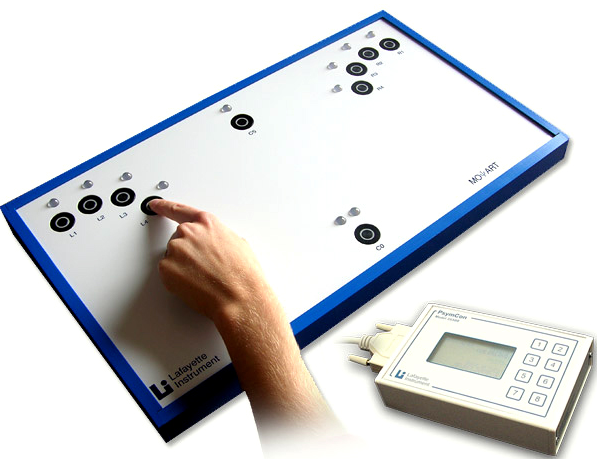

```{r setup, include = FALSE}
options(htmltools.dir.version = FALSE)
```

```{r additional, echo = FALSE}
library(kableExtra)
library(tidyverse)
```

```{r xaringanExtra, echo = FALSE}
xaringanExtra::use_xaringan_extra(c("freezeframe", "tachyons"))
```


class: title-slide-section-gold, bottom

# Review from last lecture

---

## There are .grey[two basic control systems] that guide action

We have discussed two sources of information that help us control our actions:

1. Interoceptive information (e.g., touch, proprioception)

2. Exteroceptive information (e.g., vision)

<br>

.black[CLOSED-LOOP CONTROL]: a class of control in which, **during** the course of an action, feedback is **compared** against a standard (or reference) to enable an action to be carried out as planned

.black[OPEN-LOOP CONTROL]: a class of control in which **all** the information needed to initiate and carry out an action as planned is contained in the **initial instructions** to the effectors

---

## Feedback provides a means for .grey[achieving] control objectives

- *Our driving example again*:
  - Speed limit is 50 km/h
  - Your speed is 60 km/h
  - Error is -10 km/h (50 - 60)

- A common alternative term for closed-loop control is **error-correcting feedback control**

- Fundamental objective of this class of control is to **reduce errors to 0** or **as close to 0** as makes no practical difference

---

## Feedback provides a means for .grey[achieving] control objectives

.footnote[Fig: Tresilian 2012]

.center[

]

---

## Closed-loop control can be .grey[ineffective] when there are .grey[time delays]

.footnote[Tresilian 2012]

.center[

]

---

## In the .grey[absence of disturbances], control may be possible .grey[without] using feedback

.footnote[Tresilian 2012]

.pull-left[
.black[Open-loop control]: a style of control in which the output of the controlled system is not fed back to the controller. What the controlled system is actually doing has no effect on the control inputs supplied by the controller

Open-loop control **requires detailed knowledge** about the controlled system
]

.pull-right[.center[

]]

---

background-image: url(imgs/wadman-etal.png)
background-size: contain

.footnote[Wadman et al. 1979]

---

## Lift finger to .grey[stop] sweep hand at .grey[10 o'clock] position

.pull-left[.center[

]]

.pull-right[.center[

]]

---

class: inverse, middle, center

# Any questions?

---

background-image: url(imgs/reaction-time.png)
background-size: contain

---

# Learning objectives

1. Discuss how reaction time can be used as an **index of motor preparation**.

2. Identify and describe the **3 stages** of information-processing.

3. Describe how the **property** of a stimulus can influence reaction time.

4. Explain how **Hick's Law** describes the relationship between the number of response choices and reaction time using examples.

--

.bg-gold.b--mid-gray.ba.bw2.br3.shadow-5.ph4.mt5[
.tc[
.black[<ins>Take-home message</ins>:

Although reaction time is one of the simplest performance measures, its use has had a profound influence on the development of motor behaviour research. 
]]]

---

## A key .grey[assumption] of the information-processing model is that the stages are .grey[non-overlapping]

.center[

]

---

## Recall our .grey[three types of reaction time] tasks

.center[

]

- The **stages** in our information-processing model are **differentially** impacted by the **type** of reaction time task being performed

---

## Stimulus .grey[modality] influences simple reaction time

.footnote[*Hypothetical data for illustrative purposes*]

```{r echo=FALSE}
# Create some hypothetical data
modality_rt <- tibble::tibble(
  modality = c("Auditory", "Tactile", "Visual", "Visual+Auditory"),
  time = c(158, 171, 188, 145)
)
```


```{r echo=FALSE, fig.width=14}
# Create plot
ggplot2::ggplot(modality_rt, aes(x = modality, y = time)) +
  geom_bar(stat = "identity", size = 2, fill = "#ffffff", color = c("#272822", "#272822", "#272822", "#fdbf57")) +
  scale_y_continuous(name = "Reaction time (ms)",
                       limits = c(0, 200),
                       breaks = seq(0, 200, 20)) +
  scale_x_discrete(name = "Stimulus modality") +
  coord_flip() +
  theme(
    axis.title = element_text(face = "bold", size = 20),
    axis.text = element_text(size = 18)
  )
```

---

## Stimulus .grey[intensity] influences simple reaction time

.footnote[*Hypothetical data for illustrative purposes*]

```{r echo=FALSE, fig.width=14}
# Create some hypothetical data and plot it
intensity_rt <- function(x) {2^(-x*2)}
ggplot2::ggplot(data.frame(x = seq(0, 5, 0.00001)), aes(x = x)) +
  stat_function(fun = intensity_rt, size = 1.5) +
  scale_y_continuous(name = "Reaction time (ms)",
                     limits = c(-0.25, 1)) +
  scale_x_continuous(name = "Stimulus Intensity (db)") +
  theme(
    axis.title = element_text(face = "bold", size = 20),
    axis.text = element_blank(),
    axis.ticks = element_blank()
  ) +
  annotate(geom = "text", x = 0.25, y = -0.2, label = "Low intensity", size = 7) +
  annotate(geom = "text", x = 4.75, y = -0.2, label = "High intensity", size = 7)
```

---

## A .grey[real-world example] of a stimulus intensity effect

.footnote[Brown et al. 2008 (https://doi.org/10.1249/mss.0b013e31816770e1)]

.left-column[
<br>
Mean reaction time data (and standard deviation) from the 100 m sprint and 110/100 m hurdles events grouped according to starting position. 2004 Olympic Games
]

.right-column[.center[

]]

---

class: title-slide-section-gold, middle

# *How does product design affect the user experience?*

---

background-image: url(https://2qrvzf20gyjyyrbe93pemsx1-wpengine.netdna-ssl.com/wp-content/uploads/2016/11/Flashing-Red-Light.jpg)
background-size: cover

---

background-image: url(https://m.media-amazon.com/images/M/MV5BMTYzMjc0NjI0NF5BMl5BanBnXkFtZTYwODE3NjU3._V1_.jpg)
background-size: cover

---

background-image: url(https://i2.wp.com/datasovereigntynow.org/wp-content/uploads/2020/12/traffic-lights.jpg)
background-size: cover

---

background-image: url(https://www.ctvnews.ca/polopoly_fs/1.5098288.1599683145!/httpImage/image.png_gen/derivatives/landscape_1020/image.png)
background-size: cover

---

## Studying the impact of the number of .grey[stimulus-response alternatives] on reaction time in the lab

.pull-left[.center[

]]

--

.pull-right[.center[

]]

---

## Reaction time .grey[increases] with the number of stimulus-response alternatives

.footnote[Approximate data from Merkel 1885 through plot digitization]

```{r echo=FALSE}
# Create tibble from digitizing a plot of the data from Merkel 1885
merkel <- tibble::tibble(
  choices = c(seq(1, 10)),
  rt = c(174.67, 311.15, 372.96, 427.03, 493.99, 546.78, 585.40, 616.30, 630.47, 639.48)
)
```

.pull-left[
```{r echo=FALSE, fig.align='center', fig.height=5.75}
ggplot2::ggplot(merkel, aes(x = choices, y = rt)) +
  geom_line(size = 1) +
  geom_point(size = 4, color = "#ac1455") +
  scale_y_continuous(name = "Reaction time (ms)",
                     limits = c(100, 700),
                     breaks = seq(100, 700, 100)) +
  scale_x_continuous(name = "Number of S-R alternatives",
                     limits = c(1, 10),
                     breaks = seq(1, 10, 1)) +
  theme(
    axis.title = element_text(face = "bold", size = 20),
    axis.text = element_text(size = 18)
  )
```
]

--

.pull-right[
```{r echo=FALSE, message=FALSE, fig.align='center', fig.height=5.75}
ggplot2::ggplot(merkel, aes(x = choices, y = rt)) +
  geom_line(size = 0.75, linetype = "dashed") +
  geom_smooth(method = "lm", se = FALSE, color = "#fdbf57", size = 2) +
  geom_point(size = 4, color = "#ac1455") +
  scale_y_continuous(name = "Reaction time (ms)",
                     limits = c(100, 700),
                     breaks = seq(100, 700, 100)) +
  scale_x_continuous(name = "Number of S-R alternatives",
                     trans = "log2",
                     limits = c(1, 14)) +
  theme(
    axis.title = element_text(face = "bold", size = 20),
    axis.text = element_text(size = 18)
  ) +
  annotate(geom = "text", x = c(1, 2, 4, 8), y = c(rep(115, 4)), label = c("0", "1", "2", "3"), size = 6) +
  annotate(geom = "segment", x = 10, y = 112, xend = 8.5, yend = 112, arrow = arrow(length = unit(2, "mm")), size = 1) +
  annotate(geom = "text", x = 10.1, y = 112, label = "Log[2](N)", hjust = "left", size = 6.5, parse = TRUE)
```
]

---

## The number of choice and reaction time can be capture with a .grey[log-linear] equation

.pull-left[
### $RT = a + b\log_{2}(N)$

where:
- *a* = y-intercept
- *b* = slope
- *N* = number of S-R alternatives
- log<sub>2</sub>(*N*) = **bits** of information

**One bit** = the amount of information needed to reduce the original uncertainty in half
]

--

.pull-right[
*Converting S-R alternatives to bits (i.e., amount of information)*
.center[

]]

---

## Understanding the .grey[parameters *a* and *b*] in the equation for Hick's Law

.pull-left[
The **y-intercept** (*a*) is the expected reaction time when no choice is required (i.e., simple reaction time task)

.center[

]]

--

.pull-right[
The **slope** (*b*) is the expected increase in reaction time when the number of S-R alternatives is doubled

.center[

]]

---

## .grey[Exceptions] to Hick's Law

- If stimulus is **tactile**
  - *Direct stimulus-response relationship*

- If response is a **saccade**
  - *Saccade toward targets are natural and biologically important*

- If **extended practice** is undertaken
  - *42,000 practice trials eliminated typical RT difference between 2- and 4-choice tasks*

---

class: title-slide-section-gold, middle

# *How can <ins>**Hick's Law**</ins> be used to create better user experiences?*

---

background-image: url(https://miro.medium.com/max/2000/1*r0h4UwjJavVS3OqACDv3PQ.jpeg)
background-size: cover

.footnote[Source: https://miro.medium.com/max/2000/1*r0h4UwjJavVS3OqACDv3PQ.jpeg]

---

background-image: url(https://i.gifer.com/6E2k.gif)
background-size: contain

.footnote[Source: https://i.gifer.com/6E2k.gif]

---

class: title-slide-section-gold, middle

# *Let's return to our traffic lights...*

---

background-image: url(imgs/better-traffic-lights.png)
background-size: cover

---

# Learning objectives

1. Identify and describe the **3 stages** of information-processing.

2. Discuss how reaction time can be used as an **index of motor preparation**.

3. Describe how the **property** of a stimulus can influence reaction time.

4. Explain how **Hick's Law** describes the relationship between the number of response choices and reaction time using examples.

.bg-gold.b--mid-gray.ba.bw2.br3.shadow-5.ph4.mt5[
.tc[
.black[<ins>Take-home message</ins>:

Although reaction time is one of the simplest performance measures, its use has had a profound influence on the development of motor behaviour research. 
]]]

---

class: title-slide-final, middle
background-image: url(https://raw.githubusercontent.com/cartermaclab/mackin-xaringan/main/imgs/logos/mcmaster-stack-color.png)
background-size: 95px
background-position: 9% 15%

# What questions do you have?

<br>

|                                                                                                                |                                   |
| :------------------------------------------------------------------------------------------------------------- | :-------------------------------- |
| <a href="mailto:michaelcarter@mcmaster.ca">.mackinred[<i class="fa fa-paper-plane fa-fw"></i>]                         | michaelcarter@mcmaster.ca                 |
| <a href="https://cartermaclab.org">.mackinred[<i class="fa fa-link fa-fw"></i>]                                       | www.cartermaclab.org                        |
| <a href="https://twitter.com/cartermaclab">.mackinred[<i class="fa fa-twitter fa-fw"></i>]                          | @cartermaclab                         |
| <a href="https://github.com/cartermaclab">.mackinred[<i class="fa fa-github fa-fw"></i>]                              | @cartermaclab                           |

