```{r setup, include = FALSE}
options(htmltools.dir.version = FALSE)
```

```{r additional, echo = FALSE}
library(kableExtra)
library(tidyverse)
```

```{r xaringanExtra, echo = FALSE}
xaringanExtra::use_xaringan_extra(c("clipboard",
                                    "freezeframe",
                                    "panelset",
                                    "scribble",
                                    "tachyons", 
                                    "tile_view"))
```


class: title-slide-section-gold, bottom

# Review from last lecture

---

## Stimulus-response .grey[compatibility]

.pull-left[.center[
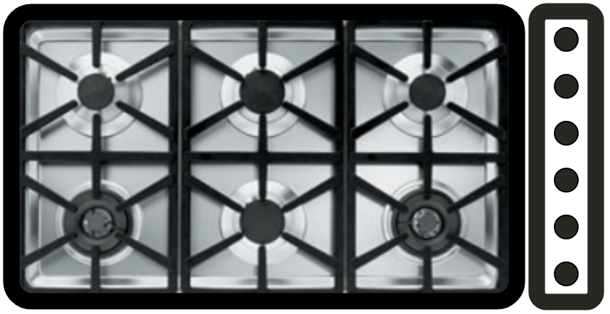


]]

.pull-right[
- refers to the **naturalness** of the mapping between the **stimulus** and the **required response**

- when compatibility is **high**...
  - **faster** learning
  - **faster** reaction times
  - **fewer** errors
  - **lower** mental workload
  - **higher** user satisfaction

- most common type is **spatial** compatibility
]

---

## A .grey[simple setup] to study S-R compatibility in the lab

.center[

]

---

.pull-left[.center[
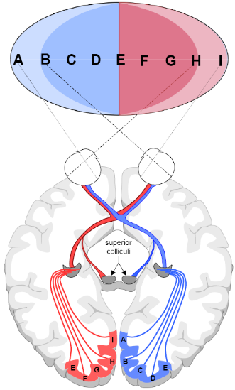
]]

.pull-right[.center[

]]

.footnote[Left: Tresilian 2012 ; Right: Kandel et al. 2013]

---

## How can we .grey[dissociate] between the spatial and anatomical explanations?

.center[

]

---

## Which explanation is .grey[supported] by this data?

.footnote[*Hypothetical data for illustrative purposes*]

.pull-left[
```{r echo=FALSE, fig.align='center', fig.height=6.5}
ggplot2::ggplot(normal_hands, aes(x = response, y = rt, group = stimulus, color = stimulus, shape = stimulus)) +
  geom_line(size = 1.5) +
  geom_point(size = 5) +
  scale_y_continuous(name = "Reaction time (ms)",
                     limits = c(250, 500),
                     breaks = seq(250, 500, 25)) +
  scale_x_discrete(name = "Normal hand placement") +
  scale_color_manual(values = c("#ac1455", "#fdbf57")) +
  theme(
    legend.text = element_text(size = 18),
    legend.title = element_blank(),
    legend.position = c(0.8, 0.9),
    axis.title = element_text(face = "bold", size = 20),
    axis.text = element_text(size = 18)
  )
```
]

.pull-right[
```{r echo=FALSE}
# Create tibble of hypothetical normal hands S-R compatibility data
crossed_hands <- tibble::tibble(
  stimulus = c("Left stimulus", "Left stimulus", "Right stimulus", "Right stimulus"),
  response = c("Left key", "Right key", "Left key", "Right key"),
  rt = c(362, 489, 476, 359)
)
```

```{r echo=FALSE, fig.align='center', fig.height=6.5}
ggplot2::ggplot(crossed_hands, aes(x = response, y = rt, group = stimulus, color = stimulus, shape = stimulus)) +
  geom_line(size = 1.5, linetype = "dotted") +
  geom_point(size = 5) +
  scale_y_continuous(name = "Reaction time (ms)",
                     limits = c(250, 500),
                     breaks = seq(250, 500, 25)) +
  scale_x_discrete(name = "Crossed hand placement") +
  scale_color_manual(values = c("#ac1455", "#fdbf57")) +
  theme(
    legend.text = element_text(size = 18),
    legend.title = element_blank(),
    legend.position = "none",
    axis.title = element_text(face = "bold", size = 20),
    axis.text = element_text(size = 18)
  )
```
]

---

## Reaction time .grey[increases] with response complexity

.footnote[Maslovat et al. 2019 (https://doi.org/10.1016/j.neulet.2019.03.056)]

.center[
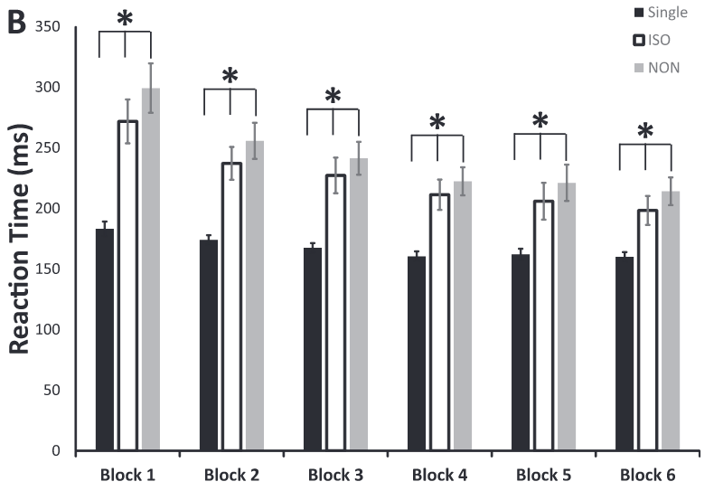
]

---

class: inverse, middle, center

# Any questions?

---

class: middle, center

# What is attention?

---

## What is .grey[attention]?

> *Everyone knows what **attention** is. It is the taking possession by the mind, in clear and vivid form, of one out of what seem several simultaneously possible objects or trains of thought. Focalization, concentration of consciousness, is of its essence. It implies withdrawal from some things in order to deal effectively with others.*
> .tr[
William James 1890
]

--

.center[
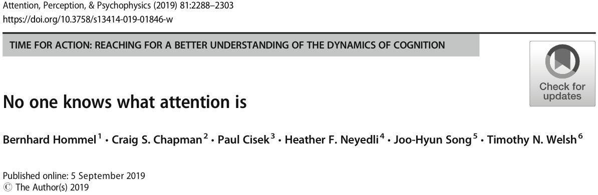
]

---

# Learning objectives

1. Define the term **attention** as it relates to the performance of motor skills.

2. Describe how researchers can **assess** the attention demands of performing a motor skill and how attention **may limit** information-processing activities during task performance.

3. Describe the difference between **symmetric** and **asymmetric** bimanual coordination and discuss why asymmetric is **more challenging** than symmetric.

--

.bg-gold.b--mid-gray.ba.bw2.br3.shadow-5.ph4.mt5[
.tc[
.black[<ins>Take-home message</ins>:

The performance of any motor skill is affected by cognitive, motor, and biomechanical factors.
]]]

---

## What is .grey[attention]?

- **limited capacity** to engage in multiple cognitive and/or motor activities **simultaneously**

- **selective** attention to specific **environmental features** when we perform motor skills
  - this can happen either through **intentional** or **incidental** processes

--

<br>

- in **multi-task** situations, performance can suffer for two broad reasons:
  - **structural interference** occurs when physical or neurological structures are the cause of the reduced performance (e.g., eyes, limbs, etc)
  
  - **capacity interference** occurs when required attentional resources exceeds some attentional limit

---

## We can leverage .grey[interference] as an .grey[indirect] measure of attention

.footnote[Right fig: Schmidt & Lee 2011]

.left-column[
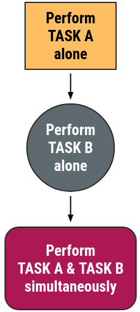
]

--

.center[
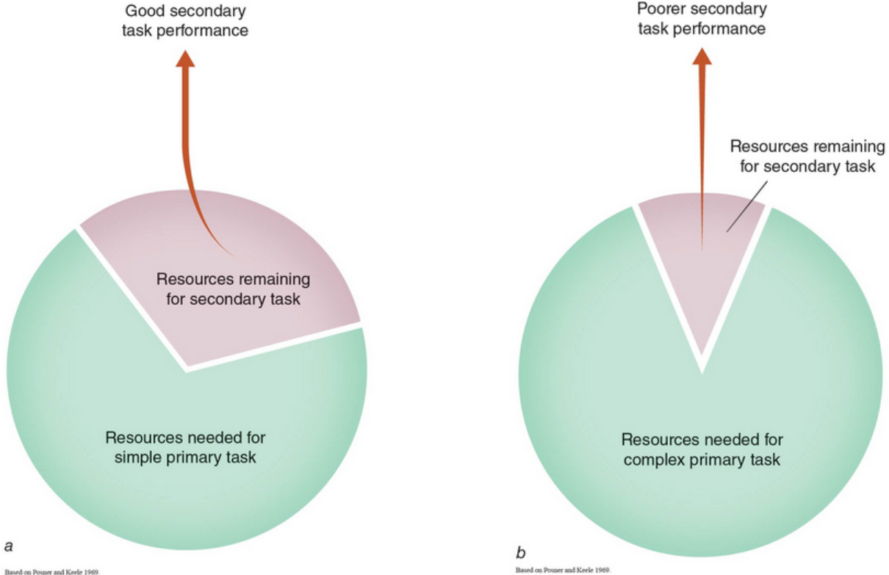
]

---

## We can use a .grey[probe reaction time task] to gauge the attention demands of an action

.footnote[*Approximate data from Posner and Keele 1969 through plot digitization*]

.pull-left[
**Primary task**
- Reach to a target (small or large)

**Secondary task**
- Simple reaction time task of pressing a button as quickly as possible whenever you hear an auditory tone

The auditory probe could be **presented randomly** at **6 possible positions** in the movement: 0, 15, 45, 75, 105, or 135 degrees
]

--

.pull-right[
```{r echo=FALSE}
# Create tibble of digitized Posner & Keele 1969 data
probe_rt <- tibble::tibble(
  position = c(0, 15, 45, 75, 105, 135, 0, 15, 45, 75, 105, 135),
  target = c(rep("Small target", 6), rep("Large target", 6)),
  rt = c(457.64, 374.66, 352.61, 329.98, 346.81, 393.23, 444.29, 330.56, 313.15, 292.84, 299.81, 327.66)
)
```

```{r echo=FALSE, fig.align='center', fig.height=5.75}
ggplot2::ggplot(probe_rt, aes(x = position, y = rt, group = target, color = target, shape = target)) +
  geom_line(aes(linetype = target), size = 1) +
  geom_point(size = 4) +
  scale_y_continuous(name = "Reaction time (ms)",
                     limits = c(200, 500),
                     breaks = seq(200, 500, 50)) +
  scale_x_continuous(name = "Position in movement (degs)",
                     limits = c(0, 135),
                     breaks = c(0, 15, 45, 75, 105, 135)) +
  scale_color_manual(values = c("#ac1455", "#fdbf57")) +
  scale_linetype_manual(values = c(1, 2)) +
  theme(
    legend.text = element_text(size = 18),
    legend.title = element_blank(),
    legend.position = c(0.8, 0.9),
    axis.title = element_text(face = "bold", size = 20),
    axis.text = element_text(size = 18)
  ) +
  geom_hline(yintercept = 258.03, size = 1) +
  annotate(geom = "curve", x = 15, y = 225, xend = 0, yend = 250, curvature = -.3, arrow = arrow(length = unit(2, "mm"))) +
  annotate(geom = "text", x = 16, y = 225, label = "Probe (control) RT without any movement", hjust = "left", size = 6)
```
]

---

.footnote[Source: https://youtu.be/ZaaK36mX_Pk]

.center[
<iframe width="1050" height="575" src="https://www.youtube.com/embed/ZaaK36mX_Pk" title="YouTube video player" frameborder="0" allow="accelerometer; autoplay; clipboard-write; encrypted-media; gyroscope; picture-in-picture" allowfullscreen></iframe>
]

---

## The .grey[time between] the presentation of two stimuli can have a .grey[strong influence] on performance

.footnote[*Approximate data from Posner and Keele 1969 through plot digitization*]

.black[Task 1 alone]: **Say** a word (e.g., *"TOP"*) as quickly as possible when you **hear** an auditory cue

.black[Task 2 alone]: **Press** a key with your right hand when you **see** a visual cue

.black[Sequential]: Perform Task 1 **then** Task 2 but **manipulate** time **between** the auditory and visual cues

---

## The .grey[time between] the presentation of two stimuli can have a .grey[strong influence] on performance

<br>

.center[
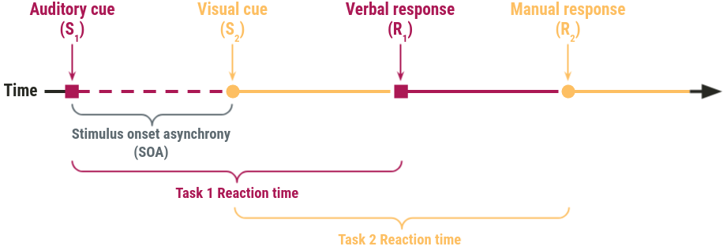
]

---

## Psychological refractory period (PRP) .grey[decreases] as SOA .grey[increases]

.footnote[*Approximate data of Davis 1959 through plot digitization of adapted figure in Schmidt & Lee 2011*]

.pull-left[
.black[Task 1 reaction time]: 161 ms

.black[Task 2 (control) reaction time]: 128 ms

<br>
*We need to **compare** the reaction times of **Task 2 in the sequential condition** (Task 1 then Task 2) to the **Task 2 alone** (i.e., control condition) to determine whether a **PRP** happened*
]

--

.pull-right[
```{r echo=FALSE}
# Create tibble of digitized Davis 1959 data
prp <- tibble::tibble(
  soa = c(50, 100, 150, 200, 250, 300, 350, 400, 450, 500),
  rt = c(259.33, 221.99, 204.62, 172.08, 146.21, 135.49, 135.51, 126.25, 123.66, 134.75)
)
```

```{r echo=FALSE, fig.align='center', fig.height=5.75}
ggplot2::ggplot(prp, aes(x = soa, y = rt)) +
  geom_line(size = 1) +
  geom_point(size = 4, color = "#ac1455") +
  scale_y_continuous(name = "Reaction time (ms)",
                     limits = c(75, 275),
                     breaks = seq(75, 275, 25)) +
  scale_x_continuous(name = "Stimulus onset asynchrony (ms)",
                     limits = c(0, 500),
                     breaks = seq(0, 500, 50)) +
  theme(
    legend.text = element_text(size = 18),
    legend.title = element_blank(),
    legend.position = c(0.8, 0.9),
    axis.title = element_text(face = "bold", size = 20),
    axis.text = element_text(size = 18)
  ) +
  geom_hline(yintercept = 128, size = 1, linetype = "dashed") +
  annotate(geom = "curve", x = 50, y = 115, xend = 0, yend = 125, curvature = -.3, arrow = arrow(length = unit(2, "mm"))) +
  annotate(geom = "text", x = 51, y = 115, label = "Task 2 alone reaction time", hjust = "left", size = 6)
  
```

]

---

## The .grey[psychological refractory period] in action...

.footnote[Video: https://youtu.be/WMB4k-OINM0]

.center[
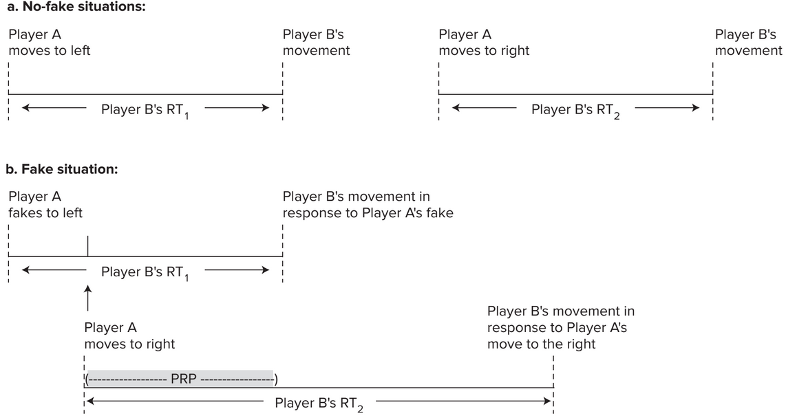
]

---

.footnote[Source: https://youtu.be/Yoh9K4mllos]

.center[
<iframe width="1050" height="575" src="https://www.youtube.com/embed/Yoh9K4mllos" title="YouTube video player" frameborder="0" allow="accelerometer; autoplay; clipboard-write; encrypted-media; gyroscope; picture-in-picture" allowfullscreen></iframe>
]

---

class: title-slide-section-gold, middle, center

--

## Why are these seemingly *simple* tasks so difficult?

---

.center[
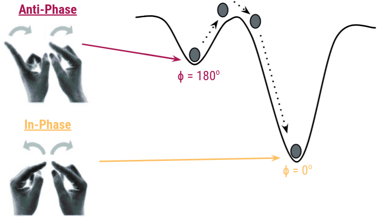
]

---

.footnote[Source: https://youtu.be/zx53Zj7EKQE]

.center[
<iframe width="1050" height="575" src="https://www.youtube.com/embed/zx53Zj7EKQE?start=101" title="YouTube video player" frameborder="0" allow="accelerometer; autoplay; clipboard-write; encrypted-media; gyroscope; picture-in-picture" allowfullscreen></iframe>
]

---

## Rapid bimanual reaches .grey[with/without] an obstacle?

.center[
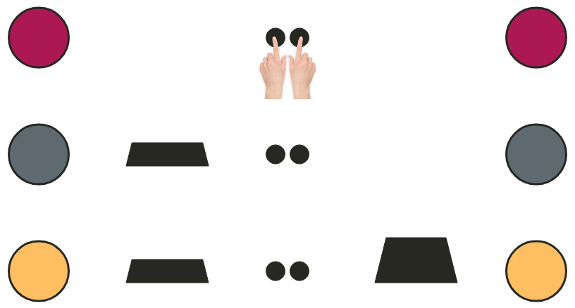
]

---

background-image: url(imgs/kelso-left-hurdle.png)
background-size: 35%
background-position: 95% 93%

## Rapid bimanual reaches .grey[with/without] an obstacle?

.footnote[Kelso et al 1983 (http://dx.doi.org/10.1080/14640748308402139)]

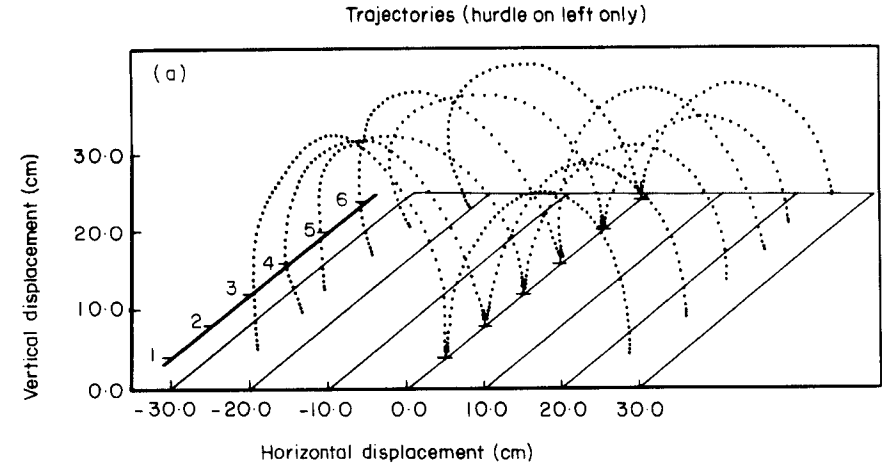

---

# Learning objectives

1. Define the term **attention** as it relates to the performance of motor skills.

2. Describe how researchers can **assess** the attention demands of performing a motor skill and how attention **may limit** information-processing activities during task performance.

3. Describe the difference between **symmetric** and **asymmetric** bimanual coordination and discuss why asymmetric is **more challenging** than symmetric.

.bg-gold.b--mid-gray.ba.bw2.br3.shadow-5.ph4.mt5[
.tc[
.black[<ins>Take-home message</ins>:

The performance of any motor skill is affected by cognitive, motor, and biomechanical factors.
]]]

---

class: title-slide-final, middle
background-image: url(https://raw.githubusercontent.com/cartermaclab/mackin-xaringan/main/imgs/logos/mcmaster-stack-color.png)
background-size: 95px
background-position: 9% 15%

# What questions do you have?


|                                                                                                                |                                   |
| :------------------------------------------------------------------------------------------------------------- | :-------------------------------- |
| <a href="https://cartermaclab.org">.mackinred[<i class="fa fa-link fa-fw"></i>]                                       | www.cartermaclab.org                        |
| <a href="https://twitter.com/cartermaclab">.mackinred[<i class="fa fa-twitter fa-fw"></i>]                          | @cartermaclab                         |
| <a href="https://github.com/cartermaclab">.mackinred[<i class="fa fa-github fa-fw"></i>]                              | @cartermaclab                           |
