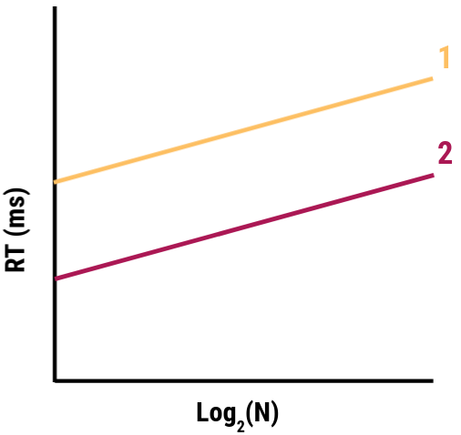

```{r setup, include = FALSE}
options(htmltools.dir.version = FALSE)
```

```{r additional, echo = FALSE}
library(kableExtra)
library(tidyverse)
```

```{r xaringanExtra, echo = FALSE}
xaringanExtra::use_xaringan_extra(c("clipboard",
                                    "freezeframe",
                                    "panelset",
                                    "scribble",
                                    "tachyons", 
                                    "tile_view"))
```


class: title-slide-section-gold, bottom

# Review from last lecture

---

## What is .grey[attention]?

- **limited capacity** to engage in multiple cognitive and/or motor activities **simultaneously**

- **selective** attention to specific **environmental features** when we perform motor skills
  - this can happen either through **intentional** or **incidental** processes

<br>

- in **multi-task** situations, performance can suffer for two broad reasons:
  - **structural interference** occurs when physical or neurological structures are the cause of the reduced performance (e.g., eyes, limbs, etc)
  
  - **capacity interference** occurs when required attentional resources exceeds some attentional limit

---

## We can use a .grey[probe reaction time task] to gauge the attention demands of an action

.footnote[*Approximate data from Posner and Keele 1969 through plot digitization*]

.pull-left[
**Primary task**
- Reach to a target (small or large)

**Secondary task**
- Simple reaction time task of pressing a button as quickly as possible whenever you hear an auditory tone

The auditory probe could be **presented randomly** at **6 possible positions** in the movement: 0, 15, 45, 75, 105, or 135 degrees
]

.pull-right[
```{r echo=FALSE}
# Create tibble of digitized Posner & Keele 1969 data
probe_rt <- tibble::tibble(
  position = c(0, 15, 45, 75, 105, 135, 0, 15, 45, 75, 105, 135),
  target = c(rep("Small target", 6), rep("Large target", 6)),
  rt = c(457.64, 374.66, 352.61, 329.98, 346.81, 393.23, 444.29, 330.56, 313.15, 292.84, 299.81, 327.66)
)
```

```{r echo=FALSE, fig.align='center', fig.height=5.75}
ggplot2::ggplot(probe_rt, aes(x = position, y = rt, group = target, color = target, shape = target)) +
  geom_line(aes(linetype = target), size = 1) +
  geom_point(size = 4) +
  scale_y_continuous(name = "Reaction time (ms)",
                     limits = c(200, 500),
                     breaks = seq(200, 500, 50)) +
  scale_x_continuous(name = "Position in movement (degs)",
                     limits = c(0, 135),
                     breaks = c(0, 15, 45, 75, 105, 135)) +
  scale_color_manual(values = c("#ac1455", "#fdbf57")) +
  scale_linetype_manual(values = c(1, 2)) +
  theme(
    legend.text = element_text(size = 18),
    legend.title = element_blank(),
    legend.position = c(0.8, 0.9),
    axis.title = element_text(face = "bold", size = 20),
    axis.text = element_text(size = 18)
  ) +
  geom_hline(yintercept = 258.03, size = 1) +
  annotate(geom = "curve", x = 15, y = 225, xend = 0, yend = 250, curvature = -.3, arrow = arrow(length = unit(2, "mm"))) +
  annotate(geom = "text", x = 16, y = 225, label = "Probe (control) RT without any movement", hjust = "left", size = 6)
```
]

---

## The .grey[time between] the presentation of two stimuli can have a .grey[strong influence] on performance

<br>

.center[

]

---

## Psychological refractory period (PRP) .grey[decreases] as SOA .grey[increases]

.footnote[*Approximate data of Davis 1959 through plot digitization of adapted figure in Schmidt & Lee 2011*]

.pull-left[
.black[Task 1 reaction time]: 161 ms

.black[Task 2 (control) reaction time]: 128 ms

<br>
*We need to **compare** the reaction times of **Task 2 in the sequential condition** (Task 1 then Task 2) to the **Task 2 alone** (i.e., control condition) to determine whether a **PRP** happened*
]

.pull-right[
```{r echo=FALSE}
# Create tibble of digitized Davis 1959 data
prp <- tibble::tibble(
  soa = c(50, 100, 150, 200, 250, 300, 350, 400, 450, 500),
  rt = c(259.33, 221.99, 204.62, 172.08, 146.21, 135.49, 135.51, 126.25, 123.66, 134.75)
)
```

```{r echo=FALSE, fig.align='center', fig.height=5.75}
ggplot2::ggplot(prp, aes(x = soa, y = rt)) +
  geom_line(size = 1) +
  geom_point(size = 4, color = "#ac1455") +
  scale_y_continuous(name = "Reaction time (ms)",
                     limits = c(75, 275),
                     breaks = seq(75, 275, 25)) +
  scale_x_continuous(name = "Stimulus onset asynchrony (ms)",
                     limits = c(0, 500),
                     breaks = seq(0, 500, 50)) +
  theme(
    legend.text = element_text(size = 18),
    legend.title = element_blank(),
    legend.position = c(0.8, 0.9),
    axis.title = element_text(face = "bold", size = 20),
    axis.text = element_text(size = 18)
  ) +
  geom_hline(yintercept = 128, size = 1, linetype = "dashed") +
  annotate(geom = "curve", x = 50, y = 115, xend = 0, yend = 125, curvature = -.3, arrow = arrow(length = unit(2, "mm"))) +
  annotate(geom = "text", x = 51, y = 115, label = "Task 2 alone reaction time", hjust = "left", size = 6)
```
]

---

.center[

]

---

## Rapid bimanual reaches .grey[with/without] an obstacle?

.center[

]

---

class: inverse, middle, center

# Any questions?

---

class: middle

.pull-left[.center[

]]

.pull-right[.center[

]]

---

## Movements can be made quickly at the .grey[cost of accuracy] or accurately at the .grey[cost of speed]

.pull-left[.center[

]]

.pull-right[.center[

]]

---

# Learning objectives

1. Identify and describe factors that **influence** movement **speed** and **accuracy**.

2. Explain **Fitts'** Law.

3. Identify and discuss practical examples of **speed-accuracy trade-offs** in every day life.

--

.bg-gold.b--mid-gray.ba.bw2.br3.shadow-5.ph4.mt5[
.tc[
.black[<ins>Take-home message</ins>:

The sensorimotor system is often faced with conflicting goals. Under such conditions, it has to achieve some sort of balance between these goals. 
]]]

---

background-image: url(imgs/fitts-reciprocal-task.png)
background-size: 52%
background-position: 80% 80%


## Target .grey[width] and movement .grey[amplitude] impact .grey[movement time]

.left-column[
.black[Instructions]: Make alternating movements between the targets as **quickly** and **accurately** as possible for a specified total time (e.g., 10 s)
]

---

## We can manipulate .grey[task difficulty] with changes in .grey[width] and/or .grey[amplitude]

.pull-left[
### $MT = a + b\log_{2}(2A/W)$

where:
- *a* = y-intercept
- *b* = slope
- *A* = amplitude
- *W* = width
- *log<sub>2</sub>(2A/W)* = **index of difficulty**

<br>
*Q: What does this remind you of?*
]

.pull-right[.center[

]]

---

## Calculating the .grey[index of difficulty]

.black[<ins>Different index of difficulty (ID) for same distance</ins>]

.pull-left[
**Amplitude = 2 cm | Target width = 2 cm**

$ID = \log_{2}(2A/W)$  

$ID = \log_{2}(2*2/2)$

$ID = \log_{2}(2)$

$ID = 1 \,bit$
]

.pull-right[
**Amplitude = 2 cm | Target width = 1 cm**

$ID = \log_{2}(2A/W)$  

$ID = \log_{2}(2*2/1)$

$ID = \log_{2}(4)$

$ID = 2 \,bits$
]

---

## Calculating the .grey[index of difficulty]

.black[<ins>Same index of difficulty (ID) for different distances and target widths</ins>]

.pull-left[
**Amplitude = 4 cm | Target width = 1 cm**

$ID = \log_{2}(4A/W)$  

$ID = \log_{2}(2*4/1)$

$ID = \log_{2}(8)$

$ID = 3 \,bits$
]

.pull-right[
**Amplitude = 8 cm | Target width = 2 cm**

$ID = \log_{2}(2A/W)$  

$ID = \log_{2}(2*8/2)$

$ID = \log_{2}(8)$

$ID = 3 \,bits$
]

---

## ID .grey[determines] movement time per tap

.footnote[*Reciprocal tapping task data from Fitts 1954 (https://doi.org/10.1037/h0055392) 1 oz stylus condition *]

```{r echo=FALSE}
# Create tibble of Fitts 1954 data
fitts <- tibble::tibble(
  target = c(rep("0.25 in", 4), rep("0.5 in", 4), rep("1 in", 4), rep("2 in", 4)),
  id = c(4, 5, 6, 7, 3, 4, 5, 6, 2, 3, 4, 5, 1, 2, 3, 4),
  rt = c(0.392, 0.484, 0.580, 0.731, 0.281, 0.372, 0.469, 0.595, 0.212, 0.260, 0.357, 0.481, 0.180, 0.203, 0.279, 0.388)
)
```

.pull-left[.center[
```{r echo=FALSE, message=FALSE, fig.align='center', fig.width=7.5, fig.height=7}
ggplot2::ggplot(fitts, aes(x = id, y = rt)) +
  geom_smooth(method = "lm", color = "#272822", se = FALSE, size = 2) +
  geom_point(aes(color = target, shape = target, fill = target), size = 5) +
  scale_y_continuous(name = "Movement time per tap (s)",
                     limits = c(0.1, 0.8),
                     breaks = seq(0.1, 0.8, 0.1)) +
  scale_x_continuous(name = "Index of difficulty (ID)",
                     limits = c(1, 7),
                     breaks = seq(1, 7, 1)) +
  scale_color_manual(values = c("#ac1455", "#fdbf57", "#007096", "#5e6a71")) +
  scale_fill_manual(values = c("#ac1455", "#fdbf57", "#007096", "#5e6a71")) +
  scale_shape_manual(values = c(21, 22, 23, 24)) +
  theme(
    legend.text = element_text(size = 18),
    legend.title = element_blank(),
    legend.position = c(0.89, 0.15),
    axis.title = element_text(face = "bold", size = 20),
    axis.text = element_text(size = 18)
  )
```
]]

.pull-right[.center[
.black[Low index of difficulty]


.black[High index of difficulty]

]]

---

## ID .grey[determines] movement time per tap

.footnote[*Reciprocal tapping task data from Fitts 1954 (https://doi.org/10.1037/h0055392) 1 oz stylus condition *]

.pull-left[.center[
```{r echo=FALSE, message=FALSE, fig.align='center', fig.width=7.5, fig.height=7}
ggplot2::ggplot(fitts, aes(x = id, y = rt)) +
  geom_smooth(method = "lm", color = "#272822", se = FALSE, size = 2) +
  geom_point(aes(color = target, shape = target, fill = target), size = 5) +
  scale_y_continuous(name = "Movement time per tap (ms)",
                     limits = c(0.1, 0.8),
                     breaks = seq(0.1, 0.8, 0.1)) +
  scale_x_continuous(name = "Index of difficulty (ID)",
                     limits = c(1, 7),
                     breaks = seq(1, 7, 1)) +
  scale_color_manual(values = c("#ac1455", "#fdbf57", "#007096", "#5e6a71")) +
  scale_fill_manual(values = c("#ac1455", "#fdbf57", "#007096", "#5e6a71")) +
  scale_shape_manual(values = c(21, 22, 23, 24)) +
  theme(
    legend.text = element_text(size = 18),
    legend.title = element_blank(),
    legend.position = c(0.89, 0.15),
    axis.title = element_text(face = "bold", size = 20),
    axis.text = element_text(size = 18)
  )
```
]]

.pull-right[<br>
- Movement **time per tap increases** as movement **amplitude increases**

- Movement **time per tap increases** as target **width decreases**

- Movement **time per tap is constant** for a **fixed ratio** of movement **amplitude** to target **width**

- Experience an online Fitts' task: http://fww.few.vu.nl/hci/interactive/fitts/
]

---

## Understanding the .grey[parameters *a* and *b*] in the equation for Fitts' Law

.pull-left[
The **y-intercept** (*a*) is the expected movement time per tap when ID = 0

.center[

]]

--

.pull-right[
The **slope** (*b*) is the expected increase in movement time when ID increases by 1 unit

.center[

]]

---

## .grey[Aging] affects .grey[both parameters] in the equation for Fitts' Law

.footnote[Data from Ketcham et al 2002 (https://doi.org/10.1093/geronb/57.1.P54)]

```{r echo=FALSE}
# Create tibble of Ketcham et al 2002 data
ketcham <- tibble::tibble(
  age = c(rep("Young adults", 5), rep("Elderly adults", 5)),
  id = c(rep(2:6, times = 2)),
  rt = c(333, 420, 527, 609, 717, 642, 741, 986, 1105, 1304)
)
```

.pull-left[
```{r echo=FALSE, fig.align='center', fig.height=5.75}
ggplot2::ggplot(ketcham, aes(x = id, y = rt, group = age, color = age, shape = age, linetype = age)) +
  geom_line(size = 1) +
  geom_point(size = 5) +
  scale_y_continuous(name = "Movement time per tap (ms)",
                     limits = c(200, 1400),
                     breaks = seq(200, 1400, 200)) +
  scale_x_continuous(name = "Index of difficulty (ID))",
                     limits = c(2, 6),
                     breaks = seq(2, 6, 1)) +
  scale_color_manual(values = c("#ac1455", "#fdbf57")) +
  scale_linetype_manual(values = c(2, 1)) +
  theme(
    legend.text = element_text(size = 18),
    legend.title = element_blank(),
    legend.position = c(0.2, 0.9),
    axis.title = element_text(face = "bold", size = 20),
    axis.text = element_text(size = 18)
  )
```
]

--

.pull-right[<br>
- **Larger intercept** in the **elderly** adults means unconstrained (i.e., minimal accuracy and amplitude demands) movements are **slower** than **young** adults

- **Larger slope** in the **elderly** adults means a more severe **speed-accuracy** trade-off than **young** adults
]

---

background-image: url(imgs/ketcham-etal.png)
background-position: 50% 80%
background-size: 55%

## Young adults' movements are .grey[smoother] and .grey[faster], with .grey[fewer corrections]

.footnote[Data from Ketcham et al 2002 (https://doi.org/10.1093/geronb/57.1.P54)]

---

## Golf club design .grey[impose] a .grey[speed-accuracy] trade-off

.footnote[Left: https://www.golfchannel.com/sites/default/files/styles/full/public/2018/03/06/gettyimages-923541572_master.jpg; Right: https://www.protourgolfcollege.com/uploads/5/6/1/5/5615801/522284_orig.png]

.pull-left[.center[
.black[Driver]


]]

.pull-left[.center[
.black[Iron]


]]

---

background-image: url(imgs/jones-etal.png)
background-size: 35%
background-position: 60% 85%

## Motor variability is .grey[proportional] to the force produced

.footnote[Jones et al 2002 (https://doi.org/10.1152/jn.2002.88.3.1533)]

.left-column[
.black[Instructions]: Participants are asked to **generate** and **maintain** a specific percent of their **max voluntary contraction**. As the required force level **increases**, participants show greater **variability in maintaining** the target force level.
]

---

## Motor variability is .grey[proportional] to the force produced

.footnote[Jones et al 2002 (https://doi.org/10.1152/jn.2002.88.3.1533)]

.pull-left[.center[

]]

.pull-right[.center[

]]

---

background-image: url(imgs/scott-loeb.png)
background-size: 26%
background-position: 65% 85%

## Proprioceptive error .grey[varies] with limb configuration

.footnote[Scott and Loeb 1994 (https://doi.org/10.1523/JNEUROSCI.14-12-07529.1994)]

.left-column[
.black[Instructions]: Participants are asked to **reach** to a peripheral target with **time limit**. As movement **distance** increased, participants showed **greater variability** in the **end-point distributions** of their **reaching** movements
]

---

# Learning objectives

1. Identify and describe factors that **influence** movement **speed** and **accuracy**.

2. Explain **Fitts'** Law.

3. Identify and discuss practical examples of **speed-accuracy trade-offs** in every day life.

.bg-gold.b--mid-gray.ba.bw2.br3.shadow-5.ph4.mt5[
.tc[
.black[<ins>Take-home message</ins>:

The sensorimotor system is often faced with conflicting goals. Under such conditions, it has to achieve some sort of balance between these goals. 
]]]

---

class: title-slide-final, middle
background-image: url(https://raw.githubusercontent.com/cartermaclab/mackin-xaringan/main/imgs/logos/mcmaster-stack-color.png)
background-size: 95px
background-position: 9% 15%

# What questions do you have?


|                                                                                                                |                                   |
| :------------------------------------------------------------------------------------------------------------- | :-------------------------------- |
| <a href="https://cartermaclab.org">.mackinred[<i class="fa fa-link fa-fw"></i>]                                       | www.cartermaclab.org                        |
| <a href="https://twitter.com/cartermaclab">.mackinred[<i class="fa fa-twitter fa-fw"></i>]                          | @cartermaclab                         |
| <a href="https://github.com/cartermaclab">.mackinred[<i class="fa fa-github fa-fw"></i>]                              | @cartermaclab                           |
