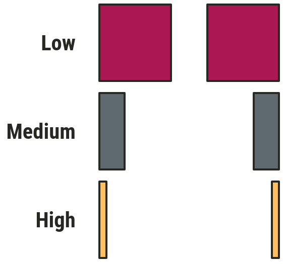
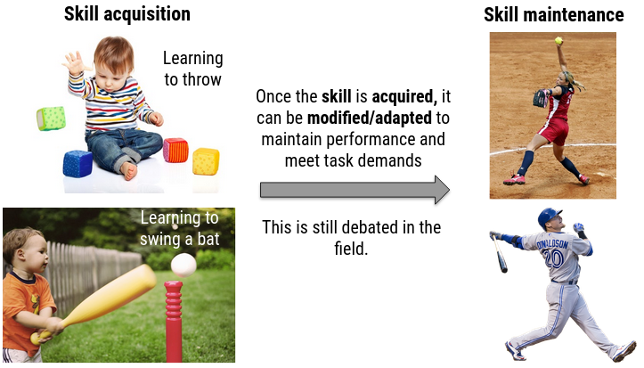
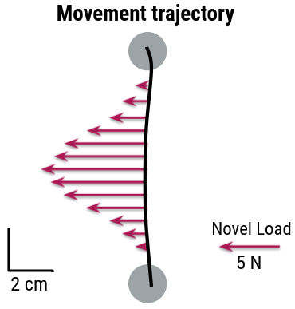
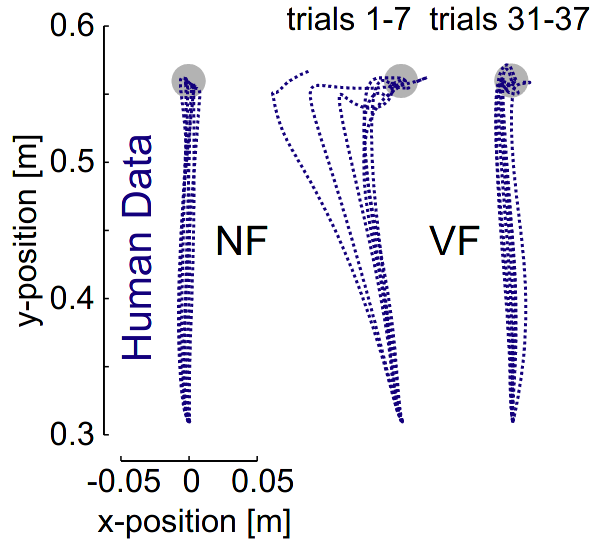
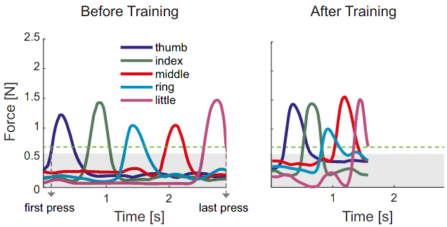
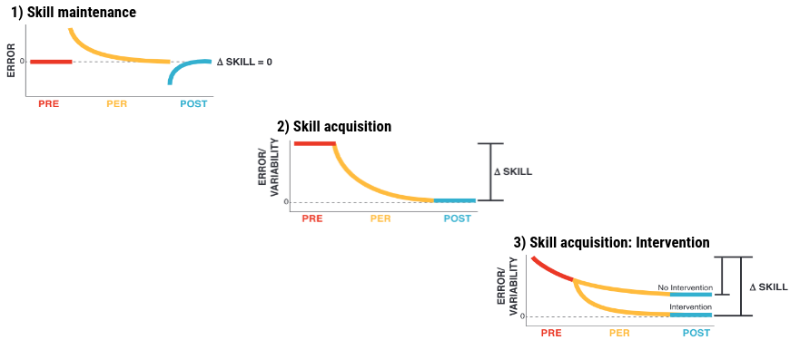
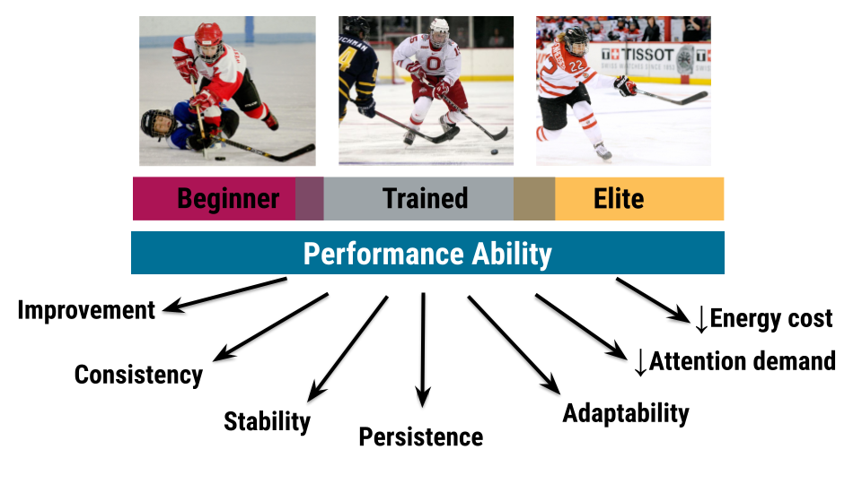
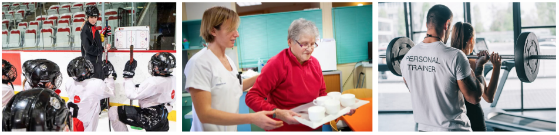

```{r setup, include=FALSE}
options(htmltools.dir.version = FALSE)
```

```{r additional, echo=FALSE, include = FALSE}
library(tidyverse)
```

```{r xaringanExtra, echo=FALSE, include = FALSE}
xaringanExtra::use_xaringan_extra(c("clipboard",
                                    "freezeframe",
                                    "panelset",
                                    "scribble",
                                    "tachyons", 
                                    "tile_view"))
```


class: title-slide-section-gold, bottom

# Review from last lecture

---

## The .grey[time between] the presentation of two stimuli can have a .grey[strong influence] on performance

.center[
]

---

## Psychological refractory period (PRP) .grey[decreases] as SOA .grey[increases]

.footnote[*Approximate data of Davis 1959 through plot digitization of adapted figure in Schmidt & Lee 2011*]

.pull-left[
.black[Task 1 reaction time]: 161 ms

.black[Task 2 (control) reaction time]: 128 ms

<br>
*We need to **compare** the reaction times of **Task 2 in the sequential condition** (Task 1 then Task 2) to the **Task 2 alone** (i.e., control condition) to determine whether a **PRP** happened*
]

--

.pull-right[
```{r echo=FALSE}
# Create tibble of digitized Davis 1959 data
prp <- tibble::tibble(
  soa = c(50, 100, 150, 200, 250, 300, 350, 400, 450, 500),
  rt = c(259.33, 221.99, 204.62, 172.08, 146.21, 135.49, 135.51, 126.25, 123.66, 134.75)
)
```

```{r echo=FALSE, fig.align='center', fig.height=5.75}
ggplot2::ggplot(prp, aes(x = soa, y = rt)) +
  geom_line(size = 1) +
  geom_point(size = 4, color = "#ac1455") +
  scale_y_continuous(name = "Reaction time (ms)",
                     limits = c(75, 275),
                     breaks = seq(75, 275, 25)) +
  scale_x_continuous(name = "Stimulus onset asynchrony (ms)",
                     limits = c(0, 500),
                     breaks = seq(0, 500, 50)) +
  theme(
    legend.text = element_text(size = 18),
    legend.title = element_blank(),
    legend.position = c(0.8, 0.9),
    axis.title = element_text(face = "bold", size = 20),
    axis.text = element_text(size = 18)
  ) +
  geom_hline(yintercept = 128, size = 1, linetype = "dashed") +
  annotate(geom = "curve", x = 50, y = 115, xend = 0, yend = 125, curvature = -.3, arrow = arrow(length = unit(2, "mm"))) +
  annotate(geom = "text", x = 51, y = 115, label = "Task 2 alone reaction time", hjust = "left", size = 6)
```
]

---

## We can manipulate .grey[task difficulty] with changes in .grey[width] and/or .grey[amplitude]

.pull-left[
### $MT = a + b\log_{2}(2A/W)$

where:
- *a* = y-intercept
- *b* = slope
- *A* = amplitude
- *W* = width
- *log<sub>2</sub>(2A/W)* = **index of difficulty**

<br>
*Q: What does this remind you of?*
]

.pull-right[.center[

]]

---

## ID .grey[determines] movement time per tap

.footnote[*Reciprocal tapping task data from Fitts 1954 (https://doi.org/10.1037/h0055392) 1 oz stylus condition *]

```{r echo=FALSE}
# Create tibble of Fitts 1954 data
fitts <- tibble::tibble(
  target = c(rep("0.25 in", 4), rep("0.5 in", 4), rep("1 in", 4), rep("2 in", 4)),
  id = c(4, 5, 6, 7, 3, 4, 5, 6, 2, 3, 4, 5, 1, 2, 3, 4),
  rt = c(0.392, 0.484, 0.580, 0.731, 0.281, 0.372, 0.469, 0.595, 0.212, 0.260, 0.357, 0.481, 0.180, 0.203, 0.279, 0.388)
)
```

.pull-left[.center[
```{r echo=FALSE, message=FALSE, fig.align='center', fig.width=7.5, fig.height=7}
ggplot2::ggplot(fitts, aes(x = id, y = rt)) +
  geom_smooth(method = "lm", color = "#272822", se = FALSE, size = 2) +
  geom_point(aes(color = target, shape = target, fill = target), size = 5) +
  scale_y_continuous(name = "Movement time per tap (s)",
                     limits = c(0.1, 0.8),
                     breaks = seq(0.1, 0.8, 0.1)) +
  scale_x_continuous(name = "Index of difficulty (ID)",
                     limits = c(1, 7),
                     breaks = seq(1, 7, 1)) +
  scale_color_manual(values = c("#ac1455", "#fdbf57", "#007096", "#5e6a71")) +
  scale_fill_manual(values = c("#ac1455", "#fdbf57", "#007096", "#5e6a71")) +
  scale_shape_manual(values = c(21, 22, 23, 24)) +
  theme(
    legend.text = element_text(size = 18),
    legend.title = element_blank(),
    legend.position = c(0.89, 0.15),
    axis.title = element_text(face = "bold", size = 20),
    axis.text = element_text(size = 18)
  )
```
]]

.pull-right[<br>
- Movement **time per tap increases** as movement **amplitude increases**

- Movement **time per tap increases** as target **width decreases**

- Movement **time per tap is constant** for a **fixed ratio** of movement **amplitude** to target **width**

- Experience an online Fitts' task: http://fww.few.vu.nl/hci/interactive/fitts/
]

---

class: inverse, middle, center

# Any questions?

---

# How do we go...

.pull-left[
.center[
from this $\Downarrow$


]
]

.pull-right[
.center[
to this $\Downarrow$


]
]

---

# Learning objectives

1. Define **motor learning**.

2. Describe and understand the **distinction** between performance and learning.

3. Identify and explain **general characteristics** of the learning process.

4. Understand how we **measure** motor performance and motor learning.

--

.bg-gold.b--mid-gray.ba.bw2.br3.shadow-5.ph4.mt5[
.tc[
.black[Take-home message:

Valid conclusions about motor learning depend on reliably separating relatively permanent effects on performance from transient effects on performance.
]]]

---

# Performance .grey[versus] learning

.pull-left[
.black[Performance]
- **Observable** behaviour
- **Temporary**
- **May not** be due to practice
- **Influenced** by performance variables
]

--

.pull-right[
.black[Learning]
- **Inferred** from performance
- **Relatively** permanent
- **Due** to practice
- **Not influenced** by performance variables
]

---

# Motor learning

.pull-left[.center[

]]

.pull-right[.center[

]]

<br>

> Motor learning is a **set of processes** resulting from **practice or experience** causing **relatively permanent gains** in the **capability for skilled performance**.
---

## Motor learning is an .grey[umbrella term] but there are (at least) .grey[two] main types

.footnote[Krakauer et al. 2019 (https://doi.org/10.1002/cphy.c170043)]

.black[SKILL ACQUISITION]: the processes by which an individual acquires the ability to identify an appropriate movement goal given a particular task context, select the correction action given a sensory stimulus and/or the current state of the body and the world, and execute that action with accuracy and precision

--

<br>
.black[SKILL MAINTENANCE]: the ability to maintain performance levels of existing skills under changing conditions

---

## Motor learning is an .grey[umbrella term] but there are (at least) .grey[two] main types

.center[

]

---

class: title-slide-section-gold, center, middle

## So how can we study motor learning?

---

## Skill .grey[maintenance]

An example of a skill maintenance paradigm is **force-field reaching**

.pull-left[

.tiny[Source: https://www.shadmehrlab.org/]
]

.pull-right[.center[

]]

---

## Skill .grey[maintenance]

An example of a skill maintenance paradigm is **force-field reaching**

.footnote[Right fig: Franklin et al. 2008 (https://doi.org/10.1523/JNEUROSCI.3099-08.2008)]

.pull-left[

.tiny[Source: https://www.shadmehrlab.org/]
]

.pull-right[

]

---

## Skill .grey[acquisition]

.footnote[Waters-Metenier et al. 2014 (https://doi.org/10.1523/JNEUROSCI.2282-13.2014)]

An example of a skill acquisition paradigm is **sequence learning**

.pull-left[.center[

]]

.pull-right[.center[

]]

---

## Skill .grey[acquisition]

.footnote[Waters-Metenier et al. 2014 (https://doi.org/10.1523/JNEUROSCI.2282-13.2014)]

An example of a skill acquisition paradigm is **sequence learning**

.pull-left[.center[

]]

.pull-right[.center[

]]

---

## Summary: Ways to .grey[study] motor learning

.footnote[Adapted from Sternad 2015 (https://doi.org/10.1016/j.cobeha.2018.01.004)]

.center[

]

---

## Practice is associated with, .grey[but does not guarantee], learning

.pull-left[.center[
**Good learner**


<br>
.tiny[Source: https://waxgolf.files.wordpress.com/2019/06/rory-mcilroy-drive.gif]
]]

.pull-right[.center[
**Poor learner**


<br>
.tiny[Source: https://clubhouse.swingu.com/wp-content/uploads/2020/04/charlesold.gif]
]]

---

## Learning produces .grey[relatively] permanent changes in performance

.center[

]

---

## We can observe .grey[7 performance characteristics] during the learning process

.center[

]

---

## Performance .grey[characteristics] of learning

1. .black[Improvement]: performance of the skill gets **better with time**

--

2. .black[Consistency]: performance of the skill becomes **increasingly less variable** with time

--

3. .black[Stability]: performance becomes **increasingly more resistant** to *external* and *internal* perturbations

--

4. .black[Persistence]: the **improved performance capability** increases in its persistence

--

5. .black[Adaptability]: the improved performance can **generalize** to a variety of performance context characteristics

--

6. .black[Decreased attention demand]: learner can more easily perform **concurrent** activities

--

7. .black[Decreased energy cost]: performance of the skill becomes **more efficient** with time

---

## We can illustrate performance graphically with .grey[performance] or .grey[learning curves]

- We typically report the **mean performance across trials and/or people**

```{r echo=FALSE}
# Create tibble of illustrative data for performance curve
performance_curve <- tibble::tibble(
  day = c(rep("Day 1", 25), rep("Day 2", 25), rep("Day 3", 25), rep("Day 4", 25)),
  trial = rep(1:25, 4),
  error = c(2.4, 2.9, 3.3, 3.5, 3.3, 3.7, 3.9, 4.3, 4.6, 4.9, 4.8, 5.2, 5.5, 5.2, 5.6, 6.0, 6.0, 5.8, 6.2, 6.4, 6.4, 6.5, 6.6, 7.0, 6.7, 5.5, 6.1, 6.5, 6.8, 6.7, 7.2, 6.9, 7.2, 7.0, 7.5, 7.3, 7.5, 7.7, 7.4, 7.7, 7.5, 7.5, 7.7, 8.1, 7.7, 7.9, 8.3, 7.9, 8.0, 8.0, 7.0, 7.3, 7.7, 8.0, 7.9, 8.1, 8.0, 8.2, 7.9, 8.0, 7.8, 7.9, 8.2, 8.0, 8.0, 8.3, 7.9, 8.3, 8.2, 8.2, 8.3, 8.2, 8.3, 8.4, 8.3, 7.9, 8.2, 8.1, 8.3, 8.1, 8.3, 8.2, 8.3, 8.2, 8.5, 8.3, 8.2, 8.5, 8.3, 8.6, 8.8, 8.5, 8.7, 8.4, 8.3, 8.6, 8.7, 8.5, 8.4, 8.6)
)
```

```{r echo=FALSE, fig.align='center', fig.width=12, fig.height=5.75}
ggplot2::ggplot(performance_curve,
                              aes(x = trial, y = error, 
                                  group = day)) +
  geom_line(size = 1.25) +
  scale_x_continuous(name = "Trials",
                     limits = c(1, 25),
                     breaks = seq(5, 25, 10)) +
  scale_y_continuous(name = "Time on target (s)",
                     limits = c(0, 10),
                     breaks = seq(0, 10, 1)) +
  facet_wrap(~day, nrow = 1) +
  theme(
    axis.title = element_text(face = "bold", size = 20),
    axis.text = element_text(size = 18),
    legend.position = "none",
    strip.text.x = element_text(face = "bold", size = 20, color = "#FFFFFF"),
    strip.background = element_rect(color = "#272822", fill = "#7a003c", size = 2, linetype = "solid")
  )
```

---

## Understanding the .grey[basic mechanisms] of motor .grey[control and learning] is essential for .grey[teaching and rehabilitating] skilled behaviours

.center[<br>

]

---

## Which training program would you .grey[recommend]?

```{r echo=FALSE}
practice <- tibble::tibble(
  group = c(rep("Program 1", 6), rep("Program 2", 6)),
  block = rep(1:6, 2),
  score = c(98, 97, 99, 99, 100, 100, 8, 38, 50, 58, 70, 81)
)
```

```{r echo=FALSE, fig.align='center', fig.width=12}
ggplot2::ggplot(practice, aes(x = block, y = score, group = group, color = group, shape = group)) +
  geom_line(aes(linetype = group), size = 1) +
  geom_point(size = 4) +
  scale_y_continuous(name = "Score (%)",
                     limits = c(0, 100),
                     breaks = seq(0, 100, 25)) +
  scale_x_continuous(name = "Blocks",
                     limits = c(1, 6),
                     breaks = seq(1, 6, 1)) +
  scale_color_manual(values = c("#ac1455", "#fdbf57")) +
  scale_linetype_manual(values = c(1, 2)) +
  theme(
    legend.text = element_text(size = 18),
    legend.title = element_blank(),
    legend.position = c(0.88, 0.12),
    axis.title = element_text(face = "bold", size = 20),
    axis.text = element_text(size = 18)
  )
```

---

## Which training program would you .grey[recommend]?

```{r echo=FALSE}
ret_trans <- tibble::tibble(
  group = c(rep("Program 1", 12), rep("Program 2", 12)),
  block = rep(1:12, 2),
  phase = c(rep("Practice", 6), rep("Retention", 3), rep("Transfer", 3), rep("Practice", 6), rep("Retention", 3), rep("Transfer", 3)),
  score = c(98, 97, 99, 99, 100, 100, 14, 12, 11, 7, 9, 6, 8, 38, 50, 58, 70, 81, 83, 80, 82, 80, 78, 79)
)
```

```{r echo=FALSE, fig.align='center', fig.width=12}
ggplot2::ggplot(ret_trans, aes(x = block, y = score, group = group)) +
  geom_line(aes(color = group, linetype = group), size = 1) +
  geom_point(aes(color = group, shape = group), size = 4) +
  scale_y_continuous(name = "Score (%)",
                     limits = c(0, 100),
                     breaks = seq(0, 100, 25)) +
  scale_x_continuous(name = "Blocks",
                     breaks = seq(1, 12, 1)) +
  scale_color_manual(values = c("#ac1455", "#fdbf57")) +
  scale_linetype_manual(values = c(1, 2)) +
  facet_grid(~phase, scales = "free_x", space = "free_x") +
  theme(
    legend.text = element_text(size = 18),
    legend.title = element_blank(),
    axis.title = element_text(face = "bold", size = 20),
    axis.text = element_text(size = 18),
    strip.text.x = element_text(face = "bold", size = 20, color = "#FFFFFF"),
    strip.background = element_rect(color = "#272822", fill = "#7a003c", size = 2, linetype = "solid")
  )
```

---

## We need to rely on .grey[methods] that can separate the .grey[relatively permanent] effects from .grey[transient] ones

.black[Performance-learning paradox]
- a high level of performance in practice **does not** mean an individual has learned the task

- a low level of performance in practice **does not** mean an individual has not learned the task

- To avoid being a victim of this paradox, we must rely on performance in **retention** and **transfer** tests when making evidence-based recommendations

---

## Pause, reflect

You often hear people say "practice makes perfect". Some coaches even say "perfect practice makes perfect". Do you agree, and why or why not?

---

## .grey[Knowledge translation] of best practice conditions poses a .grey[considerable challenge]

.center[<br>


.big[*Too often our **perceptions** about the **best** ways to facilitate learning are **heavily biased***]
]

---

## We must use .grey[retention] or .grey[transfer] tests to measure whether a skill has been learned

.pull-left[.center[
.black[Retention tests]]
- Assesses the **permanence** or **persistence** of the skill

- Occurs after a period of **no practice** (rule of thumb is minimum of 24 hours)

- Are performed under a **common level** of the manipulated practice variable

- The number of tests **can vary** from experiment to experiment
]

--

.pull-right[.center[
.black[Transfer tests]]
- Assesses the **adaptability** or **flexibility** of the skill

- Occurs after a period of **no practice** (rule of thumb is minimum of 24 hours)

- Are performed under a **common level** of the manipulated practice variable

- The number of tests **can vary** from experiment to experiment
]

---

## Pause, reflect

Compare and contrast retention and transfer tests.

---

# Learning objectives

1. Define **motor learning**.

2. Describe and understand the **distinction** between performance and learning.

3. Identify and explain **general characteristics** of the learning process.

4. Understand how we **measure** motor performance and motor learning.

.bg-gold.b--mid-gray.ba.bw2.br3.shadow-5.ph4.mt5[
.tc[
.black[Take-home message:

Valid conclusions about motor learning depend on reliably separating relatively permanent effects on performance from transient effects on performance.
]]]

---

class: title-slide-final, middle
background-image: url(https://raw.githubusercontent.com/cartermaclab/mackin-xaringan/main/imgs/logos/mcmaster-stack-color.png)
background-size: 95px
background-position: 9% 15%

# What questions do you have?


|                                                                                                                |                                   |
| :------------------------------------------------------------------------------------------------------------- | :-------------------------------- |
| <a href="https://twitter.com/cartermaclab">.mackinred[<i class="fa fa-twitter fa-fw"></i>]                     | @_LauraStGermain                  |
| <a href="https://github.com/LauraStGermain">.mackinred[<i class="fa fa-github fa-fw"></i>]                     | @LauraStGermain                   |
| <a href="https://cartermaclab.org">.mackinred[<i class="fa fa-link fa-fw"></i>]                                | www.cartermaclab.org              |
