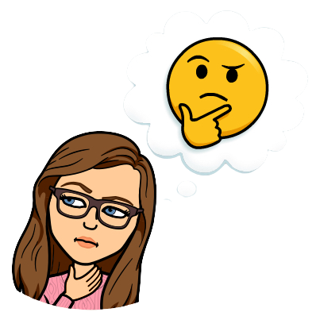

```{r setup, include=FALSE}
options(htmltools.dir.version = FALSE)
```

```{r additional, echo=FALSE, include=FALSE}
library(tidyverse)
```


```{r xaringanExtra, echo=FALSE, include=FALSE}
xaringanExtra::use_xaringan_extra(c("clipboard",
                                    "freezeframe",
                                    "panelset",
                                    "scribble",
                                    "tachyons", 
                                    "tile_view"))
```

## Test 2

- Tuesday November 1 (multiple choice) and Thursday November 3 (fill in the blank and short answer)

- Bring a **pencil** for the scantron

- Bring student ID

- Student's who's last names start with **N-Z** will be writing in a different room
    - November 1: Canadian Martyrs Testing Centre
    - November 3: T12 room 123

---

class: title-slide-section-gold, bottom

# Review from last lecture

---

## Motor learning

.pull-left[.center[

]]

.pull-right[.center[

]]

<br>

> Motor learning is a **set of processes** resulting from **practice or experience** causing **relatively permanent gains** in the **capability for skilled performance**.

---

## Motor learning is an .grey[umbrella term] but there are (at least) .grey[two] main types

.footnote[Krakauer et al. 2019 (https://doi.org/10.1002/cphy.c170043)]

.black[SKILL ACQUISITION]: the processes by which an individual acquires the ability to identify an appropriate movement goal given a particular task context, select the correction action given a sensory stimulus and/or the current state of the body and the world, and execute that action with accuracy and precision

<br>
.black[SKILL MAINTENANCE]: the ability to maintain performance levels of existing skills under changing conditions

---

## Summary: Ways to .grey[study] motor learning

.footnote[Adapted from Sternad 2015 (https://doi.org/10.1016/j.cobeha.2018.01.004)]

.center[

]

---

## We can observe .grey[7 performance characteristics] during the learning process

.center[

]

---

## We need to rely on .grey[methods] that can separate the .grey[relatively permanent] effects from .grey[transient] ones

.black[Performance-learning paradox]
- a high level of performance in practice **does not** mean an individual has learned the task

- a low level of performance in practice **does not** mean an individual has not learned the task

- To avoid being a victim of this paradox, we must rely on performance in **retention** and **transfer** tests when making evidence-based recommendations

---

class: inverse, middle, center

# Any questions?

---

background-image: url(https://www.elmvalecommunitychurch.com/wp-content/uploads/sermons/2020/03/Riding-a-bike.png)
background-size: cover

---

# Learning objectives

1. Identify and describe the **basic recipe** for a motor learning experiment/intervention.

2. Compare and contrast **retention** and **transfer** tests.

3. Compare and contrast **Fitts'** and **Bernstein's** models of skill acquisition.

--

.bg-gold.b--mid-gray.ba.bw2.br3.shadow-5.ph4.mt5[
.tc[
.black[Take-home message:

Models of skill acquisition can help us recognize areas to focus on during practice and skill acquisition, retention, and transfer depend on many factors.
]]]

---

## How to .grey[design] a motor learning experiment

.footnote[Adapted from Schmidt & Lee 2011]

.left-column[.center[
.black[Group 1: Alignment aid]


.black[Group 2: No aid]

]]

--

```{r echo=FALSE}
ml_expt_practice <- tibble::tibble(
  group = c(rep("Alignment aid", 13), rep("No aid", 13)),
  sessions = factor(rep(1:13, 2)),
  phase = c(rep("Pre-test", 3), rep("Practice", 10), rep("Pre-test", 3), rep("Practice", 10)),
  score = c(9, 7, 2, 10, 19, 27, 33, 39, 42, 48, 54, 59, 62, 2, 8, 9, 11, 14, 19, 23, 27, 29, 31, 33, 38, 39)
)
practice_only <- ml_expt_practice %>% 
  dplyr::filter(phase == "Practice")
```

.right-column[
```{r echo=FALSE, fig.align='center', fig.width=8, fig.height=6.5}
ggplot2::ggplot(ml_expt_practice, aes(x = sessions, y = score, group = group)) +
  geom_line(data = practice_only, aes(color = group, linetype = group), size = 1) +
  geom_point(aes(color = group, shape = group), size = 4) +
  scale_y_continuous(name = "Percentage of putts made (%)",
                     limits = c(0, 70),
                     breaks = seq(0, 70, 10)) +
  scale_x_discrete(name = "",
                   labels = c("1" = "A",
                              "2" = "B",
                              "3" = "C",
                              "4" = "1",
                              "5" = "2",
                              "6" = "3",
                              "7" = "4",
                              "8" = "5",
                              "9" = "6",
                              "10" = "7",
                              "11" = "8",
                              "12" = "9",
                              "13" = "10")) +
  scale_color_manual(values = c("#ac1455", "#fdbf57")) +
  scale_linetype_manual(values = c(1, 2)) +
  facet_grid(~factor(phase, levels = c("Pre-test", "Practice")), scales = "free_x", space = "free_x") +
  theme(
    legend.text = element_text(size = 18),
    legend.title = element_blank(),
    legend.position = c(0.40, 0.9),
    axis.title = element_text(face = "bold", size = 20),
    axis.text = element_text(size = 18),
    strip.text.x = element_text(face = "bold", size = 20, color = "#FFFFFF"),
    strip.background = element_rect(color = "#272822", fill = "#7a003c", size = 2, linetype = "solid")
  )
```
]

---

## How to .grey[design] a motor learning experiment

.footnote[Adapted from Schmidt & Lee 2011]

.left-column[.center[
.black[Group 1: Alignment aid]


.black[Group 2: No aid]

]]

```{r echo=FALSE}
ml_expt <- tibble::tibble(
    group = c(rep("Alignment aid", 19), rep("No aid", 19)),
    sessions = factor(rep(1:19, 2)),
    phase = c(rep("Pre-test", 3), rep("Practice", 10), rep("Retention", 3), rep("Transfer", 3), rep("Pre-test", 3), rep("Practice", 10), rep("Retention", 3), rep("Transfer", 3)),
    score = c(9, 7, 2, 10, 19, 27, 33, 39, 42, 48, 54, 59, 62, 55, 46, 39, 48, 38, 33, 2, 8, 9, 11, 14, 19, 23, 27, 29, 31, 33, 38, 39, 39, 45, 55, 33, 39, 48)
)
```

.right-column[
```{r echo=FALSE, fig.align='center', fig.width=10, fig.height=6.5}
ggplot2::ggplot(ml_expt, aes(x = sessions, y = score, group = group)) +
  geom_line(data = practice_only, aes(color = group, linetype = group), size = 1) +
  geom_point(aes(color = group, shape = group), size = 4) +
  scale_y_continuous(name = "Percentage of putts made (%)",
                     limits = c(0, 70),
                     breaks = seq(0, 70, 10)) +
  scale_x_discrete(name = "",
                   labels = c("1" = "A",
                              "2" = "B",
                              "3" = "C",
                              "4" = "1",
                              "5" = "2",
                              "6" = "3",
                              "7" = "4",
                              "8" = "5",
                              "9" = "6",
                              "10" = "7",
                              "11" = "8",
                              "12" = "9",
                              "13" = "10",
                              "14" = "A",
                              "15" = "B",
                              "16" = "C",
                              "17" = "A",
                              "18" = "B",
                              "19" = "C")) +
  scale_color_manual(values = c("#ac1455", "#fdbf57")) +
  scale_linetype_manual(values = c(1, 2)) +
  facet_grid(~factor(phase, levels = c("Pre-test", "Practice", "Retention", "Transfer")), scales = "free_x", space = "free_x") +
  theme(
    legend.text = element_text(size = 18),
    legend.title = element_blank(),
    legend.position = c(0.40, 0.9),
    axis.title = element_text(face = "bold", size = 20),
    axis.text = element_text(size = 18),
    strip.text.x = element_text(face = "bold", size = 20, color = "#FFFFFF"),
    strip.background = element_rect(color = "#272822", fill = "#7a003c", size = 2, linetype = "solid")
  )
```
]

---

## Pause, reflect

What are the phasess required for a motor learning experiment?

What phase(s) allow us to assess whether learning has occured?

---

## We must use .grey[retention] or .grey[transfer] tests to measure whether a skill has been learned

.pull-left[.center[
.black[Retention tests]]
- Assesses the **permanence** or **persistence** of the skill

- Occurs after a period of **no practice** (rule of thumb is minimum of 24 hours)

- Are performed under a **common level** of the manipulated practice variable

- Include the **same task** as the pre-test and acquisition phases
]

--

.pull-right[.center[
.black[Transfer tests]]
- Assesses the **adaptability** or **flexibility** of the skill

- Occurs after a period of **no practice** (rule of thumb is minimum of 24 hours)

- Are performed under a **common level** of the manipulated practice variable

- Include a **novel variation** of the task included in pre-test and acquisition
]

---

## Models give us a .grey[general guideline] to understand the learning process, but the stages .grey[are not] always clear cut

.center[

]

---

## Fitts' model: .grey[Cognitive] stage

.footnote[Source: https://www.henryford.com/-/media/henry-ford-blog/images/mobile-interior-banner-images/2016/04/little-girl-playing-soccer.jpg]

.pull-left[.center[

]]

.pull-right[
- Low level of **familiarity** with action

- **Talk** through steps or sequences of movements

- No **error correction** mechanism

- **What** am I trying to accomplish?

- **How** do I accomplish it?
]

---

## Fitts' model: .grey[Associative] stage

.footnote[https://dra9kbpogvft0.cloudfront.net/images/2020/11/1/web_yaple.jpg]

.pull-left[
- **Refine** movement patterns

- A **process** or **mechanics** focus

- Account for the **context**

- **Error correction** for big or obvious errors

- **How** can I accomplish my goal more consistently?
]

.pull-right[.center[

]]

---

## Fitts' model: .grey[Autonomous] stage

.footnote[https://www.thestar.com/content/dam/thestar/sports/olympics/2021/08/06/olympic-gold-gives-canadian-soccer-goalkeeper-stephanie-labb-licence-to-thrill/labbe_sixth_save.jpg]

.pull-left[.center[

]]

.pull-right[
- **Perform** action with low conscious control

- Sophisticated **error correction** mechanism
  - can detect, recognize, and correct even very small errors

- **High** quality movements

- Seeking **mastery**

- **Deliberately** try to avoid arrested development
]

---

## Bernstein's model: .grey[Reduce] degrees of freedom

.footnote[Source: https://www.rocketice.com/wp-content/uploads/2016/07/Curly-hair-sisters-in-ice-skating-lessons-opt.jpg]

.pull-left[
- Focused on the most **rudimentary** aspects of movement

- Decrease movement complexity by **"freezing"** (i.e., not moving) individual joints

- Adopt an **inefficient** movement pattern
]

.pull-right[.center[

]]

---

## Bernstein's model: .grey[Release] degrees of freedom

.footnote[Source: https://lavioletteism.files.wordpress.com/2012/11/wpid-caron.jpg]

.pull-left[.center[

]]

.pull-right[
- Increase movement complexity by **"un-freezing"** (i.e., moving) individual joints

- Begin to leverage **intersegmental** dynamics

- This **minimizes** energy cost

- This **maximizes** force of movement
]

---

## Bernstein's model: .grey[Exploit] passive dynamics

.footnote[https://lastwordonsports.com/hockey/wp-content/uploads/sites/11/2020/08/gettyimages-1263767979-594x594-2.jpg]

.pull-left[
- Generate movements that **best satisfy** the task goal

- These movements also **minimize** energy cost

- Make use of **"free energy"**

- From **spring-like** properties of muscles, **intersegmental** energy transfers
]

.pull-right[.center[

]]

---

# Pause, reflect

What stage of learning are these learners likely in? What evidence do you have to suggest this?

---

class: title-slide-section-gold, center, middle

# How long do we retain learned motor skills?

--

<br><br>

.black[RETENTION INTERVAL]: A period of time where no **further practice** is undertaken. During this time, **"motor forgetting"** may occur, leading to **reduced** performance. Alternatively, **consolidation** may occur, leading to **improved or maintained** performance.

---

## The .grey[retention interval] has a .grey[significant] impact on the retention of .grey[discrete] motor skills

.footnote[Adapted from Neumans and Ammons 1957 (https://doi.org/10.1037/h0041719) through plot digitization]

```{r echo=FALSE}
discrete_acquisition <- tibble::tibble(
  trial = seq(3, 63, by = 3),
  phase = rep("Acquisition", 21),
  score = c(1.47, 1.64, 2.16, 2.65, 3.04, 3.56, 4.22, 4.72, 5.08, 5.5, 6.41, 6.93, 7.18, 7.32, 7.37, 7.42, 7.54, 7.67, 7.74, 7.81, 7.79)
)
```

```{r echo=FALSE}
discrete_retention <- tibble::tibble(
  trial = c(seq(1, 3, by = 2), 1, seq(3, 15, by = 3), 1, seq(3, 27, by = 3), 1, seq(3, 36, by = 3), 1, seq(3, 36, by = 3)),
  group = c(rep("1 min", 2), rep("20 min", 6), rep("2 days", 10), rep("7 weeks", 13), rep("1 year", 13)),
  score = c(7.78, 7.81, 6.92, 7.46, 7.81, 7.78, 7.51, 7.81, 4.19, 5.76, 6.9, 7.46, 7.51, 7.56, 7.63, 7.88, 7.7, 7.95, 3.13, 4.04, 4.8, 5.39, 6.25, 6.47, 6.89, 7.39, 7.51, 7.65, 7.88, 7.7, 7.83, 0.81, 2.04, 3.2, 3.79, 4.68, 5.71, 5.98, 6.45, 7.16, 7.36, 7.36, 7.43, 7.48)
)
```

.pull-left[
```{r echo=FALSE, fig.align='center', fig.height=5.75}
ggplot2::ggplot(discrete_acquisition, aes(x = trial, y = score)) +
  geom_line(aes(color = phase), size = 1) +
  geom_point(aes(color = phase), size = 4) +
  scale_y_continuous(name = "Mean correct response",
                     limits = c(0, 8),
                     breaks = seq(0, 8, 1)) +
  scale_x_continuous(name = "Acquisition trials (every 3rd trial)",
                     limits = c(1, 63),
                     breaks = seq(9, 63, 9)) +
  scale_color_manual(values = "#ac1455") +
  theme(
    legend.text = element_text(size = 18),
    legend.title = element_blank(),
    legend.position = "none",
    axis.title = element_text(face = "bold", size = 20),
    axis.text = element_text(size = 18),
  )
```
]

.pull-right[
```{r echo=FALSE, fig.align='center', fig.height=5.75}
ggplot2::ggplot(discrete_retention, aes(x = trial, y = score)) +
  geom_line(aes(color = group), size = 1) +
  geom_point(aes(color = group, fill = group, shape = group), size = 4) +
  scale_y_continuous(name = "Mean correct response",
                     limits = c(0, 8),
                     breaks = seq(0, 8, 1)) +
  scale_x_continuous(name = "Retention (trial 1) and relearning (every 3rd trial)",
                     limits = c(1, 36),
                     breaks = c(1, seq(9, 36, 9))) +
  scale_color_manual(values = c("#ac1455", "#fdbf57", "#5e6a71", "#007096", "#007b4b")) +
  scale_fill_manual(values = c("#ac1455", "#fdbf57", "#5e6a71", "#007096", "#007b4b")) +
  scale_shape_manual(values = c(21, 22, 23, 24, 25)) +
  theme(
    legend.text = element_text(size = 18),
    legend.title = element_blank(),
    legend.position = c(0.85, 0.2),
    axis.title = element_text(face = "bold", size = 20),
    axis.text = element_text(size = 18),
  )
```
]

---

## The .grey[retention interval] has a .grey[smaller] impact on the retention of .grey[continuous] motor skills

.footnote[Adapted from Fleishman and Parker 1962 (https://doi.org/10.1037/h0041220) through plot digitization]

```{r echo=FALSE}
continuous_acquisition <- tibble::tibble(
  segment = seq(1, 50),
  phase = rep("Acquisition", 50),
  error = c(2186.11, 2172.61, 2097.65, 1872.52, 1981.88, 1947.89, 1770.54, 1716.06, 1647.94, 1579.79, 1477.55, 1409.42, 1348.11, 1273.14, 1198.22, 1034.53, 877.65, 1041.6, 966.66, 768.84, 659.76, 741.8, 619.06, 585.06, 639.81, 715.02, 564.98, 530.97, 517.46, 483.45, 483.58, 476.89, 470.2, 470.34, 470.45, 525.2, 443.43, 484.52, 409.57, 423.34, 423.49, 369, 396.43, 369.28, 410.36, 437.76, 376.47, 376.62, 288.01, 349.58)
)
```

```{r echo=FALSE}
continuous_retention <- tibble::tibble(
  segment = rep(1:3, 3),
  group = c(rep("9 months", 3), rep("1 year", 3), rep("2 years", 3)),
  error = c(432.65, 344.1, 426.24, 364.41, 426.03, 357.95, 576, 494.29, 474.01)
)
```

.pull-left[
```{r echo=FALSE, fig.align='center', fig.height=5.75}
ggplot2::ggplot(continuous_acquisition, aes(x = segment, y = error)) +
  geom_line(aes(color = phase), size = 1) +
  geom_point(aes(color = phase), size = 4) +
  scale_y_continuous(name = "Mean integrated absolute error (a.u.)",
                     limits = c(0, 2500),
                     breaks = seq(0, 2500, 500)) +
  scale_x_continuous(name = "Six minute practice segments",
                     limits = c(1, 50),
                     breaks = c(1, seq(10, 50, 10))) +
  scale_color_manual(values = "#ac1455") +
  theme(
    legend.text = element_text(size = 18),
    legend.title = element_blank(),
    legend.position = "none",
    axis.title = element_text(face = "bold", size = 20),
    axis.text = element_text(size = 18),
  )
```
]

.pull-right[
```{r echo=FALSE, fig.align='center', fig.width=5.75, fig.height=5.75}
ggplot2::ggplot(continuous_retention, aes(x = segment, y = error)) +
  geom_line(aes(color = group), size = 1) +
  geom_point(aes(color = group, fill = group, shape = group), size = 4) +
  scale_y_continuous(name = "Mean integrated absolute error (a.u.)",
                     limits = c(0, 2500),
                     breaks = seq(0, 2500, 500)) +
  scale_x_continuous(name = "Six minute retention segments",
                     limits = c(1, 3),
                     breaks = seq(1, 3, 1)) +
  scale_color_manual(values = c("#ac1455", "#fdbf57", "#5e6a71")) +
  scale_fill_manual(values = c("#ac1455", "#fdbf57", "#5e6a71")) +
  scale_shape_manual(values = c(21, 22, 23)) +
  theme(
    legend.text = element_text(size = 18),
    legend.title = element_blank(),
    legend.position = c(0.8, 0.88),
    axis.title = element_text(face = "bold", size = 20),
    axis.text = element_text(size = 18),
  )
```
]

---

## There are 3 main .grey[similarity] factors that can impact skill .grey[transfer]

.pull-left[
**Transfer** refers to the **gain or loss** in the capability to perform one task as a result of practice or experience **on another task**

We can classify transfer as:
- **Positive** transfer if it enhances performance in the other skill

- **Negative** transfer if it degrades performance

- **No** transfer if it does not affect performance
]

--

.pull-right[.center[

]]

---

# Learning objectives

1. Identify and describe the **basic recipe** for a motor learning experiment/intervention.

2. Compare and contrast **retention** and **transfer** tests.

3. Compare and contrast **Fitts'** and **Bernstein's** models of skill acquisition.

.bg-gold.b--mid-gray.ba.bw2.br3.shadow-5.ph4.mt5[
.tc[
.black[Take-home message:

Models of skill acquisition can help us recognize areas to focus on during practice and skill acquisition, retention, and transfer depend on many factors.
]]]

---
class: title-slide-final, middle
background-image: url(https://raw.githubusercontent.com/cartermaclab/mackin-xaringan/main/imgs/logos/mcmaster-stack-color.png)
background-size: 95px
background-position: 9% 15%

# What questions do you have?



|                                                                                                                |                                   |
| :------------------------------------------------------------------------------------------------------------- | :-------------------------------- |
| <a href="https://twitter.com/cartermaclab">.mackinred[<i class="fa fa-twitter fa-fw"></i>]                     | @_LauraStGermain                  |
| <a href="https://github.com/LauraStGermain">.mackinred[<i class="fa fa-github fa-fw"></i>]                     | @LauraStGermain                   |
| <a href="https://cartermaclab.org">.mackinred[<i class="fa fa-link fa-fw"></i>]                                | www.cartermaclab.org              |
