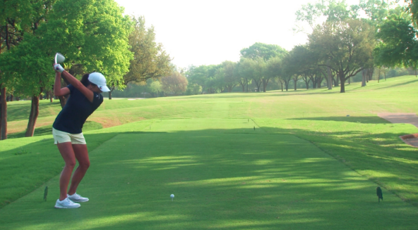

```{r setup, include=FALSE}
options(htmltools.dir.version = FALSE)
```

```{r libraries, echo=FALSE, include = FALSE}
library(tidyverse)
```


```{r xaringanExtra, echo=FALSE, include = FALSE}
xaringanExtra::use_xaringan_extra(c("clipboard",
                                    "freezeframe",
                                    "panelset",
                                    "scribble",
                                    "tachyons", 
                                    "tile_view"))
```

class: title-slide-section-gold, bottom

# Review from last lecture

---

## How to .grey[design] a motor learning experiment

.footnote[Adapted from Schmidt & Lee 2011]

.left-column[.center[
.black[Group 1: Alignment aid]


.black[Group 2: No aid]

]]

```{r echo=FALSE}
ml_expt <- tibble::tibble(
    group = c(rep("Alignment aid", 19), rep("No aid", 19)),
    sessions = factor(rep(1:19, 2)),
    phase = c(rep("Pre-test", 3), rep("Practice", 10), rep("Retention", 3), rep("Transfer", 3), rep("Pre-test", 3), rep("Practice", 10), rep("Retention", 3), rep("Transfer", 3)),
    score = c(9, 7, 2, 10, 19, 27, 33, 39, 42, 48, 54, 59, 62, 55, 46, 39, 48, 38, 33, 2, 8, 9, 11, 14, 19, 23, 27, 29, 31, 33, 38, 39, 39, 45, 55, 33, 39, 48)
)

ml_practice_only <- ml_expt %>% 
  dplyr::filter(phase == "Practice")
```

.right-column[
```{r echo=FALSE, fig.align='center', fig.width=10, fig.height=6.5}
ggplot2::ggplot(ml_expt, aes(x = sessions, y = score, group = group)) +
  geom_line(data = ml_practice_only, aes(color = group, linetype = group), size = 1) +
  geom_point(aes(color = group, shape = group), size = 4) +
  scale_y_continuous(name = "Percentage of putts made (%)",
                     limits = c(0, 70),
                     breaks = seq(0, 70, 10)) +
  scale_x_discrete(name = NULL,
                   labels = c("1" = "A",
                              "2" = "B",
                              "3" = "C",
                              "4" = "1",
                              "5" = "2",
                              "6" = "3",
                              "7" = "4",
                              "8" = "5",
                              "9" = "6",
                              "10" = "7",
                              "11" = "8",
                              "12" = "9",
                              "13" = "10",
                              "14" = "A",
                              "15" = "B",
                              "16" = "C",
                              "17" = "A",
                              "18" = "B",
                              "19" = "C")) +
  scale_color_manual(values = c("#ac1455", "#fdbf57")) +
  scale_linetype_manual(values = c(1, 2)) +
  facet_grid(~factor(phase, levels = c("Pre-test", "Practice", "Retention", "Transfer")), scales = "free_x", space = "free_x") +
  theme(
    legend.text = element_text(size = 18),
    legend.title = element_blank(),
    legend.position = c(0.40, 0.9),
    axis.title = element_text(face = "bold", size = 20),
    axis.text = element_text(size = 18),
    strip.text.x = element_text(face = "bold", size = 20, color = "#FFFFFF"),
    strip.background = element_rect(color = "#272822", fill = "#7a003c", size = 2, linetype = "solid")
  )
```
]

---

class: inverse, middle, center

# Any questions?

---

background-image: url(https://golfdigest.sports.sndimg.com/content/dam/images/golfdigest/fullset/2018/10/23/5bcf2793935a810c4b03b28c_GettyImages-1052791830.jpg.rend.hgtvcom.966.690.suffix/1573249956744.jpeg)
background-size: cover

---

# Learning objectives

1. Discuss the phenomenon known as **warm-up decrement** and one strategy to **minimize** its impact on performance.

2. Differentiate between an **internal** and **external** focus of attention.

3. Explain why an external focus of attention may be **more effective** for performance and learning.

4. Describe **two techniques** that have been used to support the **constrained action hypothesis**.

--

.bg-gold.b--mid-gray.ba.bw2.br3.shadow-5.ph4.mt5[
.tc[
.black[Take-home message:

Our choice of words when providing instructions can have a considerable impact on the learner's planning processes and subsequent performance.
]]]

---

## Recall this .grey[performance] curve...

```{r echo=FALSE}
# Create tibble of illustrative data for performance curve
performance_curve <- tibble::tibble(
  day = c(rep("Day 1", 25), rep("Day 2", 25), rep("Day 3", 25), rep("Day 4", 25)),
  trial = rep(1:25, 4),
  error = c(2.4, 2.9, 3.3, 3.5, 3.3, 3.7, 3.9, 4.3, 4.6, 4.9, 4.8, 5.2, 5.5, 5.2, 5.6, 6.0, 6.0, 5.8, 6.2, 6.4, 6.4, 6.5, 6.6, 7.0, 6.7, 5.5, 6.1, 6.5, 6.8, 6.7, 7.2, 6.9, 7.2, 7.0, 7.5, 7.3, 7.5, 7.7, 7.4, 7.7, 7.5, 7.5, 7.7, 8.1, 7.7, 7.9, 8.3, 7.9, 8.0, 8.0, 7.0, 7.3, 7.7, 8.0, 7.9, 8.1, 8.0, 8.2, 7.9, 8.0, 7.8, 7.9, 8.2, 8.0, 8.0, 8.3, 7.9, 8.3, 8.2, 8.2, 8.3, 8.2, 8.3, 8.4, 8.3, 7.9, 8.2, 8.1, 8.3, 8.1, 8.3, 8.2, 8.3, 8.2, 8.5, 8.3, 8.2, 8.5, 8.3, 8.6, 8.8, 8.5, 8.7, 8.4, 8.3, 8.6, 8.7, 8.5, 8.4, 8.6)
)
```

```{r echo=FALSE, fig.align='center', fig.width=12, fig.height=7}
ggplot2::ggplot(performance_curve,
                              aes(x = trial, y = error, 
                                  group = day)) +
  geom_line(size = 1.25) +
  scale_x_continuous(name = "Trials",
                     limits = c(1, 25),
                     breaks = seq(5, 25, 10)) +
  scale_y_continuous(name = "Time on target (s)",
                     limits = c(0, 10),
                     breaks = seq(0, 10, 1)) +
  facet_grid(~day) +
  theme(
    axis.title = element_text(face = "bold", size = 20),
    axis.text = element_text(size = 18),
    legend.position = "none",
    strip.text.x = element_text(face = "bold", size = 20, color = "#FFFFFF"),
    strip.background = element_rect(color = "#272822", fill = "#7a003c", size = 2, linetype = "solid")
  )
```

---

## How can we .grey[minimize] the impact of warm-up decrement?

.footnote[Steve Nash talking about his pre-shot routine: https://youtu.be/7-gore5GbDI]

.pull-left[
.black[WARM-UP DECREMENT]: A **reduction** in performance seen after a **period of no practice** or **time away** from the task

- it is a **psychological** phenomenon rather than a physiological one and it **dissipates** after a few trials or attempts

<iframe width="500" height="175" src="https://www.youtube.com/embed/7-gore5GbDI" title="YouTube video player" frameborder="0" allow="accelerometer; autoplay; clipboard-write; encrypted-media; gyroscope; picture-in-picture" allowfullscreen></iframe>
]

.pull-right[.center[


]
1. Establish **pre-shot** routines

2. Develop ways to "*re-set*" after the period of inactivity

3. Minimize periods of inactivity with interspersed practice (especially with discrete skills)
]

---

## Establishing and using a .grey[pre-shot] routine is .grey[advantageous] for novice .grey[and] experienced golfers

.footnote[Data based on McCann et al 2001 (https://doi.org/10.1080/17461390100071503) and adapted through plot digitization from Lee 2011]

.left-column[
.black[Task]: Wedge shots from **43.75**, **54.68**, and **65.62** yards

.black[Groups]:
1. **Control** - no practice
2. **Practice** - 3-week training program
3. **Practice+Preshot** - same as Practice plus a 13 step preshot routine
]

--

```{r echo=FALSE}
# Create tibble of adapted McCann et al 2001 data
mccann <- tibble::tibble(
  skill = c(rep("Non-golfers", 3), rep("Golfers", 3)),
  group = factor(rep(1:3, 2)),
  score = c(5.22, 21.34, 34.74, 2.71, 19.98, 29.84)
)
```

.right-column[
```{r echo=FALSE, fig.align='center', fig.width = 12, fig.height=6}
ggplot2::ggplot(mccann, aes(x = group, y = score, group = skill)) +
  geom_segment(aes(x = group, xend = group, y = 0, yend = score), color = "#272822", size = 1.25) +
  geom_point(color = "#5e6a71", fill = "#fdbf57", size = 6, shape = 21, stroke = 2) +
  scale_x_discrete(name = "",
                   labels = c("1" = "Control",
                              "2" = expression(paste("Practice \n only")),
                              "3" = expression(paste("Practice + \n Preshot")))) +
  scale_y_continuous(name = "Improvement from baseline (%)",
                     limits = c(0, 40),
                     breaks = seq(0, 40, 10)) +
  coord_flip() +
  facet_grid(~skill) +
  theme(
    axis.title = element_text(face = "bold", size = 20),
    axis.text = element_text(size = 18),
    legend.position = "none",
    strip.text.x = element_text(face = "bold", size = 20, color = "#FFFFFF"),
    strip.background = element_rect(color = "#272822", fill = "#7a003c", size = 2, linetype = "solid")
  )
```
]

---

## Preshot routines .grey[may be] advantageous for multiple reasons

.center[

]

- Psychological explanations such as **increased confidence**, **self-efficacy**, **positive outlook**, etc

- **Attentional focus** on **external** factors important to successful performance

---

background-image: url(https://i.pinimg.com/originals/49/01/b7/4901b7bd2dac5beec53df7dc303ea32d.jpg)
background-size: cover

---

## Focus of attention can be based on .grey[specific instructions] or be .grey[self-adopted]

.black[ATTENTIONAL FOCUS]: The information that a performer's attention (or consciousness) is directed at

- **Internal** focus of attention: Focus on information associated with the performer's **body**
  - e.g., "*Think about the timing of your hip rotation*"

- **External** focus of attention: Focus on information that is **external** to the performer's body

  - e.g., "*Think about the tennis racquet hitting the ball*"

--

<br>
.center[
### THIS IS **NOT** A VISUAL FOCUS...IT IS A <ins>**MENTAL FOCUS**</ins>
]

---

## An .grey[external] focus is .grey[more] effective than an internal

.footnote[Approximate data from Wulf et al 2003 Experiment 2 (https://doi.org/10.1080/02724980343000062) through plot digitization]

.left-column[
.black[Task]: Stabilometer
.center[

]
.black[Groups]:
- **Internal** focus = feet
- **External** focus = markers on platform
- **Control** = no instructions given
]

--

```{r echo=FALSE}
# Create tibble of adapted Wulf et al 2003 data
wulf_balance <- tibble::tibble(
  group = c(rep("Control", 21), rep("External", 21), rep("Internal", 21)),
  phase = factor(c(rep("Practice 1", 7), rep("Practice 2", 7), rep("Retention", 4), rep("Transfer", 3), rep("Practice 1", 7), rep("Practice 2", 7), rep("Retention", 4), rep("Transfer", 3), rep("Practice 1", 7), rep("Practice 2", 7), rep("Retention", 4), rep("Transfer", 3))),
  trials = rep(1:21, 3),
  rmse = c(10.76, 8.92, 8.14, 7.54, 7.38, 6.46, 6.43, 6.91, 6.22, 5.93, 5.46, 5.32, 5.11, 5.32, 5.49, 5.15, 5.13, 4.85, 4.3, 4.59, 4.25, 11.09, 8.8, 7.62, 6.81, 6.34, 6.34, 5.93, 6.01, 5.6, 4.89, 5.15, 4.87, 4.92, 4.49, 4.68, 4.21, 3.92, 4.14, 3.26, 3.14, 3.14, 10.88, 9.79, 9.51, 8.63, 8.4, 8.14, 7.73, 7.85, 7.71, 7.57, 6.72, 6.41, 6.24, 6.2, 6.08, 5.86, 5.75, 5.91, 4.73, 4.7, 4.11)
)
```

.right-column[
```{r echo=FALSE, fig.align='center', fig.width=12, fig.height=7}
ggplot2::ggplot(wulf_balance, aes(x = trials, y = rmse, group = group)) +
  geom_line(aes(color = group), size = 1) +
  geom_point(aes(color = group, fill = group, shape = group), size = 4) +
  scale_y_continuous(name = "Root mean squared error (degs)",
                     limits = c(0, 12),
                     breaks = seq(0, 12, 2)) +
  scale_x_continuous(name = "Trials",
                     breaks = seq(1, 21, 2)) +
  scale_color_manual(values = c("#ac1455", "#fdbf57", "#5e6a71")) +
  scale_fill_manual(values = c("#ac1455", "#fdbf57", "#5e6a71")) +
  scale_shape_manual(values = c(21, 22, 23)) +
  facet_grid(~phase, scales = "free_x", space = "free_x") +
  theme(
    axis.title = element_text(face = "bold", size = 20),
    axis.text = element_text(size = 18),
    legend.title = element_blank(),
    legend.position = c(0.1, 0.15),
    legend.text = element_text(size = 16),
    strip.text.x = element_text(face = "bold", size = 20, color = "#FFFFFF"),
    strip.background = element_rect(color = "#272822", fill = "#7a003c", size = 2, linetype = "solid")
  )
```
]

---

## The external focus .grey[benefit] extends to sport skills

.footnote[Approximate data from Wulf et al 1999 (https://doi.org/10.1080/02701367.1999.10608029) through plot digitization]

.left-column[
.black[Task]: Golf pitch shot

.black[Groups]:
- **Internal** focus = arm swing
- **External** focus = club swing
- **Control** = no instructions given
]

--

```{r echo=FALSE}
# Create tibble of adapted Wulf et al 1999 data
wulf_sport <- tibble::tibble(
  group = c(rep("External", 11), rep("Internal", 11)),
  phase = factor(c(rep("Practice", 8), rep("Retention", 3), rep("Practice", 8), rep("Retention", 3))),
  blocks = rep(1:11, 2),
  score = c(12.92, 20.47, 19.03, 22.77, 22, 23.66, 23.19, 23.43, 19.7, 20.7, 22.61, 4.76, 11.85, 8.18, 12.22, 12.62, 11.99, 10.2, 13.54, 12.5, 15.42, 13.33)
)
```

.right-column[
```{r echo=FALSE, fig.align='center', fig.height=6}
ggplot2::ggplot(wulf_sport, aes(x = blocks, y = score, group = group)) +
  geom_line(aes(color = group), size = 1) +
  geom_point(aes(color = group, fill = group, shape = group), size = 4) +
  scale_y_continuous(name = "Score (points)",
                     limits = c(0, 25),
                     breaks = seq(0, 25, 5)) +
  scale_x_continuous(name = "Blocks of 10 trials",
                     breaks = seq(1, 11, 1)) +
  scale_color_manual(values = c("#ac1455", "#fdbf57")) +
  scale_fill_manual(values = c("#ac1455", "#fdbf57")) +
  scale_shape_manual(values = c(21, 22)) +
  facet_grid(~phase, scales = "free_x", space = "free_x") +
  theme(
    axis.title = element_text(face = "bold", size = 20),
    axis.text = element_text(size = 18),
    legend.title = element_blank(),
    legend.position = c(0.63, 0.15),
    legend.text = element_text(size = 16),
    strip.text.x = element_text(face = "bold", size = 20, color = "#FFFFFF"),
    strip.background = element_rect(color = "#272822", fill = "#7a003c", size = 2, linetype = "solid")
  )
```
]

---

class: title-slide-section-gold, middle, center

## Why is directing attention **away** from the body **superior for performance** compared to directing attention **towards** one's body?

---

## Explaining the .grey[external focus] advantage

.black[CONSTRAINED ACTION HYPOTHESIS]: **Consciously** controlling one's movements **constrains** the motor system, which **interferes** with **automatic** control process

- Focusing on the **movement effect** via an **external** focus allows the motor system to more **naturally self-organize**

--

<br>
.black[*Q: How could we test the predictions of the constrained action hypothesis?*]

- "Consciously controlling..."

- "...constrains the motor system...interferes with automatic control processes"

--

<br>
(**Hint**: Think back to Motor Control section of course and some techniques we learned about)

---

## .grey[Testing] the constrained action hypothesis: .grey[Probe] reaction time

.footnote[Adapted and approximate data from Wulf et al 2001 (https://doi.org/10.1080/713756012) through plot digitization]

.left-column[
.black[Task]: Stabilometer

.black[Secondary task]: Simple reaction time button press

.black[Groups]:
- **Internal** focus = feet
- **External** focus = markers on platform

.black[Probes]: randomly 8 times during a trial
]

--

```{r echo=FALSE}
# Create tibble of adapted Wulf et al 2001 data
wulf_probe <- tibble::tibble(
  group = c(rep("External", 13), rep("Internal", 13)),
  phase = factor(c(rep("Practice 1", 6), rep("Practice 2", 6), "Retention", rep("Practice 1", 6), rep("Practice 2", 6), "Retention")),
  trials = rep(1:13, 2),
  rt = c(387.98, 355.79, 347.68, 337.45, 344.58, 347.11, 309.02, 331.74, 339.93, 328.99, 341.08, 320.94, 301.28, 450.33, 403.61, 387.01, 394.14, 389.22, 363.76, 389.44, 385.23, 358.35, 387.8, 386.43, 366.28, 331.67)
)
```

.right-column[
```{r echo=FALSE, fig.align='center', fig.height=5.75}
ggplot2::ggplot(wulf_probe, aes(x = trials, y = rt, group = interaction(group, phase))) +
  geom_line(aes(color = group, linetype = group), size = 1) +
  geom_point(aes(color = group, fill = group, shape = group), size = 4) +
  scale_y_continuous(name = "Probe reaction time (ms)",
                     limits = c(250, 475),
                     breaks = seq(250, 475, 25)) +
  scale_x_continuous(name = "Trials",
                     breaks = seq(1, 13, 1)) +
  scale_color_manual(values = c("#ac1455", "#fdbf57")) +
  scale_fill_manual(values = c("#ac1455", "#fdbf57")) +
  scale_shape_manual(values = c(21, 22)) +
  theme(
    axis.title = element_text(face = "bold", size = 20),
    axis.text = element_text(size = 18),
    legend.title = element_blank(),
    legend.position = c(0.86, 0.9),
    legend.text = element_text(size = 16),
  ) +
  geom_hline(yintercept = 317.2, linetype = "dashed", color = "#fdbf57", size = 1) +
  geom_hline(yintercept = 299.1, color = "#ac1455", size = 1) +
  annotate(
    geom = "text", x = 1, y = 326, label = "Internal control RT",
    hjust = "left", size = 6) +
  annotate(
    geom = "text", x = 1, y = 290, label = "External control RT",
    hjust = "left", size = 6) 
```
]

---

## .grey[Testing] the constrained action hypothesis: .grey[EMG]

.footnote[Adapted and approximate data from Zachry et al 2005 (https://doi.org/10.1016/j.brainresbull.2005.06.035) through plot digitization]

.left-column[
.black[Task]: Basketball free throw

.black[Groups]:
- **Internal** focus = wrist
- **External** focus = basket

.black[Electromyography]:
- Flexor carpi radialis (FCR)
- Biceps brachii (BB)
- Triceps brachii (TB)
- Deltoid (D)
]

--

```{r echo=FALSE}
# Create tibble of adapted Zachry et al 2005 data
zachry_emg <- tibble::tibble(
  group = c(rep("External", 4), rep("Internal", 4)),
  muscle = factor(c("FCR", "BB", "TB", "D", "FCR", "BB", "TB", "D")),
  rms = c(21.04, 16.54, 23.59, 25.42, 25.30, 24.69, 34.78, 29.19),
  sd = c(4.38, 4.26, 5.23, 4.74, 3.77, 5.35, 7.67, 5.96)
)
```

.right-column[
```{r echo=FALSE, fig.align='center', fig.width=11, fig.height=6.5}
ggplot2::ggplot(zachry_emg) +
  geom_bar(aes(x = group, y = rms, fill = group), stat = "identity") +
  geom_errorbar(aes(x = group, ymin = rms - sd, ymax = rms + sd), width = 0.4, size = 1.3) +
  scale_y_continuous(name = "EMG-RMS (V)",
                     limits = c(0, 45),
                     breaks = seq(0, 45, 5)) +
  scale_x_discrete(name = NULL,
                   breaks = NULL) +
  scale_fill_manual(values = c("#ac1455", "#fdbf57")) +
  facet_grid(~muscle) +
  theme(
    axis.title = element_text(face = "bold", size = 20),
    axis.text.y = element_text(size = 18),
    axis.text.x = element_blank(),
    legend.title = element_blank(),
    legend.position = c(0.1, 0.9),
    legend.text = element_text(size = 16),
    strip.text.x = element_text(face = "bold", size = 20, color = "#FFFFFF"),
    strip.background = element_rect(color = "#272822", fill = "#7a003c", size = 2, linetype = "solid")
  )
```
]

---

## .grey[Testing] the constrained action hypothesis

.pull-left[
.black[Probe reaction time experiment]
- External focus group had superior balance in practice and retention

- External focus group had **faster** probe reaction times in practice and retention

- Suggesting **less conscious control** of movements...**why**?

- Suggesting **greater** automaticity...**why**?
]

--

.pull-right[
.black[Electromyography (EMG) experiment]
- External focus group was more accurate in basketball free throws in practice

- External focus group had **lower** muscle activity, especially in the key muscles involved in free throw

- Suggesting **enhanced** movement efficiency (i.e., naturally self-organize)...**why**?

- Suggesting **greater** motor "noise" interferes with automaticity...**why**?
]

---

# Learning objectives

1. Discuss the phenomenon known as **warm-up decrement** and one strategy to **minimize** its impact on performance.

2. Differentiate between an **internal** and **external** focus of attention.

3. Explain why an external focus of attention may be **more effective** for performance and learning.

4. Describe **two techniques** that have been used to support the **constrained action hypothesis**.

.bg-gold.b--mid-gray.ba.bw2.br3.shadow-5.ph4.mt5[
.tc[
.black[Take-home message:

Our choice of words when providing instructions can have a considerable impact on the learner's planning processes and subsequent performance.
]]]

---

class: title-slide-final, middle
background-image: url(https://raw.githubusercontent.com/cartermaclab/mackin-xaringan/main/imgs/logos/mcmaster-stack-color.png)
background-size: 95px
background-position: 9% 15%

# What questions do you have?


|                                                                                                                |                                   |
| :------------------------------------------------------------------------------------------------------------- | :-------------------------------- |
| <a href="https://twitter.com/cartermaclab">.mackinred[<i class="fa fa-twitter fa-fw"></i>]                     | @_LauraStGermain                  |
| <a href="https://github.com/LauraStGermain">.mackinred[<i class="fa fa-github fa-fw"></i>]                     | @LauraStGermain                   |
| <a href="https://cartermaclab.org">.mackinred[<i class="fa fa-link fa-fw"></i>]                                | www.cartermaclab.org              |
