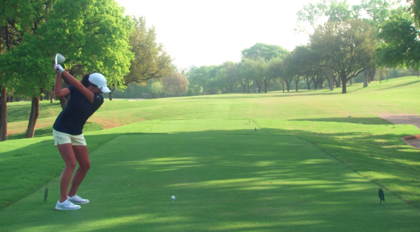

```{r setup, include=FALSE}
options(htmltools.dir.version = FALSE)
```

```{r libraries, echo=FALSE, include = FALSE}
library(kableExtra)
library(tidyverse)
```

```{r xaringanExtra, echo=FALSE, include = FALSE}
xaringanExtra::use_xaringan_extra(c("clipboard",
                                    "freezeframe",
                                    "panelset",
                                    "scribble",
                                    "tachyons", 
                                    "tile_view"))
```

class: title-slide-section-gold, bottom

# Review from last lecture

---

## Recall this .grey[performance] curve...

```{r echo=FALSE}
# Create tibble of illustrative data for performance curve
performance_curve <- tibble::tibble(
  day = c(rep("Day 1", 25), rep("Day 2", 25), rep("Day 3", 25), rep("Day 4", 25)),
  trial = rep(1:25, 4),
  error = c(2.4, 2.9, 3.3, 3.5, 3.3, 3.7, 3.9, 4.3, 4.6, 4.9, 4.8, 5.2, 5.5, 5.2, 5.6, 6.0, 6.0, 5.8, 6.2, 6.4, 6.4, 6.5, 6.6, 7.0, 6.7, 5.5, 6.1, 6.5, 6.8, 6.7, 7.2, 6.9, 7.2, 7.0, 7.5, 7.3, 7.5, 7.7, 7.4, 7.7, 7.5, 7.5, 7.7, 8.1, 7.7, 7.9, 8.3, 7.9, 8.0, 8.0, 7.0, 7.3, 7.7, 8.0, 7.9, 8.1, 8.0, 8.2, 7.9, 8.0, 7.8, 7.9, 8.2, 8.0, 8.0, 8.3, 7.9, 8.3, 8.2, 8.2, 8.3, 8.2, 8.3, 8.4, 8.3, 7.9, 8.2, 8.1, 8.3, 8.1, 8.3, 8.2, 8.3, 8.2, 8.5, 8.3, 8.2, 8.5, 8.3, 8.6, 8.8, 8.5, 8.7, 8.4, 8.3, 8.6, 8.7, 8.5, 8.4, 8.6)
)
```

```{r echo=FALSE, fig.align='center', fig.width=12, fig.height=7}
ggplot2::ggplot(performance_curve,
                              aes(x = trial, y = error, 
                                  group = day)) +
  geom_line(size = 1.25) +
  scale_x_continuous(name = "Trials",
                     limits = c(1, 25),
                     breaks = seq(5, 25, 10)) +
  scale_y_continuous(name = "Time on target (s)",
                     limits = c(0, 10),
                     breaks = seq(0, 10, 1)) +
  facet_grid(~day) +
  theme(
    axis.title = element_text(face = "bold", size = 20),
    axis.text = element_text(size = 18),
    legend.position = "none",
    strip.text.x = element_text(face = "bold", size = 20, color = "#FFFFFF"),
    strip.background = element_rect(color = "#272822", fill = "#7a003c", size = 2, linetype = "solid")
  )
```

---

## Establishing and using a .grey[pre-shot] routine is .grey[advantageous] for novice .grey[and] experienced golfers

.footnote[Data based on McCann et al 2001 (https://doi.org/10.1080/17461390100071503) and adapted through plot digitization from Lee 2011]

.left-column[
.black[Task]: Wedge shots from **43.75**, **54.68**, and **65.62** yards

.black[Groups]:
1. **Control** - no practice
2. **Practice** - 3-week training program
3. **Practice+Preshot** - same as Practice plus a 13 step preshot routine
]

```{r echo=FALSE}
# Create tibble of adapted McCann et al 2001 data
mccann <- tibble::tibble(
  skill = c(rep("Non-golfers", 3), rep("Golfers", 3)),
  group = factor(rep(1:3, 2)),
  score = c(5.22, 21.34, 34.74, 2.71, 19.98, 29.84)
)
```

.right-column[
```{r echo=FALSE, fig.align='center', fig.width = 12, fig.height=6}
ggplot2::ggplot(mccann, aes(x = group, y = score, group = skill)) +
  geom_segment(aes(x = group, xend = group, y = 0, yend = score), color = "#272822", size = 1.25) +
  geom_point(color = "#5e6a71", fill = "#fdbf57", size = 6, shape = 21, stroke = 2) +
  scale_x_discrete(name = "",
                   labels = c("1" = "Control",
                              "2" = expression(paste("Practice \n only")),
                              "3" = expression(paste("Practice + \n Preshot")))) +
  scale_y_continuous(name = "Improvement from baseline (%)",
                     limits = c(0, 40),
                     breaks = seq(0, 40, 10)) +
  coord_flip() +
  facet_grid(~skill) +
  theme(
    axis.title = element_text(face = "bold", size = 20),
    axis.text = element_text(size = 18),
    legend.position = "none",
    strip.text.x = element_text(face = "bold", size = 20, color = "#FFFFFF"),
    strip.background = element_rect(color = "#272822", fill = "#7a003c", size = 2, linetype = "solid")
  )
```
]

---

## Preshot routines .grey[may be] advantageous for multiple reasons

.center[

]

- Psychological explanations such as **increased confidence**, **self-efficacy**, **positive outlook**, etc

- **Attentional focus** on **external** factors important to successful performance

---

## Focus of attention can be based on .grey[specific instructions] or be .grey[self-adopted]

.black[ATTENTIONAL FOCUS]: The information that a performer's attention (or consciousness) is directed at

- **Internal** focus of attention: Focus on information associated with the performer's **body**
  - e.g., "*Think about the timing of your hip rotation*"

- **External** focus of attention: Focus on information that is **external** to the performer's body

  - e.g., "*Think about the tennis racquet hitting the ball*"

<br>
.center[
### THIS IS **NOT** A VISUAL FOCUS...IT IS A <ins>**MENTAL FOCUS**</ins>
]

---

## An .grey[external] focus is .grey[more] effective than an internal

.footnote[Approximate data from Wulf et al 2003 Experiment 2 (https://doi.org/10.1080/02724980343000062) through plot digitization]

.left-column[
.black[Task]: Stabilometer
.center[

]
.black[Groups]:
- **Internal** focus = feet
- **External** focus = markers on platform
- **Control** = no instructions given
]

```{r echo=FALSE}
# Create tibble of adapted Wulf et al 2003 data
wulf_balance <- tibble::tibble(
  group = c(rep("Control", 21), rep("External", 21), rep("Internal", 21)),
  phase = factor(c(rep("Practice 1", 7), rep("Practice 2", 7), rep("Retention", 4), rep("Transfer", 3), rep("Practice 1", 7), rep("Practice 2", 7), rep("Retention", 4), rep("Transfer", 3), rep("Practice 1", 7), rep("Practice 2", 7), rep("Retention", 4), rep("Transfer", 3))),
  trials = rep(1:21, 3),
  rmse = c(10.76, 8.92, 8.14, 7.54, 7.38, 6.46, 6.43, 6.91, 6.22, 5.93, 5.46, 5.32, 5.11, 5.32, 5.49, 5.15, 5.13, 4.85, 4.3, 4.59, 4.25, 11.09, 8.8, 7.62, 6.81, 6.34, 6.34, 5.93, 6.01, 5.6, 4.89, 5.15, 4.87, 4.92, 4.49, 4.68, 4.21, 3.92, 4.14, 3.26, 3.14, 3.14, 10.88, 9.79, 9.51, 8.63, 8.4, 8.14, 7.73, 7.85, 7.71, 7.57, 6.72, 6.41, 6.24, 6.2, 6.08, 5.86, 5.75, 5.91, 4.73, 4.7, 4.11)
)
```

.right-column[
```{r echo=FALSE, fig.align='center', fig.width=12, fig.height=7}
ggplot2::ggplot(wulf_balance, aes(x = trials, y = rmse, group = group)) +
  geom_line(aes(color = group), size = 1) +
  geom_point(aes(color = group, fill = group, shape = group), size = 4) +
  scale_y_continuous(name = "Root mean squared error (degs)",
                     limits = c(0, 12),
                     breaks = seq(0, 12, 2)) +
  scale_x_continuous(name = "Trials",
                     breaks = seq(1, 21, 2)) +
  scale_color_manual(values = c("#ac1455", "#fdbf57", "#5e6a71")) +
  scale_fill_manual(values = c("#ac1455", "#fdbf57", "#5e6a71")) +
  scale_shape_manual(values = c(21, 22, 23)) +
  facet_grid(~phase, scales = "free_x", space = "free_x") +
  theme(
    axis.title = element_text(face = "bold", size = 20),
    axis.text = element_text(size = 18),
    legend.title = element_blank(),
    legend.position = c(0.1, 0.15),
    legend.text = element_text(size = 16),
    strip.text.x = element_text(face = "bold", size = 20, color = "#FFFFFF"),
    strip.background = element_rect(color = "#272822", fill = "#7a003c", size = 2, linetype = "solid")
  )
```
]

---

## Explaining the .grey[external focus] advantage

.black[CONSTRAINED ACTION HYPOTHESIS]: **Consciously** controlling one's movements **constrains** the motor system, which **interferes** with **automatic** control process

- Focusing on the **movement effect** via an **external** focus allows the motor system to more **naturally self-organize**

<br>
.black[*Q: How could we test the predictions of the constrained action hypothesis?*]

- "Consciously controlling..."

- "...constrains the motor system...interferes with automatic control processes"

---

class: inverse, middle, center

# Any questions?

---

background-image: url(imgs/factors-learning.png)
background-size: contain

---

background-image: url(imgs/factors-learning-feedback.png)
background-size: contain

---

# Learning objectives

1. Distinguish between **intrinsic** and **augmented** feedback.

2. Compare and contrast the **knowledge of performance** and **knowledge of results** feedback, and give examples of each.

3. Discuss the **roles** and **influence** of augmented feedback on motor learning.

--

.bg-gold.b--mid-gray.ba.bw2.br3.shadow-5.ph4.mt5[
.tc[
.black[Take-home message:

(Augmented) feedback plays a vital role in skill acquisition, retention, and transfer. 
]]]

---

background-image: url(imgs/feedback-flowchart.png)
background-size: contain

.footnote[Adapted from Magill and Anderson 2017]

---

## Feedback can arise from .grey[within] the performer or come from an .grey[external] source

.black[INTRINSIC FEEDBACK]: Sensory information that arises as a **natural consequence** of performing an action
  - e.g., vision, proprioception, haptic, etc
  
  - also called **response-produced** feedback, **inherent** feedback, and **task-**intrinsic feedback

<br>
.black[AUGMENTED FEEDBACK]: Information about performing an action that is **fed back** to the learner by an **external** source to **supplement** (i.e., augment) the use of intrinsic feedback
  - e.g., from a coach, therapist, video-replay, etc

---

## Knowledge of results gives .grey[information] about the .grey[outcome] of a performance attempt

.pull-left[.center[
.black[Knowledge of results is **redundant** with the outcome]


.tiny[Source: http://talkhockey.ca/wp-content/uploads/Skills-0666.gif]
]]

.pull-right[.center[
.black[Knowledge of results is **not redundant** with the outcome]


.tiny[Source: https://gifimage.net/wp-content/uploads/2017/10/chinese-divers-gif.gif]
]]

---

## Knowledge of performance gives .grey[information] about .grey[movement characteristics] of a performance

.pull-left[.center[
.black[See **gait** cycle]


.tiny[Source: https://www.sciencefriday.com/wp-content/uploads/2017/09/giphy-68.gif]
]]

.pull-right[.center[
.black[See **trajectory** of tennis racquet during serve]


.tiny[Source: https://thumbs.gfycat.com/GlaringWickedBarasinga-size_restricted.gif]
]]

---

## Augmented feedback: .grey[Similarities] and .grey[differences]

```{r echo = FALSE, results = "asis"}
kr_kp_table <- tibble::tibble(
  c1 = c("Verbal (or verbalizable)",
         "Augmented",
         "Provided after movement (usually)",
         "Information about goal outcome",
         "Often redundant with intrinsic feedback",
         "Usually provided as a score",
         "Often used in laboratory research"),
  c2 = c("Verbal (or verbalizable)",
         "Augmented",
         "Provided after movement (usually)",
         "Information about movement pattern",
         "Usually distinct from intrinsic feedback",
         "Usually kinematic information",
         "Often provided in everyday activities")
)

kbl(kr_kp_table,
    col.names = c("Knowledge of results",
                  "Knowledge of performance"),
    align = c("l", "l")) %>%
  kable_paper(c("hover", "condensed", "responsive"), html_font = "Roboto Condensed") %>% 
  row_spec(0, bold = TRUE, font_size = 35) %>% 
  pack_rows("Similarities", 1, 3) %>% 
  pack_rows("Differences", 4, 7)
```

---

## Knowledge of results feedback can offer different amounts of information

.footnote[Luft 2014 (https://doi.org/10.1016/j.bbr.2013.12.043)]

.black[FINELY GRADED]: Includes both a **magnitude** and a **direction**
  - e.g., +25 ms, 5 yards to the left
  
--
  
.black[GRADED]: Includes only a **direction**
  - e.g., too slow, to the left
  
--
  
.black[BINARY]: Includes neither a **magnitude** nor a **direction**
  - e.g., hit, miss

---

## .grey[Paradoxical] properties of augmented feedback

<br>

.pull-left[
- Augmented feedback **can be essential** for motor learning

.black[BUT...]

- Augmented feedback **may not be essential** for motor learning

]

--

.pull-right[
- Augmented feedback **can enhance** motor learning

.black[BUT...]

- Augmented feedback **can hinder** motor learning
]

---

## Augmented feedback .grey[can be essential] for motor learning

- Some performance contexts **do not make critical sensory feedback available** to the performer or learner

- **Injury or disease** can affect the **integrity of the sensory pathways** needed to detect intrinsic feedback

- Although the necessary **intrinsic feedback is available** and the individual's sensory system is **capable** of detecting it, the individual is **unable to use** the intrinsic feedback

---

## Augmented feedback .grey[may not be essential] for motor learning

- Some motor skills inherently provide **sufficient** intrinsic feedback, rendering augmented feedback **redundant**

- Some performance contexts provide a detectable **external referent** that the performer or learner can use to evaluate the appropriateness of an action

- When learners are able to **observe fellow learners** that **are also beginners** practice a new motor skill

---

## Augmented feedback .grey[can enhance] motor learning

- Some skills do not require augmented feedback to learn them, **but** receiving augmented feedback can:
  - **accelerate** the learning or skill acquisition process
  
  - result in a **higher level of proficiency**

- In these situations, augmented feedback is **neither** essential or redundant

- E.g., learning a **difficult coordination** pattern like the 90 degree bimanual coordination pattern

  - Use of Lissajous augmented feedback

---

## Augmented feedback .grey[can hinder] motor learning

- Augmented feedback can result in a **dependence** on its provision

- This has a **negative impact** when that same augmented feedback is **not available** in a **test** situation

- The dependency is likely when there is **minimal** intrinsic feedback available or it is **difficult** to interpret and use

--

- The dependence is **likely** (but not guaranteed) when a learner receives:
  - **Erroneous** augmented feedback
  
  - **Concurrent** augmented feedback
  
  - **Frequent** augmented feedback

---

## The .grey[roles] of augmented feedback in motor learning

.footnote[<sup>1</sup>Salmoni et al 1984 (https://doi.org/10.1037/0033-2909.95.3.355); <sup>2</sup>Wulf and Lewthwaite 2016 (https://doi.org/10.3758/s13423-015-0999-9)]

.pull-left[
.black[Informational role]
- **Guide** the learner to an appropriate movement solution 

- Facilitate **achievement** the action goal of the skill

- Emphasized in the **Guidance** hypothesis<sup>1</sup>
  - Feedback is both a **performance** and **learning** variable
]

--

.pull-right[
.black[Motivational role]
- **Encourage** the learner to continue striving toward a goal through continued practice

- Secondary or a **by-product** of informational role

- Emphasized in the **"OPTIMAL"** theory<sup>2</sup>
  - Practice context can put learners into a **virtuous** or a **vicious** cycle
]

---

## Conditions best suited for .grey[knowledge of results] and .grey[knowledge of performance]

.pull-left[
.black[Knowledge of results]
1. To **confirm** own interpretation of intrinsic feedback

2. **Unable** to determine the outcome from intrinsic feedback alone

3. **Motivate** oneself to continue practicing

4. Encourage **discovery learning** through **trial-and-error** problem solving

5. May promote an **external focus** of attention
]

--

.pull-right[
.black[Knowledge of performance]
1. When skills **must be** performed according to **specified** movement characteristics

2. Specific movement components that require **precise coordination** must be improved or corrected

3. The goal of the action is to produce a specific **kinematic**, **kinetic**, or **muscle activity** profile

4. Knowledge of results is **redundant** with intrinsic feedback
]

---

# Learning objectives

1. Distinguish between **intrinsic** and **augmented** feedback.

2. Compare and contrast the **knowledge of performance** and **knowledge of results** feedback, and give examples of each.

3. Discuss the **roles** and **influence** of augmented feedback on motor learning.

.bg-gold.b--mid-gray.ba.bw2.br3.shadow-5.ph4.mt5[
.tc[
.black[Take-home message:

(Augmented) feedback plays a vital role in skill acquisition, retention, and transfer. 
]]]

---

class: title-slide-final, middle
background-image: url(https://raw.githubusercontent.com/cartermaclab/mackin-xaringan/main/imgs/logos/mcmaster-stack-color.png)
background-size: 95px
background-position: 9% 15%

# What questions do you have?


|                                                                                                                |                                   |
| :------------------------------------------------------------------------------------------------------------- | :-------------------------------- |
| <a href="https://twitter.com/cartermaclab">.mackinred[<i class="fa fa-twitter fa-fw"></i>]                     | @_LauraStGermain                  |
| <a href="https://github.com/LauraStGermain">.mackinred[<i class="fa fa-github fa-fw"></i>]                     | @LauraStGermain                   |
| <a href="https://cartermaclab.org">.mackinred[<i class="fa fa-link fa-fw"></i>]                                | www.cartermaclab.org              |
