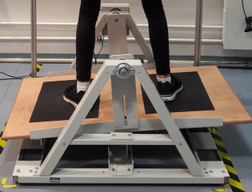
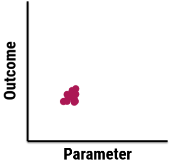
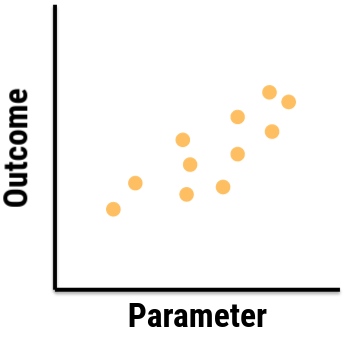
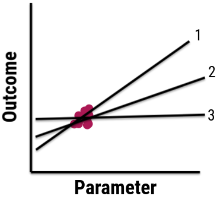
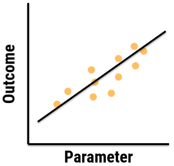
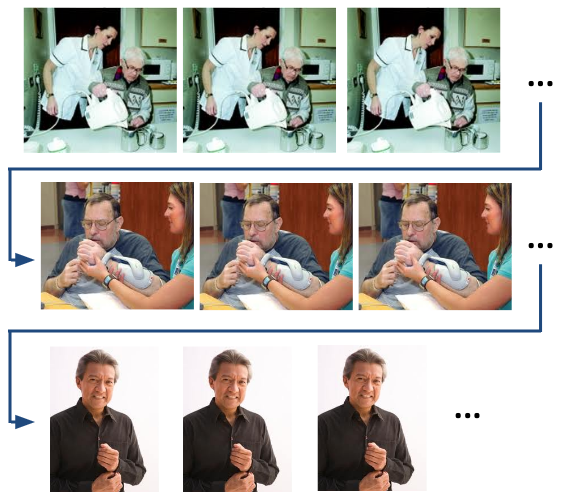
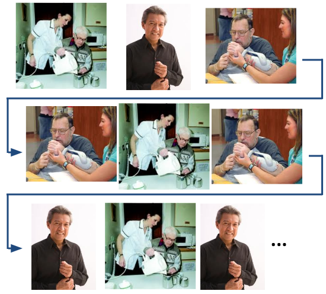
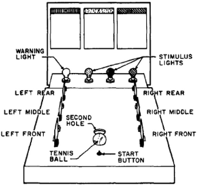

```{r setup, include=FALSE}
options(htmltools.dir.version = FALSE)
```

```{r additional, echo=FALSE}
library(tidyverse)
```

```{r xaringanExtra, echo=FALSE}
xaringanExtra::use_xaringan_extra(c("clipboard",
                                    "freezeframe",
                                    "panelset",
                                    "scribble",
                                    "tachyons", 
                                    "tile_view"))
```

class: title-slide-section-gold, bottom

# Review from last lecture

---

## Practice can be organized to .grey[promote] different amounts of .grey[contextual interference]

.footnote[<sup>1</sup>This term was introduced by Battig 1979 when he first demonstrated the contextual interference effect; Fig: Magill & Anderson 2017]

.black[CONTEXTUAL INTERFERENCE]<sup>1</sup>: refers to the **interference** that results from performing various tasks or skills with the **context** of practice

.center[

]

.black[CONTEXTUAL INTERFERENCE EFFECT]: when a **high amount** of contextual interference results in **better** retention and/transfer performance than a low amount of interference

---

background-image: url(imgs/elaboration.png)
background-position: 95% 75%

## Why is random .grey[more effective] than blocked?

.footnote[Shea & Morgan 1979 (https://doi.org/10.1037/0278-7393.5.2.179); Shea & Zimny 1983 (https://doi.org/10.1016/S0166-4115(08)61998-6)]

.left-third[
.black[<ins>ELABORATION HYPOTHESIS</ins>]

Interleaving tasks gives the learner opportunities to engage in **inter- & intra-task processing** (i.e., compare and contrast) in **working memory**, which **facilitates** the development of more **distinct or elaborative** motor memories
]

---

background-image: url(imgs/forgetting-reconstruction.png)
background-position: 95% 75%

## Why is random .grey[more effective] than blocked?

.footnote[Lee & Magill 1983 (https://doi.org/10.1037/0278-7393.9.4.730)]

.left-third[
.black[<ins>FORGETTING-RECONSTRUCTION HYPOTHESIS</ins>]

Interleaving tasks forces the learner to .gold["forget" or dump] a given .gold[action plan] from .gold[working memory] to plan and execute successive trials. The learner must then .gold[(re)construct an action plan] on each trial.
]

---

## Testing .grey[between] explanations: .grey[TMS]

.footnote[Approximate data of Lin et al 2008 (https://doi.org/10.3200/JMBR.40.6.578-586) through plot digitization]

```{r echo=FALSE}
lin_tms <- tibble::tibble(
    group = c(rep("Blocked", 12), rep("Random", 12)),
    stim = c(rep("No TMS", 4), rep("Sham TMS", 4), rep("TMS", 4), rep("No TMS", 4), rep("Sham TMS", 4), rep("TMS", 4)),
    phase = c(rep("Acquisition", 2), rep("Retention", 2), rep("Acquisition", 2), rep("Retention", 2), rep("Acquisition", 2), rep("Retention", 2), rep("Acquisition", 2), rep("Retention", 2), rep("Acquisition", 2), rep("Retention", 2), rep("Acquisition", 2), rep("Retention", 2)),
    block = factor(rep(1:4, 6)),
    error = c(21.44, 10.26, 13.93, 21.34, 21.92, 10.53, 15.15, 20.12, 19.94, 9.85, 12.84, 18.76, 17.94, 11.59, 11.92, 14.91, 20.32, 12.33, 12.87, 16, 21.27, 14.1, 13.15, 22.53)
)

lin_tms_practice_only <- lin_tms %>% 
  dplyr::filter(phase == "Acquisition")
```

.wide-left[
```{r echo=FALSE, fig.align='center', fig.width=10, fig.height=6.5}
ggplot2::ggplot(lin_tms, aes(x = block, y = error, group = interaction(stim, phase))) +
  geom_line(data = lin_tms_practice_only, aes(color = stim, linetype = stim), size = 1) +
  geom_point(aes(color = stim, fill = stim, shape = stim), size = 4) +
  scale_y_continuous(name = "Root mean squared error (deg)",
                     limits = c(8, 24),
                     breaks = seq(8, 24, 2)) +
  scale_x_discrete(name = NULL,
                   labels = c("1" = "B1",
                              "2" = "B12",
                              "3" = "1-min",
                              "4" = "24-hr")) +
  scale_color_manual(values = c("#ac1455", "#fdbf57", "#5e6a71")) +
  scale_fill_manual(values = c("#ac1455", "#fdbf57", "#5e6a71")) +
  scale_shape_manual(values = c(21, 22, 23)) +
  facet_grid(~group) +
  theme(
    axis.title = element_text(face = "bold", size = 20),
    axis.text = element_text(size = 18),
    legend.title = element_blank(),
    legend.position = c(0.9, 0.12),
    legend.text = element_text(size = 16),
    strip.text.x = element_text(face = "bold", size = 20, color = "#FFFFFF"),
    strip.background = element_rect(color = "#272822", fill = "#7a003c", size = 2, linetype = "solid")
  )
```
]

.narrow-right[
- **Random+TMS** group significantly **worse** than Random+No-TMS and Random+Sham groups

- **No significant differences** found between the different **Blocked** groups

<br>
.black[*Q: Which hypothesis is supported by this data?*]
]

---

background-image: url(imgs/ci-explanations-box-diagrams.png)
background-position: 95% 80%
background-size: 50%

## But was there a .grey[methodological issue] in the experiment? 

.footnote[Lin et al 2008 (https://doi.org/10.3200/JMBR.40.6.578-586)]

.pull-left[

]

---

## Testing .grey[between] explanations: .grey[Probe reaction time]

.footnote[Approximate data from Li & Wright 2000 (https://doi.org/10.1080/713755890) through plot digitization]

.pull-left[
.black[Task]: Sequence learning (3 patterns)

.black[Probe task]: 2-Choice reaction time task (**low** versus **high** tone)

.black[Probe protocol]: **Randomly** presented on **some** trials (12 trials for each tone)

.black[Groups]:
- **Random** groups
  1. Pre-response interval
  2. Inter-trial interval
- **Blocked** groups
  1. Pre-response interval
  2. Inter-trial interval
]

```{r echo=FALSE}
li_probe <- tibble::tibble(
    group = c(rep("Blocked", 2), rep("Random", 2)),
    interval = c("Pre-response", "Inter-trial", "Pre-response", "Inter-trial"),
    rt = c(739.79, 723.30, 885.86, 779.84),
    sd = c(16.49, 21.04, 25.92, 21.21)
)
```

.pull-right[
```{r echo=FALSE, fig.align='center', fig.height=6.5}
ggplot2::ggplot(li_probe) +
  geom_bar(aes(x = group, y = rt, fill = group), stat = "identity") +
  geom_errorbar(aes(x = group, ymin = rt - sd, ymax = rt + sd), width = 0.4, size = 1.3) +
  scale_y_continuous(name = "Probe choice reaction time (ms)",
                     limits = c(0, 1000),
                     breaks = seq(0, 1000, 100)) +
  scale_x_discrete(name = NULL,
                   breaks = NULL) +
  scale_fill_manual(values = c("#ac1455", "#fdbf57")) +
  facet_grid(~factor(interval, levels = c("Pre-response", "Inter-trial"))) +
  theme(
    axis.title = element_text(face = "bold", size = 20),
    axis.text.y = element_text(size = 18),
    axis.text.x = element_blank(),
    legend.title = element_blank(),
    legend.position = c(0.87, 0.92),
    legend.text = element_text(size = 16),
    strip.text.x = element_text(face = "bold", size = 20, color = "#FFFFFF"),
    strip.background = element_rect(color = "#272822", fill = "#7a003c", size = 2, linetype = "solid")
  ) +
  geom_hline(yintercept = 406.63, linetype = "dashed", size = 1)
```
]

---

## .grey[Judgments of learning] based on repetition schedule

.footnote[Approximate data from Simon and Bjork 2001 (https://doi.org/10.1037/0278-7393.27.4.907)]

```{r echo=FALSE}
simon <- tibble::tibble(
    group = c(rep("Blocked", 14), rep("Random", 14)),
    phase = c(rep("Acquisition", 6), "Retention", rep("Acquisition", 6), "Retention", rep("Acquisition", 6), "Retention", rep("Acquisition", 6), "Retention"),
    block = factor(rep(1:7, 4)),
    type = c(rep("Actual error", 7), rep("Judgment of learning", 7), rep("Actual error", 7), rep("Judgment of learning", 7)),
    error = c(8.39, 6.34, 4.66, 5.16, 4.53, 4.72, 19.69, 7.75, 7.46, 6.47, 5.67, 5.91, 5.5, 7.87, 12.98, 12.86, 8.88, 7.52, 5.59, 5.53, 10.93, 11.43, 10.57, 10.74, 9.88, 9.66, 8.93, 11.76)
)

simon_practice_only <- simon %>% 
  dplyr::filter(phase == "Acquisition")
```

```{r echo=FALSE, fig.align='center', fig.width=12, fig.height=6.5}
ggplot2::ggplot(simon, aes(x = block, y = error, group = interaction(group, phase))) +
  geom_line(data = simon_practice_only, aes(color = group, linetype = type), size = 1) +
  geom_point(aes(color = group, fill = group, shape = group), size = 4) +
  scale_y_continuous(name = "Percent absolute constant errror (%)",
                     limits = c(0, 20),
                     breaks = seq(0, 20, 5)) +
  scale_x_discrete(name = NULL,
                   labels = c("1" = "B1",
                              "2" = "B2",
                              "3" = "B3",
                              "4" = "B4",
                              "5" = "B5",
                              "6" = "B6",
                              "7" = "24-hr")) +
  scale_color_manual(values = c("#ac1455", "#fdbf57")) +
  scale_fill_manual(values = c("#ac1455", "#fdbf57")) +
  scale_shape_manual(values = c(21, 22)) +
  facet_grid(~type) +
  theme(
    axis.title = element_text(face = "bold", size = 20),
    axis.text = element_text(size = 18),
    legend.title = element_blank(),
    legend.position = c(0.93, 0.9),
    legend.text = element_text(size = 16),
    strip.text.x = element_text(face = "bold", size = 20, color = "#FFFFFF"),
    strip.background = element_rect(color = "#272822", fill = "#7a003c", size = 2, linetype = "solid")
  ) +
  scale_linetype(guide = "none")
```

---

## Recall this .grey[performance] curve...

```{r echo=FALSE}
# Create tibble of illustrative data for performance curve
performance_curve <- tibble::tibble(
  day = c(rep("Day 1", 25), rep("Day 2", 25), rep("Day 3", 25), rep("Day 4", 25)),
  trial = rep(1:25, 4),
  error = c(2.4, 2.9, 3.3, 3.5, 3.3, 3.7, 3.9, 4.3, 4.6, 4.9, 4.8, 5.2, 5.5, 5.2, 5.6, 6.0, 6.0, 5.8, 6.2, 6.4, 6.4, 6.5, 6.6, 7.0, 6.7, 5.5, 6.1, 6.5, 6.8, 6.7, 7.2, 6.9, 7.2, 7.0, 7.5, 7.3, 7.5, 7.7, 7.4, 7.7, 7.5, 7.5, 7.7, 8.1, 7.7, 7.9, 8.3, 7.9, 8.0, 8.0, 7.0, 7.3, 7.7, 8.0, 7.9, 8.1, 8.0, 8.2, 7.9, 8.0, 7.8, 7.9, 8.2, 8.0, 8.0, 8.3, 7.9, 8.3, 8.2, 8.2, 8.3, 8.2, 8.3, 8.4, 8.3, 7.9, 8.2, 8.1, 8.3, 8.1, 8.3, 8.2, 8.3, 8.2, 8.5, 8.3, 8.2, 8.5, 8.3, 8.6, 8.8, 8.5, 8.7, 8.4, 8.3, 8.6, 8.7, 8.5, 8.4, 8.6)
)
```

```{r echo=FALSE, fig.align='center', fig.width=12, fig.height=7}
ggplot2::ggplot(performance_curve,
                              aes(x = trial, y = error, 
                                  group = day)) +
  geom_line(size = 1.25) +
  scale_x_continuous(name = "Trials",
                     limits = c(1, 25),
                     breaks = seq(5, 25, 10)) +
  scale_y_continuous(name = "Time on target (s)",
                     limits = c(0, 10),
                     breaks = seq(0, 10, 1)) +
  facet_grid(~day) +
  theme(
    axis.title = element_text(face = "bold", size = 20),
    axis.text = element_text(size = 18),
    legend.position = "none",
    strip.text.x = element_text(face = "bold", size = 20, color = "#FFFFFF"),
    strip.background = element_rect(color = "#272822", fill = "#7a003c", size = 2, linetype = "solid")
  )
```

---

## Establishing and using a .grey[pre-shot] routine is .grey[advantageous] for novice .grey[and] experienced golfers

.footnote[Data based on McCann et al 2001 (https://doi.org/10.1080/17461390100071503) and adapted through plot digitization from Lee 2011]

.left-column[
.black[Task]: Wedge shots from **43.75**, **54.68**, and **65.62** yards

.black[Groups]:
1. **Control** - no practice
2. **Practice** - 3-week training program
3. **Practice+Preshot** - same as Practice plus a 13 step preshot routine
]

```{r echo=FALSE}
# Create tibble of adapted McCann et al 2001 data
mccann <- tibble::tibble(
  skill = c(rep("Non-golfers", 3), rep("Golfers", 3)),
  group = factor(rep(1:3, 2)),
  score = c(5.22, 21.34, 34.74, 2.71, 19.98, 29.84)
)
```

.right-column[
```{r echo=FALSE, fig.align='center', fig.width = 12, fig.height=6}
ggplot2::ggplot(mccann, aes(x = group, y = score, group = skill)) +
  geom_segment(aes(x = group, xend = group, y = 0, yend = score), color = "#272822", size = 1.25) +
  geom_point(color = "#5e6a71", fill = "#fdbf57", size = 6, shape = 21, stroke = 2) +
  scale_x_discrete(name = "",
                   labels = c("1" = "Control",
                              "2" = expression(paste("Practice \n only")),
                              "3" = expression(paste("Practice + \n Preshot")))) +
  scale_y_continuous(name = "Improvement from baseline (%)",
                     limits = c(0, 40),
                     breaks = seq(0, 40, 10)) +
  coord_flip() +
  facet_grid(~skill) +
  theme(
    axis.title = element_text(face = "bold", size = 20),
    axis.text = element_text(size = 18),
    legend.position = "none",
    strip.text.x = element_text(face = "bold", size = 20, color = "#FFFFFF"),
    strip.background = element_rect(color = "#272822", fill = "#7a003c", size = 2, linetype = "solid")
  )
```
]

---

## Preshot routines .grey[may be] advantageous for multiple reasons

.center[

]

- Psychological explanations such as **increased confidence**, **self-efficacy**, **positive outlook**, etc

- **Attentional focus** on **external** factors important to successful performance

---

## Focus of attention can be based on .grey[specific instructions] or be .grey[self-adopted]

.black[ATTENTIONAL FOCUS]: The information that a performer's attention (or consciousness) is directed at

- **Internal** focus of attention: Focus on information associated with the performer's **body**
  - e.g., "*Think about the timing of your hip rotation*"

- **External** focus of attention: Focus on information that is **external** to the performer's body

  - e.g., "*Think about the tennis racquet hitting the ball*"

<br>
.center[
### THIS IS **NOT** A VISUAL FOCUS...IT IS A <ins>**MENTAL FOCUS**</ins>
]

---

## An .grey[external] focus is .grey[more] effective than an internal

.footnote[Approximate data from Wulf et al 2003 Experiment 2 (https://doi.org/10.1080/02724980343000062) through plot digitization]

.left-column[
.black[Task]: Stabilometer
.center[

]
.black[Groups]:
- **Internal** focus = feet
- **External** focus = markers on platform
- **Control** = no instructions given
]

```{r echo=FALSE}
# Create tibble of adapted Wulf et al 2003 data
wulf_balance <- tibble::tibble(
  group = c(rep("Control", 21), rep("External", 21), rep("Internal", 21)),
  phase = factor(c(rep("Practice 1", 7), rep("Practice 2", 7), rep("Retention", 4), rep("Transfer", 3), rep("Practice 1", 7), rep("Practice 2", 7), rep("Retention", 4), rep("Transfer", 3), rep("Practice 1", 7), rep("Practice 2", 7), rep("Retention", 4), rep("Transfer", 3))),
  trials = rep(1:21, 3),
  rmse = c(10.76, 8.92, 8.14, 7.54, 7.38, 6.46, 6.43, 6.91, 6.22, 5.93, 5.46, 5.32, 5.11, 5.32, 5.49, 5.15, 5.13, 4.85, 4.3, 4.59, 4.25, 11.09, 8.8, 7.62, 6.81, 6.34, 6.34, 5.93, 6.01, 5.6, 4.89, 5.15, 4.87, 4.92, 4.49, 4.68, 4.21, 3.92, 4.14, 3.26, 3.14, 3.14, 10.88, 9.79, 9.51, 8.63, 8.4, 8.14, 7.73, 7.85, 7.71, 7.57, 6.72, 6.41, 6.24, 6.2, 6.08, 5.86, 5.75, 5.91, 4.73, 4.7, 4.11)
)
```

.right-column[
```{r echo=FALSE, fig.align='center', fig.width=12, fig.height=7}
ggplot2::ggplot(wulf_balance, aes(x = trials, y = rmse, group = group)) +
  geom_line(aes(color = group), size = 1) +
  geom_point(aes(color = group, fill = group, shape = group), size = 4) +
  scale_y_continuous(name = "Root mean squared error (degs)",
                     limits = c(0, 12),
                     breaks = seq(0, 12, 2)) +
  scale_x_continuous(name = "Trials",
                     breaks = seq(1, 21, 2)) +
  scale_color_manual(values = c("#ac1455", "#fdbf57", "#5e6a71")) +
  scale_fill_manual(values = c("#ac1455", "#fdbf57", "#5e6a71")) +
  scale_shape_manual(values = c(21, 22, 23)) +
  facet_grid(~phase, scales = "free_x", space = "free_x") +
  theme(
    axis.title = element_text(face = "bold", size = 20),
    axis.text = element_text(size = 18),
    legend.title = element_blank(),
    legend.position = c(0.1, 0.15),
    legend.text = element_text(size = 16),
    strip.text.x = element_text(face = "bold", size = 20, color = "#FFFFFF"),
    strip.background = element_rect(color = "#272822", fill = "#7a003c", size = 2, linetype = "solid")
  )
```
]

---

## Explaining the .grey[external focus] advantage

.black[CONSTRAINED ACTION HYPOTHESIS]: **Consciously** controlling one's movements **constrains** the motor system, which **interferes** with **automatic** control process

- Focusing on the **movement effect** via an **external** focus allows the motor system to more **naturally self-organize**

<br>
.black[*Q: How could we test the predictions of the constrained action hypothesis?*]

- "Consciously controlling..."

- "...constrains the motor system...interferes with automatic control processes"

<br>
(**Hint**: Think back to Motor Control section of course and some techniques we learned about)

---

class: inverse, middle, center

# Any questions?

---

background-image: url(https://cdn.dmcl.biz/media/image/173610/o/GettyImages-922040194.jpg)
background-size: cover

---

# Learning objectives

1. Compare and contrast **different  methods** of **structuring** practice.

2. Describe the relative **strengths** and **weaknesses** of different **conditions** of practice. 

3. Discuss the role and importance of **variability** and the **distribution** of practice for motor learning.

--

.bg-gold.b--mid-gray.ba.bw2.br3.shadow-5.ph4.mt5[
.tc[
.black[Take-home message:

The organization of one's practice session can have profound and often paradoxical effects of motor learning.
]]]

---

## How should we balance .grey[practice] and .grey[rest] intervals?

.footnote[Source: https://st1.latestly.com/wp-content/uploads/2021/07/FotoJet-31-784x441.jpg]

*Q's: How many days a week should learners practice? How long should each practice session be?*

--

.pull-left[.center[

]]

<br>

.black[MASSED PRACTICE]: a **practice schedule** in which the amount of rest **between** practice sessions or trials is **relatively short**

.black[DISTRIBUTED PRACTICE]: a **practice schedule** in which the amount of rest **between** practice sessions or trials is **relatively long**

---

## The benefits of .grey[more and shorter] practice sessions

.footnote[Approximate data adapted from Baddely and Longman 1978 (https://doi.org/10.1080/00140137808931764) as presented in Schmidt and Lee 2011]

.left-column[
.black[Task]: Keyboard mail sorting machine

.black[Training]: Alloted 60 hrs and 5 days each week

.black[Groups]:
- **1 hr, once/day** = 12 weeks
- **2 hr, once/day** = 6 weeks
- **1 hr, twice/day** = 6 weeks
- **2 hr, twice/day** = 3 weeks
]

--

```{r echo=FALSE}
distribution_between <- tibble::tibble(
    group = c(rep("1 hr, once/day", 13), rep("2 hr, once/day", 19), rep("1 hr, twice/day", 19), rep("2 hr, twice", 20)),
    sessions = factor(c(seq(40, 58, 2), 1, 3, 9, seq(48, 78, 2), 1, 3, 9, seq(48, 78, 2), 1, 3, 9, seq(48, 80, 2), 1, 3, 9)),
    phase = c(rep("Hours of practice", 10), rep("Retention months", 3), rep("Hours of practice", 16), rep("Retention months", 3), rep("Hours of practice", 16), rep("Retention months", 3), rep("Hours of practice", 17), rep("Retention months", 3)),
    score = c(64.54, 66.57, 68.06, 70.93, 75.19, 73.98, 75.56, 78.89, 84.07, 82.78, 67.96, 56.57, 57.13, 66.67, 67.04, 70.83, 70.09, 72.87, 73.98, 77.5, 76.11, 80.09, 78.7, 81.02, 79.26, 80.83, 86.39, 84.44, 86.85, 76.94, 62.04, 55.93, 62.59, 65.09, 67.78, 68.98, 69.81, 72.59, 72.87, 74.81, 75.74, 76.02, 78.06, 78.7, 79.26, 79.91, 83.8, 84.81, 71.39, 60.83, 54.07, 55.09, 62.04, 63.15, 62.5, 61.94, 64.44, 65, 63.89, 66.02, 71.11, 69.81, 70, 72.87, 75.37, 74.63, 75.19, 76.48, 66.85, 54.17, 45.37)
)

dist_btw_practice_only <- distribution_between %>% 
  dplyr::filter(phase == "Hours of practice")
```

.right-column[
```{r echo=FALSE, fig.align='center', fig.width=10, fig.height = 6}
ggplot2::ggplot(distribution_between, aes(x = sessions, y = score, group = group)) +
  geom_line(data = dist_btw_practice_only, aes(color = group, linetype = group), size = 1) +
  geom_point(aes(color = group, shape = group, fill = group), size = 4) +
  scale_y_continuous(name = "Correct keystroke per minute",
                     limits = c(40, 90),
                     breaks = seq(40, 90, 10)) +
  scale_x_discrete(name = NULL,
                   breaks = c(seq(40, 80, 4), 1, 3, 9)) +
  scale_color_manual(values = c("#ac1455", "#fdbf57", "#5e6a71", "#007096")) +
  scale_fill_manual(values = c("#ac1455", "#fdbf57", "#5e6a71", "#007096")) +
  scale_shape_manual(values = c(21, 22, 23, 24)) +
  scale_linetype_manual(values = c(1, 2, 3, 5)) +
  facet_grid(~factor(phase, levels = c("Hours of practice", "Retention months")), scales = "free_x") +
  theme(
    legend.text = element_text(size = 18),
    legend.title = element_blank(),
    legend.position = c(0.35, 0.2),
    axis.title = element_text(face = "bold", size = 20),
    axis.text = element_text(size = 18),
    strip.text.x = element_text(face = "bold", size = 20, color = "#FFFFFF"),
    strip.background = element_rect(color = "#272822", fill = "#7a003c", size = 2, linetype = "solid")
    )
```
]

---

class: middle

background-image: url(https://www.aubreydaniels.com/sites/default/files/Dr.%20Ericsson%20and%20deliberate%20practice.jpg)
background-size: contain

.footnote[Source: https://www.aubreydaniels.com/sites/default/files/Dr.%20Ericsson%20and%20deliberate%20practice.jpg]

<br><br><br><br><br>
## *Q: How should you practice <br /> basketball free throws?*

--

.black[CONSTANT PRACTICE]: Practice a **single variation** of the same skill

.black[VARIABLE PRACTICE]: Practice **multiple variations** of the same skill

---

## Constant .grey[versus] variable practice for free throws

.footnote[Shoenfelt et al. 2002 (https://doi.org/10.2466/pms.2002.94.3c.1113)]

.center[

]

---

## Constant .grey[versus] variable practice for free throws

.footnote[Shoenfelt et al. 2002 (https://doi.org/10.2466/pms.2002.94.3c.1113)]

```{r echo=FALSE}
# Create tibble of Shoenfelt et al. 2002 data
shoenfelt <- tibble::tibble(
  group = c("C", "VC", "VFB", "VR"),
  score = c(1, 2.4, 10.9, 7.4)
)
```

.pull-left[
```{r echo=FALSE, fig.align='center', fig.height=6.5}
ggplot2::ggplot(shoenfelt, aes(x = group, y = score, fill = group)) +
  geom_bar(stat = "identity") +
  scale_y_continuous(name = "Percent improvement from pre-test (%)",
                     limits = c(0, 12),
                     breaks = seq(0, 12, 2)) +
  scale_x_discrete(name = NULL) +
  scale_fill_manual(values = c("#ac1455", "#5e6a71", "#fdbf57", "#007096")) +
  theme(
    axis.title = element_text(face = "bold", size = 20),
    axis.text = element_text(size = 18),
    legend.position = "none"
  )
```
]

.pull-right[.center[

]]

---

## Constant .grey[versus] variable practice for free throws

.footnote[Shoenfelt et al. 2002 (https://doi.org/10.2466/pms.2002.94.3c.1113)]

.pull-left[
```{r echo=FALSE, fig.align='center', fig.height=6.5}
ggplot2::ggplot(shoenfelt, aes(x = group, y = score, fill = group)) +
  geom_bar(stat = "identity") +
  scale_y_continuous(name = "Percent improvement from pre-test (%)",
                     limits = c(0, 12),
                     breaks = seq(0, 12, 2)) +
  scale_x_discrete(name = NULL) +
  scale_fill_manual(values = c("#ac1455", "#5e6a71", "#fdbf57", "#007096")) +
  theme(
    axis.title = element_text(face = "bold", size = 20),
    axis.text = element_text(size = 18),
    legend.position = "none"
  )
```
]

.pull-right[.center[

]

***Q1:*** *What can you conclude based on this figure showing percent improvement from pre-test to 2-week retention test?*

***Q2:*** *What is the most surprising finding from this data?*
]

---

## Variable practice .grey[facilitates] the acquisition of .grey[motor schema]

- **Schema** allow us to learn the basic **mapping** between a **parameter** (e.g., force) and resulting **action** (e.g., distance)

.pull-left[.center[
.black[Constant practice]


]]

.pull-right[.center[
.black[Variable practice]


]]

---

## Variable practice .grey[facilitates] the acquisition of .grey[motor schema]

- **Schema** allow us to learn the basic **mapping** between a **parameter** (e.g., force) and resulting **action** (e.g., distance)

.pull-left[.center[
.black[Constant practice]


]]

.pull-right[.center[
.black[Variable practice]


]]

---

## Consider the following .grey[scenario]...

You are an **occupational therapist** working with a stroke patient. They want to **regain** some of their **independence** with 3 specific activities of daily living: 1) **brushing teeth**, 2) **pouring water into a glass**, and 3) **buttoning a shirt**. .black[*How should you structure the practice (and why)?*]

--

.pull-left[.center[
.black[Blocked practice]

]]

--

.pull-right[.center[
.black[Random practice]

]]

---

## Is .grey[blocked] or .grey[random] practice more effective?

.footnote[Shea and Morgan 1979 (https://doi.org/10.1037/0278-7393.5.2.179)]

.pull-left[
.black[Task]: Knock-down barrier (3 sequences and 18 trials of each) as fast and accurate as possible

.black[Groups]: **Random** (unpredictable order) versus **Blocked** (predictable order)

.black[Design]: 
- **Acquisition** - 6 blocks of trials

- **Retention** - Half completed their retention test with the **same order** from practice and the other half experienced the **opposite order** from practice
]

.pull-right[.center[

]]

---

## Is .grey[blocked] or .grey[random] practice more effective?

.footnote[Approximate data of Shea and Morgan 1979 (https://doi.org/10.1037/0278-7393.5.2.179) through plot digitization]

```{r echo=FALSE}
shea_morgan_practice <- tibble::tibble(
    group = c(rep("Blocked", 6), rep("Random", 6)),
    block = factor(rep(1:6, 2)),
    time = c(1.46, 1.33, 1.23, 1.28, 1.24, 1.22, 2.56, 1.7, 1.6, 1.5, 1.44, 1.3)
)
```

.pull-left[
```{r echo=FALSE, fig.align='center', fig.height=6.5}
ggplot2::ggplot(shea_morgan_practice, aes(x = block, y = time, group = group)) +
  geom_line(aes(color = group), size = 1) +
  geom_point(aes(color = group, shape = group, fill = group), size = 5) +
  scale_y_continuous(name = "Time to completion (s)",
                     limits = c(1.0, 2.6),
                     breaks = seq(1.0, 2.6, 0.2)) +
  scale_x_discrete(name = "Acquisition (Blocks of 9 trials)",
                   breaks = c(seq(1, 6, 1))) +
  scale_color_manual(values = c("#ac1455", "#fdbf57")) +
  scale_fill_manual(values = c("#ac1455", "#fdbf57")) +
  scale_shape_manual(values = c(21, 22)) +
  scale_linetype_manual(values = c(1, 2)) +     
  theme(
    legend.text = element_text(size = 18),
    legend.title = element_blank(),
    legend.position = c(0.85, 0.9),
    axis.title = element_text(face = "bold", size = 20),
    axis.text = element_text(size = 18)
  )
```
]

--

```{r echo=FALSE}
shea_morgan_retention <- tibble::tibble(
    group = c(rep("Blocked", 4), rep("Random", 4)),
    block = factor(c("10 min", "10 day", "10 min", "10 day", "10 min", "10 day", "10 min", "10 day")),
    test = c(rep("Blocked", 2), rep("Random", 2), rep("Blocked", 2), rep("Random", 2)),
    time = c(1.4, 1.28, 2.1, 2.2, 1.27, 1.38, 1.15, 1.19)
)
```

.pull-right[
```{r echo=FALSE, fig.align='center', fig.height=6.5}
ggplot2::ggplot(shea_morgan_retention, aes(x = block, y = time, group = interaction(group, test))) +
  geom_line(aes(color = group, linetype = test), size = 1) +
  geom_point(aes(color = group, shape = group, fill = group), size = 5) +
  scale_y_continuous(name = "Time to completion (s)",
                     limits = c(1.0, 2.6),
                     breaks = seq(1.0, 2.6, 0.2)) +
  scale_x_discrete(name = "Retention",
                   limits = c("10 min", "10 day")) +
  scale_color_manual(values = c("#ac1455", "#fdbf57")) +
  scale_fill_manual(values = c("#ac1455", "#fdbf57")) +
  scale_shape_manual(values = c(21, 22)) +
  scale_linetype_manual(values = c(1, 2)) +                                            
  theme(
    # legend.text = element_text(size = 18),
    # legend.title = element_blank(),
    legend.position = "none",
    axis.title = element_text(face = "bold", size = 20),
    axis.text = element_text(size = 18)
  ) +
  annotate(geom = "text", 
           x = 2.1,
           y = 1.28, 
           label = "B-B", 
           hjust = "left", 
           size = 6) +
  annotate(geom = "text", 
           x = 2.1,
           y = 2.2, 
           label = "B-R", 
           hjust = "left", 
           size = 6) +
  annotate(geom = "text", 
           x = 2.1,
           y = 1.38, 
           label = "R-R", 
           hjust = "left", 
           size = 6) +
  annotate(geom = "text", 
           x = 2.1,
           y = 1.19, 
           label = "R-B", 
           hjust = "left", 
           size = 6)
```
]

---

# Learning objectives

1. Compare and contrast **different  methods** of **structuring** practice.

2. Describe the relative **strengths** and **weaknesses** of different **conditions** of practice. 

3. Discuss the role and importance of **variability** and the **distribution** of practice for motor learning.

.bg-gold.b--mid-gray.ba.bw2.br3.shadow-5.ph4.mt5[
.tc[
.black[Take-home message:

The organization of one's practice session can have profound and often paradoxical effects of motor learning.
]]]

---

class: title-slide-final, middle
background-image: url(https://raw.githubusercontent.com/cartermaclab/mackin-xaringan/main/imgs/logos/mcmaster-stack-color.png)
background-size: 95px
background-position: 9% 15%

# What questions do you have?

|                                                                                                                |                                   |
| :------------------------------------------------------------------------------------------------------------- | :-------------------------------- |
| <a href="https://cartermaclab.org">.mackinred[<i class="fa fa-link fa-fw"></i>]                                       | www.cartermaclab.org                        |
| <a href="https://twitter.com/cartermaclab">.mackinred[<i class="fa fa-twitter fa-fw"></i>]                          | @bradmckay8                         |
| <a href="https://github.com/cartermaclab">.mackinred[<i class="fa fa-github fa-fw"></i>]                              | @MotorMeta                           |
