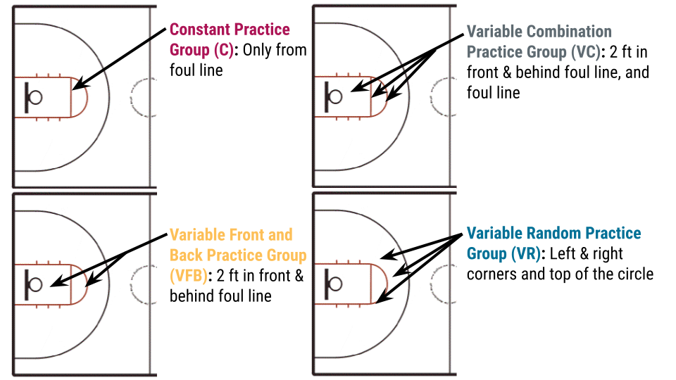

```{r setup, include=FALSE}
options(htmltools.dir.version = FALSE)
```

```{r additional, echo=FALSE, include = FALSE}
library(tidyverse)
```

```{r xaringanExtra, echo=FALSE, include = FALSE}
xaringanExtra::use_xaringan_extra(c("clipboard",
                                    "freezeframe",
                                    "panelset",
                                    "scribble",
                                    "tachyons", 
                                    "tile_view"))
```

## Test review

- Wednesday 11:30-12:30  
- Thursday 10:30-11:30  
- IWC 220  

---

class: title-slide-section-gold, bottom

# Review from last lecture

---

## Giving .grey[too much] feedback can .grey[reduce] retention

.footnote[Winstein and Schmidt 1990, Experiment 2 (https://doi.org/10.1037/0278-7393.16.4.677)]

.left-column[
.black[Task]: Waveform matching task

.black[Groups]:
- **100% feedback** or after every trial

- **50% feedback** through a tapered or faded schedule (high amount early but low amount late)
]

```{r echo=FALSE}
winstein <- tibble::tibble(
    group = c(rep("100% feedback", 18), rep("50% feedback", 18)),
    phase = c(rep("Acquisition", 16), rep("Retention", 2), rep("Acquisition", 16), rep("Retention", 2)),
    day = c(rep("Day 1", 8), rep("Day 2", 8), rep("Day 3", 2), rep("Day 1", 8), rep("Day 2", 8), rep("Day 3", 2)),
    block = factor(rep(1:18, 2)), 
    error = c(14.67, 11.61, 10.66, 10.21, 9.41, 9.56, 8.90, 8.72, 9.86, 8.81, 8.40, 8.10, 7.62, 8.16, 7.95, 7.15, 9.26, 12.12, 14.23, 11.40, 11.13, 9.59, 8.87, 9.65, 9.65, 9.05, 9.47, 7.95, 8.10, 7.80, 7.24, 7.33, 7.27, 7.86, 8.64, 10.00)
)
```

.right-column[
```{r echo=FALSE, fig.align='center', fig.width=12, fig.height=7}
ggplot2::ggplot(winstein, aes(x = block, y = error, group = interaction(group, day))) +
  geom_line(aes(linetype = group), size = 1) +
  geom_point(aes(color = group, shape = group, fill = group), size = 5) +
  scale_y_continuous(name = "Root mean square error (deg)",
                     limits = c(5, 15),
                     breaks = seq(5, 15, 1)) +
  scale_x_discrete(name = NULL,
                   labels = c("1" = "B1",
                              "2" = "B2",
                              "3" = "B3",
                              "4" = "B4",
                              "5" = "B5",
                              "6" = "B6",
                              "7" = "B7",
                              "8" = "B8",
                              "9" = "B9",
                              "10" = "B10",
                              "11" = "B11",
                              "12" = "B12",
                              "13" = "B13",
                              "14" = "B14",
                              "15" = "B15",
                              "16" = "B16",
                              "17" = "5-min",
                              "18" = "24-hr")) +
  scale_color_manual(values = c("#ac1455", "#fdbf57")) +
  scale_fill_manual(values = c("#ac1455", "#fdbf57")) +
  scale_shape_manual(values = c(21, 24)) +
  scale_linetype_manual(values = c(1, 2)) +
  facet_grid(~factor(phase, levels = c("Acquisition", "Retention")), scales = "free_x", space = "free_x") +
  theme(
    legend.text = element_text(size = 18),
    legend.title = element_blank(),
    legend.position = c(0.75, 0.9),
    axis.title = element_text(face = "bold", size = 20),
    axis.text = element_text(size = 18),
    axis.text.x = element_text(angle = 45, vjust = 0.6),
    strip.text.x = element_text(face = "bold", size = 20, color = "#FFFFFF"),
    strip.background = element_rect(color = "#272822", fill = "#7a003c", size = 2, linetype = "solid")
  )
```
]

---

## Providing feedback with a .grey[summary] display can .grey[prevent] becoming .grey[dependent] on feedback

.footnote[Adapted and approximate data from Schmidt et al 1989 (https://doi.org/10.1037/0278-7393.15.2.352) through plot digitization]

.left-column[
.black[Task]: Waveform matching

.black[Groups]:
- Summary **1**
- Summary **5**
- Summary **10**
- Summary **15**

.black[Protocol]: Feedback is given for all trials in the summary length
]

```{r echo=FALSE}
schmidt_simple <- tibble::tibble(
    group = c(rep("Summary 1", 7), rep("Summary 5", 7), rep("Summary 10", 7), rep("Summary 15", 7)),
    phase = c(rep("Acquisition", 6), "Retention", rep("Acquisition", 6), "Retention", rep("Acquisition", 6), "Retention", rep("Acquisition", 6), "Retention"),
    block = factor(rep(1:7, 4)), 
    error = c(54.39, 18.80, 13.53, 17.80, 13.95, 12.02, 49.86, 77.06, 31.21, 25.70, 17.56, 20.40, 17.03, 42.46, 83.51, 46.97, 38.59, 24.00, 29.23, 26.57, 28.85, 91.38, 44.10, 41.45, 35.22, 32.09, 21.80, 23.60)
)
```

.right-column[
```{r echo=FALSE, fig.align='center', fig.width=11, fig.height=6}
ggplot2::ggplot(schmidt_simple, aes(x = block, y = error, group = interaction(group, phase))) +
  geom_line(size = 1) +
  geom_point(aes(color = group, shape = group, fill = group), size = 5) +
  scale_y_continuous(name = "Absolute constant error (ms)",
                     limits = c(0, 100),
                     breaks = seq(0, 100, 20)) +
  scale_x_discrete(name = NULL,
                   labels = c("1" = "B1",
                              "2" = "B2",
                              "3" = "B3",
                              "4" = "B4",
                              "5" = "B5",
                              "6" = "B6",
                              "7" = "24-hr")) +
  scale_color_manual(values = c("#ac1455", "#fdbf57", "#5e6a71", "#007096")) +
  scale_fill_manual(values = c("#ac1455", "#fdbf57", "#5e6a71", "#007096")) +
  scale_shape_manual(values = c(21, 22, 23, 24)) +
  #scale_linetype_manual(values = c(1, 2)) +
  theme(
    legend.text = element_text(size = 18),
    legend.title = element_blank(),
    legend.position = c(0.88, 0.85),
    axis.title = element_text(face = "bold", size = 20),
    axis.text = element_text(size = 18)
  )
```
]

---

## .grey[Error estimation] during practice with different relative feedback frequencies

.footnote[Adapted and approximate data from Guadagnoli and Kohl 2001 (https://doi.org/10.1080/00222890109603152) through plot digitization]

.left-column[
.black[Task:] Strike a padded with a exact amount of force (19.5 N)

.black[Feedback]: **100%** or **20%** of trials

.black[Error estimation]: **100%** or **20%** of trials

This resulted in **four** experimental groups
]

```{r echo=FALSE}
guadagnoli_ee <- tibble::tibble(
    feedback = c(rep("100% feedback", 2), rep("20% feedback", 2)),
    estimation = c("100% Estimation", "20% Estimation", "100% Estimation", "20% Estimation"),
    error = c(240.23, 353.12, 290.81, 285.95)
)
```

.right-column[
```{r echo=FALSE, fig.align='center', fig.width=10, fig.height=5.75}
ggplot2::ggplot(guadagnoli_ee, aes(x = estimation, y = error, fill = estimation)) +
  geom_bar(stat = "identity") +
  scale_y_continuous(name = "RMSE in 24-hr retention",
                     limits = c(0, 400),
                     breaks = seq(0, 400, 50)) +
  scale_x_discrete(name = NULL,
                   breaks = NULL) +
  scale_fill_manual(values = c("#ac1455", "#fdbf57")) +
  facet_grid(~factor(feedback, levels = c("20% feedback", "100% feedback")), scales = "free_x", space = "free_x") +
  theme(
    axis.title = element_text(face = "bold", size = 20),
    axis.text.y = element_text(size = 18),
    axis.text.x = element_blank(),
    legend.title = element_blank(),
    legend.position = c(0.36, 0.9),
    legend.text = element_text(size = 16),
    strip.text.x = element_text(face = "bold", size = 20, color = "#FFFFFF"),
    strip.background = element_rect(color = "#272822", fill = "#7a003c", size = 2, linetype = "solid")
  )
```
]

---

class: inverse, middle, center

# Any questions?

---

background-image: url(https://cdn.dmcl.biz/media/image/173610/o/GettyImages-922040194.jpg)
background-size: cover

---

# Learning objectives

1. Compare and contrast **different  methods** of **structuring** practice.

2. Describe the relative **strengths** and **weaknesses** of different **conditions** of practice. 

3. Discuss the role and importance of **variability** and the **distribution** of practice for motor learning.

--

.bg-gold.b--mid-gray.ba.bw2.br3.shadow-5.ph4.mt5[
.tc[
.black[Take-home message:

The organization of one's practice session can have profound and often paradoxical effects of motor learning.
]]]

---

## How should we balance .grey[practice] and .grey[rest] intervals?

.footnote[Source: https://st1.latestly.com/wp-content/uploads/2021/07/FotoJet-31-784x441.jpg]

*Q's: How many days a week should learners practice? How long should each practice session be?*

--

.pull-left[.center[

]]

<br>

.black[MASSED PRACTICE]: a **practice schedule** in which the amount of rest **between** practice sessions or trials is **relatively short**

.black[DISTRIBUTED PRACTICE]: a **practice schedule** in which the amount of rest **between** practice sessions or trials is **relatively long**

---

## The benefits of .grey[more and shorter] practice sessions

.footnote[Approximate data adapted from Baddely and Longman 1978 (https://doi.org/10.1080/00140137808931764) as presented in Schmidt and Lee 2011]

.left-column[
.black[Task]: Keyboard mail sorting machine

.black[Training]: Alloted 60 hrs and 5 days each week

.black[Groups]:
- **1 hr, once/day** = 12 weeks
- **2 hr, once/day** = 6 weeks
- **1 hr, twice/day** = 6 weeks
- **2 hr, twice/day** = 3 weeks
]

--

```{r echo=FALSE}
distribution_between <- tibble::tibble(
    group = c(rep("1 hr, once/day", 13), rep("2 hr, once/day", 19), rep("1 hr, twice/day", 19), rep("2 hr, twice", 20)),
    sessions = factor(c(seq(40, 58, 2), 1, 3, 9, seq(48, 78, 2), 1, 3, 9, seq(48, 78, 2), 1, 3, 9, seq(48, 80, 2), 1, 3, 9)),
    phase = c(rep("Hours of practice", 10), rep("Retention months", 3), rep("Hours of practice", 16), rep("Retention months", 3), rep("Hours of practice", 16), rep("Retention months", 3), rep("Hours of practice", 17), rep("Retention months", 3)),
    score = c(64.54, 66.57, 68.06, 70.93, 75.19, 73.98, 75.56, 78.89, 84.07, 82.78, 67.96, 56.57, 57.13, 66.67, 67.04, 70.83, 70.09, 72.87, 73.98, 77.5, 76.11, 80.09, 78.7, 81.02, 79.26, 80.83, 86.39, 84.44, 86.85, 76.94, 62.04, 55.93, 62.59, 65.09, 67.78, 68.98, 69.81, 72.59, 72.87, 74.81, 75.74, 76.02, 78.06, 78.7, 79.26, 79.91, 83.8, 84.81, 71.39, 60.83, 54.07, 55.09, 62.04, 63.15, 62.5, 61.94, 64.44, 65, 63.89, 66.02, 71.11, 69.81, 70, 72.87, 75.37, 74.63, 75.19, 76.48, 66.85, 54.17, 45.37)
)

dist_btw_practice_only <- distribution_between %>% 
  dplyr::filter(phase == "Hours of practice")
```

.right-column[
```{r echo=FALSE, fig.align='center', fig.width=10, fig.height = 6}
ggplot2::ggplot(distribution_between, aes(x = sessions, y = score, group = group)) +
  geom_line(data = dist_btw_practice_only, aes(color = group, linetype = group), size = 1) +
  geom_point(aes(color = group, shape = group, fill = group), size = 4) +
  scale_y_continuous(name = "Correct keystroke per minute",
                     limits = c(40, 90),
                     breaks = seq(40, 90, 10)) +
  scale_x_discrete(name = NULL,
                   breaks = c(seq(40, 80, 4), 1, 3, 9)) +
  scale_color_manual(values = c("#ac1455", "#fdbf57", "#5e6a71", "#007096")) +
  scale_fill_manual(values = c("#ac1455", "#fdbf57", "#5e6a71", "#007096")) +
  scale_shape_manual(values = c(21, 22, 23, 24)) +
  scale_linetype_manual(values = c(1, 2, 3, 5)) +
  facet_grid(~factor(phase, levels = c("Hours of practice", "Retention months")), scales = "free_x") +
  theme(
    legend.text = element_text(size = 18),
    legend.title = element_blank(),
    legend.position = c(0.35, 0.2),
    axis.title = element_text(face = "bold", size = 20),
    axis.text = element_text(size = 18),
    strip.text.x = element_text(face = "bold", size = 20, color = "#FFFFFF"),
    strip.background = element_rect(color = "#272822", fill = "#7a003c", size = 2, linetype = "solid")
    )
```
]

---

## Practice distribution and total practice time involves a .grey[trade-off]

- **Distributed practice** results in more learning per time in training, but requires the most total time to complete  

<br/> 

- **Massed practice** results in reduced benefits per time in training, but requires less total time

<br/> 

.center[***What is the trade-off?***]

---

class: middle

background-image: url(https://www.aubreydaniels.com/sites/default/files/Dr.%20Ericsson%20and%20deliberate%20practice.jpg)
background-size: contain

.footnote[Source: https://www.aubreydaniels.com/sites/default/files/Dr.%20Ericsson%20and%20deliberate%20practice.jpg]

<br><br><br><br><br>
## *Q: How should you practice <br /> basketball free throws?*

--

.black[CONSTANT PRACTICE]: Practice a **single variation** of the same skill

.black[VARIABLE PRACTICE]: Practice **multiple variations** of the same skill

---

## Constant .grey[versus] variable practice for free throws

.footnote[Shoenfelt et al. 2002 (https://doi.org/10.2466/pms.2002.94.3c.1113)]

.center[

]

---

## Constant .grey[versus] variable practice for free throws

.footnote[Shoenfelt et al. 2002 (https://doi.org/10.2466/pms.2002.94.3c.1113)]

```{r echo=FALSE}
# Create tibble of Shoenfelt et al. 2002 data
shoenfelt <- tibble::tibble(
  group = c("C", "VC", "VFB", "VR"),
  score = c(1, 2.4, 10.9, 7.4)
)
```

.pull-left[
```{r echo=FALSE, fig.align='center', fig.height=6.5}
ggplot2::ggplot(shoenfelt, aes(x = group, y = score, fill = group)) +
  geom_bar(stat = "identity") +
  scale_y_continuous(name = "Percent improvement from pre-test (%)",
                     limits = c(0, 12),
                     breaks = seq(0, 12, 2)) +
  scale_x_discrete(name = NULL) +
  scale_fill_manual(values = c("#ac1455", "#5e6a71", "#fdbf57", "#007096")) +
  theme(
    axis.title = element_text(face = "bold", size = 20),
    axis.text = element_text(size = 18),
    legend.position = "none"
  )
```
]

.pull-right[.center[

]]

---

## Constant .grey[versus] variable practice for free throws

.footnote[Shoenfelt et al. 2002 (https://doi.org/10.2466/pms.2002.94.3c.1113)]

.pull-left[
```{r echo=FALSE, fig.align='center', fig.height=6.5}
ggplot2::ggplot(shoenfelt, aes(x = group, y = score, fill = group)) +
  geom_bar(stat = "identity") +
  scale_y_continuous(name = "Percent improvement from pre-test (%)",
                     limits = c(0, 12),
                     breaks = seq(0, 12, 2)) +
  scale_x_discrete(name = NULL) +
  scale_fill_manual(values = c("#ac1455", "#5e6a71", "#fdbf57", "#007096")) +
  theme(
    axis.title = element_text(face = "bold", size = 20),
    axis.text = element_text(size = 18),
    legend.position = "none"
  )
```
]

.pull-right[.center[

]

***Q1:*** *What can you conclude based on this figure showing percent improvement from pre-test to 2-week retention test?*

***Q2:*** *What is the most surprising finding from this data?*
]

---

## Variable practice .grey[facilitates] the acquisition of .grey[motor schema]

- **Schema** allow us to learn the basic **mapping** between a **parameter** (e.g., force) and resulting **action** (e.g., distance)

.pull-left[.center[
.black[Constant practice]


]]

.pull-right[.center[
.black[Variable practice]


]]

---

## Variable practice .grey[facilitates] the acquisition of .grey[motor schema]

- **Schema** allow us to learn the basic **mapping** between a **parameter** (e.g., force) and resulting **action** (e.g., distance)

.pull-left[.center[
.black[Constant practice]


]]

.pull-right[.center[
.black[Variable practice]


]]

---

## Consider the following .grey[scenario]...

You are an **occupational therapist** working with a stroke patient. They want to **regain** some of their **independence** with 3 specific activities of daily living: 1) **brushing teeth**, 2) **pouring water into a glass**, and 3) **buttoning a shirt**. .black[*How should you structure the practice (and why)?*]

--

.pull-left[.center[
.black[Blocked practice]

]]

--

.pull-right[.center[
.black[Random practice]

]]

---

## Is .grey[blocked] or .grey[random] practice more effective?

.footnote[Shea and Morgan 1979 (https://doi.org/10.1037/0278-7393.5.2.179)]

.pull-left[
.black[Task]: Knock-down barrier (3 sequences and 18 trials of each) as fast and accurate as possible

.black[Groups]: **Random** (unpredictable order) versus **Blocked** (predictable order)

.black[Design]: 
- **Acquisition** - 6 blocks of trials

- **Retention** - Half completed their retention test with the **same order** from practice and the other half experienced the **opposite order** from practice
]

.pull-right[.center[

]]

---

## Is .grey[blocked] or .grey[random] practice more effective?

.footnote[Approximate data of Shea and Morgan 1979 (https://doi.org/10.1037/0278-7393.5.2.179) through plot digitization]

```{r echo=FALSE}
shea_morgan_practice <- tibble::tibble(
    group = c(rep("Blocked", 6), rep("Random", 6)),
    block = factor(rep(1:6, 2)),
    time = c(1.46, 1.33, 1.23, 1.28, 1.24, 1.22, 2.56, 1.7, 1.6, 1.5, 1.44, 1.3)
)
```

.pull-left[
```{r echo=FALSE, fig.align='center', fig.height=6.5}
ggplot2::ggplot(shea_morgan_practice, aes(x = block, y = time, group = group)) +
  geom_line(aes(color = group), size = 1) +
  geom_point(aes(color = group, shape = group, fill = group), size = 5) +
  scale_y_continuous(name = "Time to completion (s)",
                     limits = c(1.0, 2.6),
                     breaks = seq(1.0, 2.6, 0.2)) +
  scale_x_discrete(name = "Acquisition (Blocks of 9 trials)",
                   breaks = c(seq(1, 6, 1))) +
  scale_color_manual(values = c("#ac1455", "#fdbf57")) +
  scale_fill_manual(values = c("#ac1455", "#fdbf57")) +
  scale_shape_manual(values = c(21, 22)) +
  scale_linetype_manual(values = c(1, 2)) +     
  theme(
    legend.text = element_text(size = 18),
    legend.title = element_blank(),
    legend.position = c(0.85, 0.9),
    axis.title = element_text(face = "bold", size = 20),
    axis.text = element_text(size = 18)
  )
```
]

--

```{r echo=FALSE}
shea_morgan_retention <- tibble::tibble(
    group = c(rep("Blocked", 4), rep("Random", 4)),
    block = factor(c("10 min", "10 day", "10 min", "10 day", "10 min", "10 day", "10 min", "10 day")),
    test = c(rep("Blocked", 2), rep("Random", 2), rep("Blocked", 2), rep("Random", 2)),
    time = c(1.4, 1.28, 2.1, 2.2, 1.27, 1.38, 1.15, 1.19)
)
```

.pull-right[
```{r echo=FALSE, fig.align='center', fig.height=6.5}
ggplot2::ggplot(shea_morgan_retention, aes(x = block, y = time, group = interaction(group, test))) +
  geom_line(aes(color = group, linetype = test), size = 1) +
  geom_point(aes(color = group, shape = group, fill = group), size = 5) +
  scale_y_continuous(name = "Time to completion (s)",
                     limits = c(1.0, 2.6),
                     breaks = seq(1.0, 2.6, 0.2)) +
  scale_x_discrete(name = "Retention",
                   limits = c("10 min", "10 day")) +
  scale_color_manual(values = c("#ac1455", "#fdbf57")) +
  scale_fill_manual(values = c("#ac1455", "#fdbf57")) +
  scale_shape_manual(values = c(21, 22)) +
  scale_linetype_manual(values = c(1, 2)) +                                            
  theme(
    # legend.text = element_text(size = 18),
    # legend.title = element_blank(),
    legend.position = "none",
    axis.title = element_text(face = "bold", size = 20),
    axis.text = element_text(size = 18)
  ) +
  annotate(geom = "text", 
           x = 2.1,
           y = 1.28, 
           label = "B-B", 
           hjust = "left", 
           size = 6) +
  annotate(geom = "text", 
           x = 2.1,
           y = 2.2, 
           label = "B-R", 
           hjust = "left", 
           size = 6) +
  annotate(geom = "text", 
           x = 2.1,
           y = 1.38, 
           label = "R-R", 
           hjust = "left", 
           size = 6) +
  annotate(geom = "text", 
           x = 2.1,
           y = 1.19, 
           label = "R-B", 
           hjust = "left", 
           size = 6)
```
]

---

# Learning objectives

1. Compare and contrast **different  methods** of **structuring** practice.

2. Describe the relative **strengths** and **weaknesses** of different **conditions** of practice. 

3. Discuss the role and importance of **variability** and the **distribution** of practice for motor learning.

.bg-gold.b--mid-gray.ba.bw2.br3.shadow-5.ph4.mt5[
.tc[
.black[Take-home message:

The organization of one's practice session can have profound and often paradoxical effects of motor learning.
]]]

---

class: title-slide-final, middle
background-image: url(https://raw.githubusercontent.com/cartermaclab/mackin-xaringan/main/imgs/logos/mcmaster-stack-color.png)
background-size: 95px
background-position: 9% 15%

# What questions do you have?


|                                                                                                                |                                   |
| :------------------------------------------------------------------------------------------------------------- | :-------------------------------- |
| <a href="https://twitter.com/cartermaclab">.mackinred[<i class="fa fa-twitter fa-fw"></i>]                     | @_LauraStGermain                  |
| <a href="https://github.com/LauraStGermain">.mackinred[<i class="fa fa-github fa-fw"></i>]                     | @LauraStGermain                   |
| <a href="https://cartermaclab.org">.mackinred[<i class="fa fa-link fa-fw"></i>]                                | www.cartermaclab.org              |
