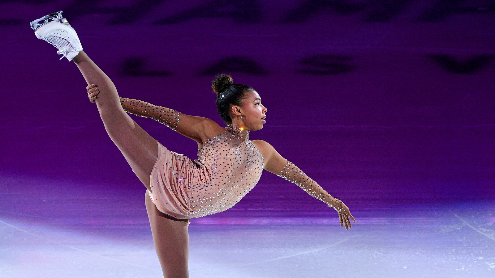

```{r setup, include=FALSE}
options(htmltools.dir.version = FALSE)
```

```{r additional, echo=FALSE, include = FALSE}
library(tidyverse)
```

```{r xaringanExtra, echo=FALSE, include = FALSE}
xaringanExtra::use_xaringan_extra(c("clipboard",
                                    "freezeframe",
                                    "panelset",
                                    "scribble",
                                    "tachyons", 
                                    "tile_view"))
```

class: title-slide-section-gold, bottom

# Review from last lecture

---

## Practice can be organized to .grey[promote] different amounts of .grey[contextual interference]

.footnote[<sup>1</sup>This term was introduced by Battig 1979 when he first demonstrated the contextual interference effect; Fig: Magill & Anderson 2017]

.black[CONTEXTUAL INTERFERENCE]<sup>1</sup>: refers to the **interference** that results from performing various tasks or skills with the **context** of practice

--

.center[

]

--

.black[CONTEXTUAL INTERFERENCE EFFECT]: when a **high amount** of contextual interference results in **better** retention and/transfer performance than a low amount of interference

---

## Why is random .grey[more effective] than blocked?

.footnote[Lee & Magill 1983 (https://doi.org/10.1037/0278-7393.9.4.730); Shea & Morgan 1979 (https://doi.org/10.1037/0278-7393.5.2.179); Shea & Zimny 1983 (https://doi.org/10.1016/S0166-4115(08)61998-6)]

.pull-left[
.black[<ins>ELABORATION HYPOTHESIS</ins>]

Interleaving tasks gives the learner opportunities to engage in **inter- & intra-task processing** (i.e., compare and contrast) in **working memory**, which **facilitates** the development of more **distinct or elaborative** motor memories
]

.pull-right[
.black[<ins>FORGETTING-RECONSTRUCTION HYPOTHESIS</ins>]

Interleaving tasks forces the learner to .gold["forget" or dump] a given .gold[action plan] from .gold[working memory] to plan and execute successive trials. The learner must then .gold[(re)construct an action plan] on each trial.
]

---

## Testing .grey[between] explanations: .grey[TMS]

.footnote[Lin et al. 2008 (https://doi.org/10.3200/JMBR.40.6.578-586)]

.pull-left[
.black[Task]: Waveform matching

.black[Groups]: 
- **Random** groups
  1. No-TMS
  2. Sham-TMS
  3. TMS
- **Blocked** groups
  1. No-TMS
  2. Sham-TMS
  3. TMS

.black[TMS protocol]: **Suprathreshold** TMS during the **intertrial interval** to modulate **elaborative** and/or **forgetting-reconstruction** processes
]


```{r echo=FALSE}
lin_tms <- tibble::tibble(
    group = c(rep("Blocked", 12), rep("Random", 12)),
    stim = c(rep("No TMS", 4), rep("Sham TMS", 4), rep("TMS", 4), rep("No TMS", 4), rep("Sham TMS", 4), rep("TMS", 4)),
    phase = c(rep("Acquisition", 2), rep("Retention", 2), rep("Acquisition", 2), rep("Retention", 2), rep("Acquisition", 2), rep("Retention", 2), rep("Acquisition", 2), rep("Retention", 2), rep("Acquisition", 2), rep("Retention", 2), rep("Acquisition", 2), rep("Retention", 2)),
    block = factor(rep(1:4, 6)),
    error = c(21.44, 10.26, 13.93, 21.34, 21.92, 10.53, 15.15, 20.12, 19.94, 9.85, 12.84, 18.76, 17.94, 11.59, 11.92, 14.91, 20.32, 12.33, 12.87, 16, 21.27, 14.1, 13.15, 22.53)
)

lin_tms_practice_only <- lin_tms %>% 
  dplyr::filter(phase == "Acquisition")
```

.pull-right[
```{r echo=FALSE, fig.align='center'}
ggplot2::ggplot(lin_tms, aes(x = block, y = error, group = interaction(stim, phase))) +
  geom_line(data = lin_tms_practice_only, aes(color = stim, linetype = stim), size = 1) +
  geom_point(aes(color = stim, fill = stim, shape = stim), size = 4) +
  scale_y_continuous(name = "Root mean squared error (deg)",
                     limits = c(8, 24),
                     breaks = seq(8, 24, 2)) +
  scale_x_discrete(name = NULL,
                   labels = c("1" = "B1",
                              "2" = "B12",
                              "3" = "1-min",
                              "4" = "24-hr")) +
  scale_color_manual(values = c("#ac1455", "#fdbf57", "#5e6a71")) +
  scale_fill_manual(values = c("#ac1455", "#fdbf57", "#5e6a71")) +
  scale_shape_manual(values = c(21, 22, 23)) +
  facet_grid(~group) +
  theme(
    axis.title = element_text(face = "bold", size = 20),
    axis.text = element_text(size = 18),
    legend.title = element_blank(),
    legend.position = c(0.9, 0.12),
    legend.text = element_text(size = 16),
    strip.text.x = element_text(face = "bold", size = 20, color = "#FFFFFF"),
    strip.background = element_rect(color = "#272822", fill = "#7a003c", size = 2, linetype = "solid")
  )
```
]

---

## Testing .grey[between] explanations: .grey[Probe reaction time]

.footnote[Approximate data from Li & Wright 2000 (https://doi.org/10.1080/713755890) through plot digitization]

.pull-left[
.black[Task]: Sequence learning (3 patterns)

.black[Probe task]: 2-Choice reaction time task (**low** versus **high** tone)

.black[Probe protocol]: **Randomly** presented on **some** trials (12 trials for each tone)

.black[Groups]:
- **Random** groups
  1. Pre-response interval
  2. Inter-trial interval
- **Blocked** groups
  1. Pre-response interval
  2. Inter-trial interval
]

```{r echo=FALSE}
li_probe <- tibble::tibble(
    group = c(rep("Blocked", 2), rep("Random", 2)),
    interval = c("Pre-response", "Inter-trial", "Pre-response", "Inter-trial"),
    rt = c(739.79, 723.30, 885.86, 779.84),
    sd = c(16.49, 21.04, 25.92, 21.21)
)
```

.pull-right[
```{r echo=FALSE, fig.align='center', fig.height=6.5}
ggplot2::ggplot(li_probe) +
  geom_bar(aes(x = group, y = rt, fill = group), stat = "identity") +
  geom_errorbar(aes(x = group, ymin = rt - sd, ymax = rt + sd), width = 0.4, size = 1.3) +
  scale_y_continuous(name = "Probe choice reaction time (ms)",
                     limits = c(0, 1000),
                     breaks = seq(0, 1000, 100)) +
  scale_x_discrete(name = NULL,
                   breaks = NULL) +
  scale_fill_manual(values = c("#ac1455", "#fdbf57")) +
  facet_grid(~factor(interval, levels = c("Pre-response", "Inter-trial"))) +
  theme(
    axis.title = element_text(face = "bold", size = 20),
    axis.text.y = element_text(size = 18),
    axis.text.x = element_blank(),
    legend.title = element_blank(),
    legend.position = c(0.87, 0.92),
    legend.text = element_text(size = 16),
    strip.text.x = element_text(face = "bold", size = 20, color = "#FFFFFF"),
    strip.background = element_rect(color = "#272822", fill = "#7a003c", size = 2, linetype = "solid")
  ) +
  geom_hline(yintercept = 406.63, linetype = "dashed", size = 1)
```
]

---

class: inverse, middle, center

# Any questions?

---

# Learning objectives

1. Identify various **characteristics** of possible model demonstrations.

2. Describe **strengths** and **weaknesses** of different models.

3. Describe how to select **appropriate ways** to **implement** observational learning. 

--

.bg-gold.b--mid-gray.ba.bw2.br3.shadow-5.ph4.mt5[
.tc[
.black[Take-home message:

Observing a model is an effective way to promote motor learning, but the effectiveness of an observation intervention will depend on moderator variables, context and function, and characteristics of the model.
]]]

---

## Observational learning

.black[Definition:] The use of demonstration(s) to convey information about how to perform a skill.

--

.black[Another definition:] The process by which a learner brings their actions to approximate those of a model.

---

## .grey[Observational practice] offers learning benefits, but to a lesser extent than .grey[physical practice]

.footnote[Approximate data adapted from Shae, Wulf & Whitacre 2000 (https://doi.org/10.1080/00222890009601357)]

.left-column[
.black[Task]: Keyboard tracking task

.black[Groups]:
- Physical practice
- Observational practice
- Control
]

--

```{r echo=FALSE}
# create table of shea at al data
shea_2000_tib <- tibble::tibble(
    group = c(rep("Physical", 22), rep("Observation", 2), rep("Control", 2)),
    block = factor(c(1:22, 21, 22, 21, 22)),
    phase = c(rep("Acquisition", 20), "Ret", "Trn", "Ret", "Trn", "Ret", "Trn"),
    score = c(11, 9.2, 9.2, 7.8, 7, 7.6, 6.9, 6.8, 6.7, 6.1, 6, 6.2, 5.9, 5.95, 5, 5.1, 5.2, 5.05, 4.5, 4.65, 4.7, 6.55, 7.9, 6.75, 10.8, 11.2)
)
```

.right-column[
```{r echo=FALSE, fig.align='center', fig.width=10, fig.height = 5.5}
ggplot2::ggplot(shea_2000_tib, aes(x = block, y = score, group = interaction(group, phase))) +
    geom_line(aes(linetype = group), size = 1) +
    geom_point(aes(color = group, shape = group, fill = group), size = 5) +
    scale_y_continuous(name = "RMSE",
                       limits = c(4, 12),
                       breaks = seq(4, 12, 2)) +
    scale_x_discrete(name = "Trial",
                     labels = c("1" = "1",
                                "2" = "2",
                                "3" = "3",
                                "4" = "4",
                                "5" = "5",
                                "6" = "6",
                                "7" = "7",
                                "8" = "8",
                                "9" = "9",
                                "10" = "10",
                                "11" = "11",
                                "12" = "12",
                                "13" = "13",
                                "14" = "14",
                                "15" = "15",
                                "16" = "16",
                                "17" = "17",
                                "18" = "18",
                                "19" = "19",
                                "20" = "20",
                                "21" = "Ret",
                                "22" = "Trn")) +
    scale_color_manual(values = c("#ac1455", "#fdbf57", "#5e6a71")) +
    scale_fill_manual(values = c("#ac1455", "#fdbf57", "#5e6a71")) +
    scale_linetype_manual(values = c(3, 2, 1)) +
    theme(
        legend.text = element_text(size = 18),
        legend.title = element_blank(),
        legend.position = c(0.5, 0.85),
        axis.title = element_text(face = "bold", size = 20),
        axis.text = element_text(size = 18)
    )
```
]

---

## An applied model for the use of observation

.footnote[Adapted from Ste-Marie, Lelievre, & St. Germain 2020 (https://doi.org/10.1080/02701367.2019.1693489)]


.center[

]

---

## .grey[Moderator variables] impact observation intervention outcomes

.pull-left[
.black[.big[Task]]  
- Complexity
- Classification 
- Goal vs action
]

.pull-right[
.black[.big[Observer]]  
- Age
- Stage of learning
- Imagery ability
- Self-efficacy level
]

---

## An applied model for the use of observation

.footnote[Adapted from Ste-Marie, Lelievre, & St. Germain 2020 (https://doi.org/10.1080/02701367.2019.1693489)]


.center[

]

---

## .grey[Where:] Models are beneficial in a variety of settings

.pull-left[
.black[.big[Training]]  
.center[
]

.center[

]]

.pull-right[
.black[.big[Performance]]  
.center[

]]

---

## .grey[Why] do we observe?

.big[.black[Skill:] Improve skill performance and learning]

.big[.black[Strategy:] Develop and execute sport strategy]

.big[.black[Performance:] Reach optimal levels of mental arousal]

---

## An applied model for the use of observation

.footnote[Adapted from Ste-Marie, Lelievre, & St. Germain 2020 (https://doi.org/10.1080/02701367.2019.1693489)]


.center[

]

---

## An applied model for the use of observation

.footnote[Adapted from Ste-Marie, Lelievre, & St. Germain 2020 (https://doi.org/10.1080/02701367.2019.1693489)]


.center[

]

---

## .grey[Who] should we observe?

.pull-left[
<br> <br>

]

.pull-right[

]

---

## .grey[Who:] Types of models

.black[Unskilled/Novice:] Will make errors during the skill
- Aids in **error detection**


--


.black[Skilled/Expert:] Performs the skill with no errors
- Aids in **error correction**


--


.black[Learning:] Will begin at an unskilled level and progress throughout practice towards a skilled level

---

## .grey[Expert] and .grey[learning] models are effective; .grey[feedback] about the learning model must be provided

.footnote[Approximate data adapted from McCullagh & Meyer 1997 (https://doi.org/10.1080/02701367.1997.10608866)]

.left-column[
.black[Task]: Free squat

.black[Groups]:
- Expert model with feedback
- Learning model **with no** feedback
- Learning model **with** feedback
- Physical performance with feedback
]

--

```{r echo=FALSE}
# create table of mccullagh and meyer data
mccullagh_1997_tib <- tibble::tibble(
  group = c(rep("EM + FB", 8), rep("LM + FB", 8), rep("PP + FB", 8), rep("LM - FB", 8)),
  trial = factor(rep(1:8, 4)),
  phase = rep(c(rep("Acq", 5), rep("Ret", 3)), 4),
  score = c(2.55, 2.95, 3.3, 3.5, 3.45, 3.2, 3.45, 3.47, 2.45, 2.85, 3.1, 3.25, 3.25, 3.3, 3.35, 3.37, 2, 2.55, 2.75, 2.9, 2.8, 2.55, 2.8, 2.7, 2.15, 2.45, 2.57, 2.55, 2.6, 2.25, 2.4, 2.41)
)
```

.right-column[
```{r echo=FALSE, fig.align='center', fig.width=10, fig.height = 5.5}
ggplot2::ggplot(mccullagh_1997_tib, aes(x = trial, y = score, group = interaction(group, phase))) +
  geom_line(aes(linetype = group), size = 1) +
  geom_point(aes(color = group, shape = group, fill = group), size = 5) +
  scale_y_continuous(name = "Form scores",
                     limits = c(1.8, 3.8),
                     breaks = seq(1.8, 3.8, 0.4)) +
  scale_x_discrete(name = "Trial",
                   labels = c("1" = "A1",
                              "2" = "A2",
                              "3" = "A3",
                              "4" = "A4",
                              "5" = "A5",
                              "6" = "R1",
                              "7" = "R2",
                              "8" = "R3")) +
  scale_color_manual(values = c("#ac1455", "#fdbf57", "#5e6a71", "#007096")) +
  scale_fill_manual(values = c("#ac1455", "#fdbf57", "#5e6a71", "#007096")) +
  scale_shape_manual(values = c(21, 22, 23, 24)) +
  scale_linetype_manual(values = c(1, 2, 3, 5)) +
  theme(
    legend.text = element_text(size = 18),
    legend.title = element_blank(),
    legend.position = c(0.1, 0.85),
    axis.title = element_text(face = "bold", size = 20),
    axis.text = element_text(size = 18)
  )

```
]

---

## .grey[Who:] Observing yourself

.black[Self-observation:] Watching video replay of yourself

.black[Positive self-review:] Taking video recordings of yourself and watching the best trials

.black[Feedforward modeling:] Editing a video of yourself to show you completing a skill at a level higher than you are currently able to perform

---

## .grey[Who:] Combining model types

- Often called a **mixed-model**
- Combining .black[skilled] and .black[unskilled]: Allows for direct comparisons, which may enhance a learner's **error detection and correction** mechanism

.pull-left[

]

.pull-right[

]

---

## Combining .grey[self-observation] with an .grey[expert] model enhances .grey[learning] 

.footnote[Approximate data adapted from Robertson, St. Germain & Ste-Marie 2018 (https://doi.org/10.1123/jmld.2016-0027)]

.left-column[
.black[Task]: Gymnastics skills

.black[Conditions]:
- **Self-observation:** watch themselves
- **Mixed-model:** watch themselves and an expert model
]

--

```{r echo=FALSE}
# create table of robertson 2018
robertson_2018_tib <- tibble::tibble(
  group = c("Self-observation", "Self-observation", "Mixed model", "Mixed model"),
  phase = c("Pre-test", "Retention", "Pre-test", "Retention"),
  score = c(2.89, 3.19, 3.65, 4.70)
)

robertson_2018_tib$group <- factor(robertson_2018_tib$group, levels = c("Self-observation", "Mixed model"))
```

.right-column[
```{r echo=FALSE, fig.align='center', fig.width=10, fig.height = 5.5}
ggplot2::ggplot(robertson_2018_tib, aes(x = phase, y = score, fill = group)) +
  geom_bar(stat = "identity", position = "dodge") +
  scale_y_continuous(name = "Form score",
                     limits = c(0, 5),
                     breaks = seq(0, 5, 1)) +
  scale_x_discrete(name = NULL,
                   breaks = NULL) +
  facet_grid(~factor(phase, levels = c("Pre-test", "Retention")), scales = "free_x", space = "free_x") +
  scale_fill_manual(values = c("#ac1455", "#fdbf57")) +
  theme(
    legend.text = element_text(size = 18),
    legend.title = element_blank(),
    legend.position = c(0.15, 0.9),
    axis.title = element_text(face = "bold", size = 20),
    axis.text = element_text(size = 18),     strip.text.x = element_text(face = "bold", size = 20, color = "#FFFFFF"),
    strip.background = element_rect(color = "#272822", fill = "#7a003c", size = 2, linetype = "solid")
  )

```
]

---

## .grey[Who:] Choosing a model type

- Observational learning is an effective way to improve motor learning

--

- There is no clear gold standard of who to observe

---

## An applied model for the use of observation

.footnote[Adapted from Ste-Marie, Lelievre, & St. Germain 2020 (https://doi.org/10.1080/02701367.2019.1693489)]


.center[

]

---

## An applied model for the use of observation

.footnote[Adapted from Ste-Marie, Lelievre, & St. Germain 2020 (https://doi.org/10.1080/02701367.2019.1693489)]


.center[

]

---

# Learning objectives

1. Identify various **characteristics** of possible model demonstrations.

2. Describe **strengths** and **weaknesses** of different models.

3. Describe how to select **appropriate ways** to **implement** observational learning. 

--

.bg-gold.b--mid-gray.ba.bw2.br3.shadow-5.ph4.mt5[
.tc[
.black[Take-home message:

Observing a model is an effective way to promote motor learning, but the effectiveness of an observation intervention will depend on moderator variables, context and function, and characteristics of the model.
]]]

---

class: title-slide-final, middle
background-image: url(https://raw.githubusercontent.com/cartermaclab/mackin-xaringan/main/imgs/logos/mcmaster-stack-color.png)
background-size: 95px
background-position: 9% 15%

# What questions do you have?


|                                                                                                                |                                   |
| :------------------------------------------------------------------------------------------------------------- | :-------------------------------- |
| <a href="https://twitter.com/cartermaclab">.mackinred[<i class="fa fa-twitter fa-fw"></i>]                     | @_LauraStGermain                  |
| <a href="https://github.com/LauraStGermain">.mackinred[<i class="fa fa-github fa-fw"></i>]                     | @LauraStGermain                   |
| <a href="https://cartermaclab.org">.mackinred[<i class="fa fa-link fa-fw"></i>]                                | www.cartermaclab.org              |
