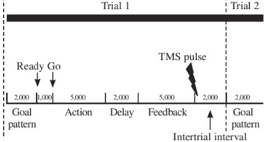

```{r setup, include=FALSE}
options(htmltools.dir.version = FALSE)
```

```{r libraries, echo=FALSE}
library(kableExtra)
library(tidyverse)
```

```{r xaringanExtra, echo=FALSE}
xaringanExtra::use_xaringan_extra(c("clipboard",
                                    "freezeframe",
                                    "panelset",
                                    "scribble",
                                    "tachyons", 
                                    "tile_view"))
```

class: title-slide-section-gold, bottom

# Review from last lecture

---

## Practice can be organized to .grey[promote] different amounts of .grey[contextual interference]

.footnote[<sup>1</sup>This term was introduced by Battig 1979 when he first demonstrated the contextual interference effect; Fig: Magill & Anderson 2017]

.black[CONTEXTUAL INTERFERENCE]<sup>1</sup>: refers to the **interference** that results from performing various tasks or skills with the **context** of practice

.center[

]

.black[CONTEXTUAL INTERFERENCE EFFECT]: when a **high amount** of contextual interference results in **better** retention and/transfer performance than a low amount of interference

---

background-image: url(imgs/elaboration.png)
background-position: 95% 75%

## Why is random .grey[more effective] than blocked?

.footnote[Shea & Morgan 1979 (https://doi.org/10.1037/0278-7393.5.2.179); Shea & Zimny 1983 (https://doi.org/10.1016/S0166-4115(08)61998-6)]

.left-third[
.black[<ins>ELABORATION HYPOTHESIS</ins>]

Interleaving tasks gives the learner opportunities to engage in **inter- & intra-task processing** (i.e., compare and contrast) in **working memory**, which **facilitates** the development of more **distinct or elaborative** motor memories
]

---

background-image: url(imgs/forgetting-reconstruction.png)
background-position: 95% 75%

## Why is random .grey[more effective] than blocked?

.footnote[Lee & Magill 1983 (https://doi.org/10.1037/0278-7393.9.4.730)]

.left-third[
.black[<ins>FORGETTING-RECONSTRUCTION HYPOTHESIS</ins>]

Interleaving tasks forces the learner to .gold["forget" or dump] a given .gold[action plan] from .gold[working memory] to plan and execute successive trials. The learner must then .gold[(re)construct an action plan] on each trial.
]

---

## Testing .grey[between] explanations: .grey[TMS]

.footnote[Approximate data of Lin et al 2008 (https://doi.org/10.3200/JMBR.40.6.578-586) through plot digitization]

```{r echo=FALSE}
lin_tms <- tibble::tibble(
    group = c(rep("Blocked", 12), rep("Random", 12)),
    stim = c(rep("No TMS", 4), rep("Sham TMS", 4), rep("TMS", 4), rep("No TMS", 4), rep("Sham TMS", 4), rep("TMS", 4)),
    phase = c(rep("Acquisition", 2), rep("Retention", 2), rep("Acquisition", 2), rep("Retention", 2), rep("Acquisition", 2), rep("Retention", 2), rep("Acquisition", 2), rep("Retention", 2), rep("Acquisition", 2), rep("Retention", 2), rep("Acquisition", 2), rep("Retention", 2)),
    block = factor(rep(1:4, 6)),
    error = c(21.44, 10.26, 13.93, 21.34, 21.92, 10.53, 15.15, 20.12, 19.94, 9.85, 12.84, 18.76, 17.94, 11.59, 11.92, 14.91, 20.32, 12.33, 12.87, 16, 21.27, 14.1, 13.15, 22.53)
)

lin_tms_practice_only <- lin_tms %>% 
  dplyr::filter(phase == "Acquisition")
```

.wide-left[
```{r echo=FALSE, fig.align='center', fig.width=10, fig.height=6.5}
ggplot2::ggplot(lin_tms, aes(x = block, y = error, group = interaction(stim, phase))) +
  geom_line(data = lin_tms_practice_only, aes(color = stim, linetype = stim), size = 1) +
  geom_point(aes(color = stim, fill = stim, shape = stim), size = 4) +
  scale_y_continuous(name = "Root mean squared error (deg)",
                     limits = c(8, 24),
                     breaks = seq(8, 24, 2)) +
  scale_x_discrete(name = NULL,
                   labels = c("1" = "B1",
                              "2" = "B12",
                              "3" = "1-min",
                              "4" = "24-hr")) +
  scale_color_manual(values = c("#ac1455", "#fdbf57", "#5e6a71")) +
  scale_fill_manual(values = c("#ac1455", "#fdbf57", "#5e6a71")) +
  scale_shape_manual(values = c(21, 22, 23)) +
  facet_grid(~group) +
  theme(
    axis.title = element_text(face = "bold", size = 20),
    axis.text = element_text(size = 18),
    legend.title = element_blank(),
    legend.position = c(0.9, 0.12),
    legend.text = element_text(size = 16),
    strip.text.x = element_text(face = "bold", size = 20, color = "#FFFFFF"),
    strip.background = element_rect(color = "#272822", fill = "#7a003c", size = 2, linetype = "solid")
  )
```
]

.narrow-right[
- **Random+TMS** group significantly **worse** than Random+No-TMS and Random+Sham groups

- **No significant differences** found between the different **Blocked** groups

<br>
.black[*Q: Which hypothesis is supported by this data?*]
]

---

background-image: url(imgs/ci-explanations-box-diagrams.png)
background-position: 95% 80%
background-size: 50%

## But was there a .grey[methodological issue] in the experiment? 

.footnote[Lin et al 2008 (https://doi.org/10.3200/JMBR.40.6.578-586)]

.pull-left[

]

---

## Testing .grey[between] explanations: .grey[Probe reaction time]

.footnote[Approximate data from Li & Wright 2000 (https://doi.org/10.1080/713755890) through plot digitization]

.pull-left[
.black[Task]: Sequence learning (3 patterns)

.black[Probe task]: 2-Choice reaction time task (**low** versus **high** tone)

.black[Probe protocol]: **Randomly** presented on **some** trials (12 trials for each tone)

.black[Groups]:
- **Random** groups
  1. Pre-response interval
  2. Inter-trial interval
- **Blocked** groups
  1. Pre-response interval
  2. Inter-trial interval
]

```{r echo=FALSE}
li_probe <- tibble::tibble(
    group = c(rep("Blocked", 2), rep("Random", 2)),
    interval = c("Pre-response", "Inter-trial", "Pre-response", "Inter-trial"),
    rt = c(739.79, 723.30, 885.86, 779.84),
    sd = c(16.49, 21.04, 25.92, 21.21)
)
```

.pull-right[
```{r echo=FALSE, fig.align='center', fig.height=6.5}
ggplot2::ggplot(li_probe) +
  geom_bar(aes(x = group, y = rt, fill = group), stat = "identity") +
  geom_errorbar(aes(x = group, ymin = rt - sd, ymax = rt + sd), width = 0.4, size = 1.3) +
  scale_y_continuous(name = "Probe choice reaction time (ms)",
                     limits = c(0, 1000),
                     breaks = seq(0, 1000, 100)) +
  scale_x_discrete(name = NULL,
                   breaks = NULL) +
  scale_fill_manual(values = c("#ac1455", "#fdbf57")) +
  facet_grid(~factor(interval, levels = c("Pre-response", "Inter-trial"))) +
  theme(
    axis.title = element_text(face = "bold", size = 20),
    axis.text.y = element_text(size = 18),
    axis.text.x = element_blank(),
    legend.title = element_blank(),
    legend.position = c(0.87, 0.92),
    legend.text = element_text(size = 16),
    strip.text.x = element_text(face = "bold", size = 20, color = "#FFFFFF"),
    strip.background = element_rect(color = "#272822", fill = "#7a003c", size = 2, linetype = "solid")
  ) +
  geom_hline(yintercept = 406.63, linetype = "dashed", size = 1)
```
]

---

## .grey[Judgments of learning] based on repetition schedule

.footnote[Approximate data from Simon and Bjork 2001 (https://doi.org/10.1037/0278-7393.27.4.907)]

```{r echo=FALSE}
simon <- tibble::tibble(
    group = c(rep("Blocked", 14), rep("Random", 14)),
    phase = c(rep("Acquisition", 6), "Retention", rep("Acquisition", 6), "Retention", rep("Acquisition", 6), "Retention", rep("Acquisition", 6), "Retention"),
    block = factor(rep(1:7, 4)),
    type = c(rep("Actual error", 7), rep("Judgment of learning", 7), rep("Actual error", 7), rep("Judgment of learning", 7)),
    error = c(8.39, 6.34, 4.66, 5.16, 4.53, 4.72, 19.69, 7.75, 7.46, 6.47, 5.67, 5.91, 5.5, 7.87, 12.98, 12.86, 8.88, 7.52, 5.59, 5.53, 10.93, 11.43, 10.57, 10.74, 9.88, 9.66, 8.93, 11.76)
)

simon_practice_only <- simon %>% 
  dplyr::filter(phase == "Acquisition")
```

```{r echo=FALSE, fig.align='center', fig.width=12, fig.height=6.5}
ggplot2::ggplot(simon, aes(x = block, y = error, group = interaction(group, phase))) +
  geom_line(data = simon_practice_only, aes(color = group, linetype = type), size = 1) +
  geom_point(aes(color = group, fill = group, shape = group), size = 4) +
  scale_y_continuous(name = "Percent absolute constant errror (%)",
                     limits = c(0, 20),
                     breaks = seq(0, 20, 5)) +
  scale_x_discrete(name = NULL,
                   labels = c("1" = "B1",
                              "2" = "B2",
                              "3" = "B3",
                              "4" = "B4",
                              "5" = "B5",
                              "6" = "B6",
                              "7" = "24-hr")) +
  scale_color_manual(values = c("#ac1455", "#fdbf57")) +
  scale_fill_manual(values = c("#ac1455", "#fdbf57")) +
  scale_shape_manual(values = c(21, 22)) +
  facet_grid(~type) +
  theme(
    axis.title = element_text(face = "bold", size = 20),
    axis.text = element_text(size = 18),
    legend.title = element_blank(),
    legend.position = c(0.93, 0.9),
    legend.text = element_text(size = 16),
    strip.text.x = element_text(face = "bold", size = 20, color = "#FFFFFF"),
    strip.background = element_rect(color = "#272822", fill = "#7a003c", size = 2, linetype = "solid")
  ) +
  scale_linetype(guide = "none")
```

---

class: inverse, middle, center

# Any questions?

---

background-image: url(imgs/factors-learning.png)
background-size: contain

---

background-image: url(imgs/factors-learning-feedback.png)
background-size: contain

---

# Learning objectives

1. Distinguish between **intrinsic** and **augmented** feedback.

2. Compare and contrast the **knowledge of performance** and **knowledge of results** feedback, and give examples of each.

3. Discuss the **roles** and **influence** of augmented feedback on motor learning.

4. Describe **theoretical** accounts of **effective** augmented feedback schedules.

--

.bg-gold.b--mid-gray.ba.bw2.br3.shadow-5.ph4.mt5[
.tc[
.black[Take-home message:

(Augmented) feedback plays a vital role in skill acquisition, retention, and transfer. 
]]]

---

background-image: url(imgs/feedback-flowchart.png)
background-size: contain

.footnote[Adapted from Magill and Anderson 2017]

---

## Feedback can arise from .grey[within] the performer or come from an .grey[external] source

.black[INTRINSIC FEEDBACK]: Sensory information that arises as a **natural consequence** of performing an action
  - e.g., vision, proprioception, haptic, etc
  
  - also called **response-produced** feedback, **inherent** feedback, and **task-**intrinsic feedback

<br>
.black[AUGMENTED FEEDBACK]: Information about performing an action that is **fed back** to the learner by an **external** source to **supplement** (i.e., augment) the use of intrinsic feedback
  - e.g., from a coach, therapist, video-replay, etc

---

## Knowledge of results gives .grey[information] about the .grey[outcome] of a performance attempt

.pull-left[.center[
.black[Knowledge of results is **redundant** with the outcome]


.tiny[Source: http://talkhockey.ca/wp-content/uploads/Skills-0666.gif]
]]

.pull-right[.center[
.black[Knowledge of results is **not redundant** with the outcome]


.tiny[Source: https://gifimage.net/wp-content/uploads/2017/10/chinese-divers-gif.gif]
]]

---

## Knowledge of performance gives .grey[information] about .grey[movement characteristics] of a performance

.pull-left[.center[
.black[See **gait** cycle]


.tiny[Source: https://www.sciencefriday.com/wp-content/uploads/2017/09/giphy-68.gif]
]]

.pull-right[.center[
.black[See **trajectory** of tennis racquet during serve]


.tiny[Source: https://thumbs.gfycat.com/GlaringWickedBarasinga-size_restricted.gif]
]]

---

## Augmented feedback: .grey[Similarities] and .grey[differences]

```{r echo = FALSE, results = "asis"}
kr_kp_table <- tibble::tibble(
  c1 = c("Verbal (or verbalizable)",
         "Augmented",
         "Provided after movement (usually)",
         "Information about goal outcome",
         "Often redundant with intrinsic feedback",
         "Usually provided as a score",
         "Often used in laboratory research"),
  c2 = c("Verbal (or verbalizable)",
         "Augmented",
         "Provided after movement (usually)",
         "Information about movement pattern",
         "Usually distinct from intrinsic feedback",
         "Usually kinematic information",
         "Often provided in everyday activities")
)

kbl(kr_kp_table,
    col.names = c("Knowledge of results",
                  "Knowledge of performance"),
    align = c("l", "l")) %>%
  kable_paper(c("hover", "condensed", "responsive"), html_font = "Roboto Condensed") %>% 
  row_spec(0, bold = TRUE, font_size = 35) %>% 
  pack_rows("Similarities", 1, 3) %>% 
  pack_rows("Differences", 4, 7)
```

---

## .grey[Paradoxical] properties of augmented feedback

<br>

.pull-left[
- Augmented feedback **can be essential** for motor learning

.black[BUT...]

- Augmented feedback **may not be essential** for motor learning

]

--

.pull-right[
- Augmented feedback **can enhance** motor learning

.black[BUT...]

- Augmented feedback **can hinder** motor learning
]

---

## Augmented feedback .grey[can be essential] for motor learning

- Some performance contexts **do not make critical sensory feedback available** to the performer or learner

- **Injury or disease** can affect the **integrity of the sensory pathways** needed to detect intrinsic feedback

- Although the necessary **intrinsic feedback is available** and the individual's sensory system is **capable** of detecting it, the individual is **unable to use** the intrinsic feedback

---

## Augmented feedback .grey[may not be essential] for motor learning

- Some motor skills inherently provide **sufficient** intrinsic feedback, rendering augmented feedback **redundant**

- Some performance contexts provide a detectable **external referent** that the performer or learner can use to evaluate the appropriateness of an action

- When learners are able to **observe fellow learners** that **are also beginners** practice a new motor skill

---

## Augmented feedback .grey[can enhance] motor learning

- Some skills do not require augmented feedback to learn them, **but** receiving augmented feedback can:
  - **accelerate** the learning or skill acquisition process
  
  - result in a **higher level of proficiency**

- In these situations, augmented feedback is **neither** essential or redundant

- E.g., learning a **difficult coordination** pattern like the 90 degree bimanual coordination pattern

  - Use of Lissajous augmented feedback

---

## Augmented feedback .grey[can hinder] motor learning

- Augmented feedback can result in a **dependence** on its provision

- This has a **negative impact** when that same augmented feedback is **not available** in a **test** situation

- The dependency is likely when there is **minimal** intrinsic feedback available or it is **difficult** to interpret and use

--

- The dependence is **likely** (but not guaranteed) when a learner receives:
  - **Erroneous** augmented feedback
  
  - **Concurrent** augmented feedback
  
  - **Frequent** augmented feedback

---

## The .grey[roles] of augmented feedback in motor learning

.footnote[<sup>1</sup>Salmoni et al 1984 (https://doi.org/10.1037/0033-2909.95.3.355); <sup>2</sup>McKay et al: https://youtu.be/i8nlc1xHKX4; <sup>3</sup>Wulf and Lewthwaite 2016 (https://doi.org/10.3758/s13423-015-0999-9)]

.pull-left[
.black[Informational role]
- **Guide** the learner to an appropriate movement solution 

- Facilitate **achievement** the action goal of the skill

- Emphasized in the **Guidance** hypothesis<sup>1</sup>
  - Feedback is both a **performance** and **learning** variable
  
  - Some recent concerns<sup>2</sup> about its accuracy, reliability, and validity
]

--

.pull-right[
.black[Motivational role]
- **Encourage** the learner to continue striving toward a goal through continued practice

- Secondary or a **by-product** of informational role

- Emphasized in the **"OPTIMAL"** theory<sup>3</sup>
  - Practice context can put learners into a **virtuous** or a **vicious** cycle
  
  - Concerns it was *"dead on arrival"* (e.g., many predictions not supported in the literature already)
]

---

## Conditions best suited for .grey[knowledge of results] and .grey[knowledge of performance]

.pull-left[
.black[Knowledge of results]
1. To **confirm** own interpretation of intrinsic feedback

2. **Unable** to determine the outcome from intrinsic feedback alone

3. **Motivate** oneself to continue practicing

4. Encourage **discovery learning** through **trial-and-error** problem solving

5. May promote an **external focus** of attention
]

--

.pull-right[
.black[Knowledge of performance]
1. When skills **must be** performed according to **specified** movement characteristics

2. Specific movement components that require **precise coordination** must be improved or corrected

3. The goal of the action is to produce a specific **kinematic**, **kinetic**, or **muscle activity** profile

4. Knowledge of results is **redundant** with intrinsic feedback
]

---

# Learning objectives

1. Distinguish between **intrinsic** and **augmented** feedback.

2. Compare and contrast the **knowledge of performance** and **knowledge of results** feedback, and give examples of each.

3. Discuss the **roles** and **influence** of augmented feedback on motor learning.

4. Describe **theoretical** accounts of **effective** augmented feedback schedules.

.bg-gold.b--mid-gray.ba.bw2.br3.shadow-5.ph4.mt5[
.tc[
.black[Take-home message:

(Augmented) feedback plays a vital role in skill acquisition, retention, and transfer. 
]]]

---

class: title-slide-final, middle
background-image: url(https://raw.githubusercontent.com/cartermaclab/mackin-xaringan/main/imgs/logos/mcmaster-stack-color.png)
background-size: 95px
background-position: 9% 15%

# What questions do you have?

|                                                                                                                |                                   |
| :------------------------------------------------------------------------------------------------------------- | :-------------------------------- |
| <a href="https://cartermaclab.org">.mackinred[<i class="fa fa-link fa-fw"></i>]                                       | www.cartermaclab.org                        |
| <a href="https://twitter.com/cartermaclab">.mackinred[<i class="fa fa-twitter fa-fw"></i>]                          | @bradmckay8                         |
| <a href="https://github.com/cartermaclab">.mackinred[<i class="fa fa-github fa-fw"></i>]                              | @MotorMeta                           |
