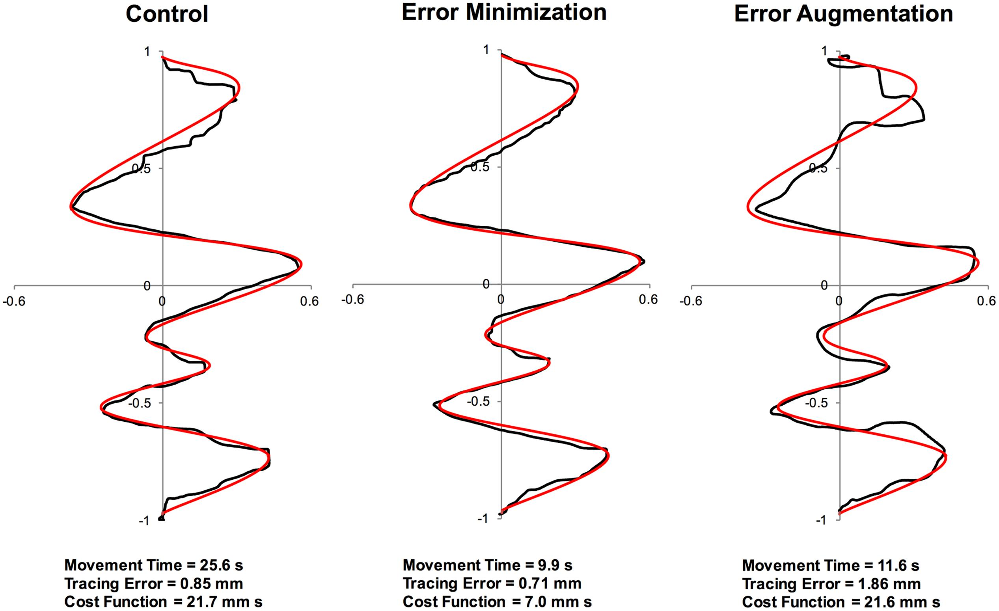
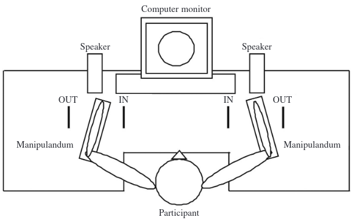
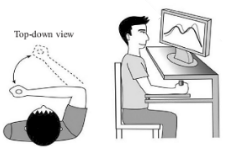
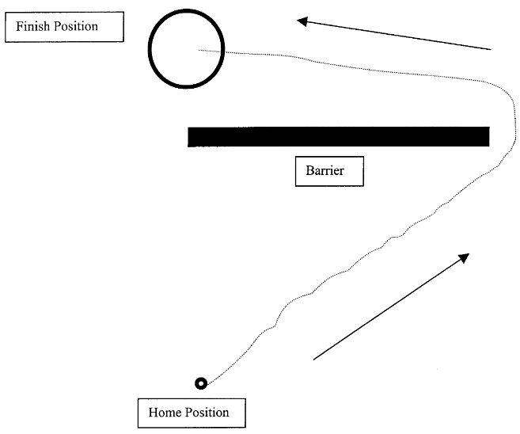
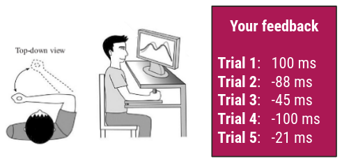

```{r setup, include=FALSE}
options(htmltools.dir.version = FALSE)
```

```{r libraries, echo=FALSE}
library(kableExtra)
library(tidyverse)
```

```{r xaringanExtra, echo=FALSE}
xaringanExtra::use_xaringan_extra(c("freezeframe", "tachyons"))
```

class: title-slide-section-gold, bottom

# Review from last lecture

---

background-image: url(imgs/feedback-flowchart.png)
background-size: contain

.footnote[Adapted from Magill and Anderson 2017]

---

## Augmented feedback: .grey[Similarities] and .grey[differences]

```{r echo = FALSE, results = "asis"}
kr_kp_table <- tibble::tibble(
  c1 = c("Verbal (or verbalizable)",
         "Augmented",
         "Provided after movement (usually)",
         "Information about goal outcome",
         "Often redundant with intrinsic feedback",
         "Usually provided as a score",
         "Often used in laboratory research"),
  c2 = c("Verbal (or verbalizable)",
         "Augmented",
         "Provided after movement (usually)",
         "Information about movement pattern",
         "Usually distinct from intrinsic feedback",
         "Usually kinematic information",
         "Often provided in everyday activities")
)

kbl(kr_kp_table,
    col.names = c("Knowledge of results",
                  "Knowledge of performance"),
    align = c("l", "l")) %>%
  kable_paper(c("hover", "condensed", "responsive"), html_font = "Roboto Condensed") %>% 
  row_spec(0, bold = TRUE, font_size = 35) %>% 
  pack_rows("Similarities", 1, 3) %>% 
  pack_rows("Differences", 4, 7)
```

---

## .grey[Paradoxical] properties of augmented feedback

<br>

.pull-left[
- Augmented feedback **can be essential** for motor learning

.black[BUT...]

- Augmented feedback **may not be essential** for motor learning

]

.pull-right[
- Augmented feedback **can enhance** motor learning

.black[BUT...]

- Augmented feedback **can hinder** motor learning
]

---

## The .grey[roles] of augmented feedback in motor learning

.footnote[<sup>1</sup>Salmoni et al 1984 (https://doi.org/10.1037/0033-2909.95.3.355); <sup>2</sup>McKay et al: https://youtu.be/i8nlc1xHKX4; <sup>3</sup>Wulf and Lewthwaite 2016 (https://doi.org/10.3758/s13423-015-0999-9)]

.pull-left[
.black[Informational role]
- **Guide** the learner to an appropriate movement solution 

- Facilitate **achievement** the action goal of the skill

- Emphasized in the **Guidance** hypothesis<sup>1</sup>
  - Feedback is both a **performance** and **learning** variable
  
  - Some recent concerns<sup>2</sup> about its accuracy, reliability, and validity
]

.pull-right[
.black[Motivational role]
- **Encourage** the learner to continue striving toward a goal through continued practice

- Secondary or a **by-product** of informational role

- Emphasized in the **"OPTIMAL"** theory<sup>3</sup>
  - Practice context can put learners into a **virtuous** or a **vicious** cycle
  
  - Concerns it was *"dead on arrival"* (e.g., many predictions not supported in the literature already)
]

---

class: inverse, middle, center

# Any questions?

---

background-image: url(imgs/factors-learning-feedback.png)
background-size: contain

---

# Learning objectives

1. Identify and describe scheduling techniques based on the **content** of the feedback.

2. Identify and describe scheduling techniques based on the **timing** of the feedback.

3. Identify and describe scheduling techniques based on the **frequency** of the feedback.

4. Identify and describe scheduling techniques that encourage specific **cognitive** processes.

--

.bg-gold.b--mid-gray.ba.bw2.br3.shadow-5.ph4.mt5[
.tc[
.black[Take-home message:

(Augmented) feedback plays a vital role in motor learning, but the effectiveness of a scheduling technique will depend on the task, individual, and environment. 
]]]

---

## Things to keep in mind when .grey[providing feedback]

.footnote[Source: https://i.redd.it/i9ef5seywxj21.jpg]

.left-column[
1. What type of feedback should I provide?

2. When should I give feedback?

3. How much feedback should I give?

4. What cognitive processes should be encouraged?
]

.right-column[.center[

]]

---

## Things to keep in mind when .grey[providing feedback]

.footnote[Source: https://i.redd.it/i9ef5seywxj21.jpg]

.left-column[
1. **What type of feedback should I provide?**

2. When should I give feedback?

3. How much feedback should I give?

4. What cognitive processes should be encouraged?
]

.right-column[.center[

]]

---

## What .grey[type] of feedback should I provide?

.footnote[Source: https://i.redd.it/i9ef5seywxj21.jpg]

.left-column[
- Prescriptive versus descriptive feedback

- Relatively *"good"* versus relatively *"poor"* trials

- Error minimization versus error augmentation
]

.right-column[.center[

]]

---

## .grey[Prescriptive] versus .grey[descriptive] feedback

.footnote[Source: https://golfbetter.ca/wp-content/uploads/2018/02/CIMG3955-1.jpg]

.pull-left[
.black[Prescriptive feedback]

.black[Example]: "You need to rotate your shoulders more to extend your follow through"

.black[Function]: Point out a **specific alteration** or **correction** for the action

.black[Application]: Most useful for **inexperienced** learners
]

.pull-right[

]

---

## .grey[Prescriptive] versus .grey[descriptive] feedback

.footnote[Source: https://golfbetter.ca/wp-content/uploads/2018/02/CIMG3955-1.jpg]

.pull-left[

]

.pull-right[
.black[Descriptive feedback]

.black[Example]: "You released your wrists too soon"

.black[Function]: Direct the learner's attention to a **specific aspect** that needs **correction** by **stating the error** made

.black[Application]: Most useful for **experienced** learners
]

---

## Relatively .grey["good"] versus relatively .grey["poor"] trials

.footnote[Approximate data of Chiviacowsky and Wulf 2007 (https://doi.org/10.1080/02701367.2007.10599402) through plot digitization]

.left-column[
.black[Task]: Underhand bean bag toss to a floor target while blindfolded

.black[Groups]:
- **KR good** - feedback reflected their 3 *best* trials in a 6 trial block

- **KR poor** - feedback reflected their 3 *worse* trials in a 6 trial block
]

--

```{r echo=FALSE}
chiviacowsky <- tibble::tibble(
    group = c(rep("KR poor", 11), rep("KR good", 11)),
    block = factor(rep(1:11, 2)),
    phase = c(rep("Acquisition", 10), "Retention", rep("Acquisition", 10), "Retention"),
    points = c(22.25, 22.88, 33.46, 43.04, 50.97, 52.93, 51.57, 56.18, 55.16, 62.75, 40.48, 28.55, 37.47, 43.08, 46.69, 57.93, 57.57, 53.89, 60.49, 55.82, 55.46, 55.73)
)
```

.right-column[
```{r echo=FALSE, fig.align='center', fig.width = 10, fig.height=6.25}
ggplot2::ggplot(chiviacowsky, aes(x = block, y = points, group = interaction(group, phase))) +
  geom_line(aes(linetype = group), size = 1) +
  geom_point(aes(color = group, shape = group, fill = group), size = 5) +
  scale_y_continuous(name = "Points (max score = 100)",
                     limits = c(0, 100),
                     breaks = seq(0, 100, 10)) +
  scale_x_discrete(name = "Blocks of 6 trials",
                   labels = c("1" = "B1",
                              "2" = "B2",
                              "3" = "B3",
                              "4" = "B4",
                              "5" = "B5",
                              "6" = "B6",
                              "7" = "B7",
                              "8" = "B8",
                              "9" = "B9",
                              "10" = "B10",
                              "11" = "24-hr")) +
  scale_color_manual(values = c("#ac1455", "#fdbf57")) +
  scale_fill_manual(values = c("#ac1455", "#fdbf57")) +
  scale_shape_manual(values = c(21, 24)) +
  scale_linetype_manual(values = c(1, 2)) +     
  theme(
    legend.text = element_text(size = 18),
    legend.title = element_blank(),
    legend.position = c(0.9, 0.15),
    axis.title = element_text(face = "bold", size = 20),
    axis.text = element_text(size = 18)
  )
```
]

---

## But .grey[awareness] of feedback type is .grey[more important] than whether it .grey[reflects] good or poor trials

.footnote[Adapted and approximate data of Patterson and Azizieh (https://doi.org/10.1016/j.humov.2012.04.004) through plot digitization]

.left-column[
.black[Task]: Targeted force production task

.black[Groups]:
- KR good+Unaware
- KR poor+Unaware
- **KR good+Aware**
- **KR poor+Aware**

.black[Aware groups]: Explicitly told their feedback reflected their 3 *best* or *worse* trials out of the 6
]

--

```{r echo=FALSE}
patterson <- tibble::tibble(
    group = c(rep("KR poor+Unaware", 4), rep("KR poor+Aware", 4), rep("KR good+Unaware", 4), rep("KR good+Aware", 4)),
    measure = c(rep("Absolute constant error", 2), rep("Variable error", 2), rep("Absolute constant error", 2), rep("Variable error", 2), rep("Absolute constant error", 2), rep("Variable error", 2), rep("Absolute constant error", 2), rep("Variable error", 2)),
    block = c("15-min", "24-hr", "15-min", "24-hr", "15-min", "24-hr", "15-min", "24-hr", "15-min", "24-hr", "15-min", "24-hr", "15-min", "24-hr", "15-min", "24-hr"),
    error = c(19.09, 24.55, 19.31, 17.44, 14.22, 17.73, 13.31, 12.75, 19.68, 25.13, 18.38, 20.06, 16.17, 19.29, 14.53, 15.28)
)
```

.right-column[
```{r echo=FALSE, fig.align='center', fig.width=10, fig.height = 5.75}
ggplot2::ggplot(patterson, aes(x = block, y = error, group = group)) +
  geom_line(aes(linetype = group), size = 1) +
  geom_point(aes(color = group, shape = group, fill = group), size = 4) +
  scale_y_continuous(name = "Error (cm)",
                     limits = c(0, 30),
                     breaks = seq(0, 30, 5)) +
  scale_x_discrete(name = NULL) +
  scale_color_manual(values = c("#ac1455", "#fdbf57", "#5e6a71", "#007096")) +
  scale_fill_manual(values = c("#ac1455", "#fdbf57", "#5e6a71", "#007096")) +
  scale_shape_manual(values = c(21, 22, 23, 24)) +
  scale_linetype_manual(values = c(1, 2, 3, 5)) +
  facet_grid(~measure) +
  theme(
    legend.text = element_text(size = 18),
    legend.title = element_blank(),
    legend.position = c(0.35, 0.2),
    axis.title = element_text(face = "bold", size = 20),
    axis.text = element_text(size = 18),
    strip.text.x = element_text(face = "bold", size = 20, color = "#FFFFFF"),
    strip.background = element_rect(color = "#272822", fill = "#7a003c", size = 2, linetype = "solid")
    )
```
]

---

## Error .grey[minimization] feedback leads to .grey[worse] retention and transfer than error .grey[augmentation]

.footnote[Williams et al 2016 (https://doi.org/10.3389/fpsyg.2016.02010)]

.left-column[
.black[Task]: Trace as fast and accurately as possible

.black[Groups]:
- **Error minimization** - cursor was pulled back to curve

- **Error augmentation** - cursor was pushed away from curve

- **Control** - normal cursor
]

.right-column[.center[

]]

---

## Error .grey[minimization] feedback leads to .grey[worse] retention and transfer than error .grey[augmentation]

.footnote[Williams et al 2016 (https://doi.org/10.3389/fpsyg.2016.02010)]

.left-column[
.black[Task]: Trace as fast and accurately as possible

.black[Groups]:
- **Error minimization** - cursor was pulled back to curve

- **Error augmentation** - cursor was pushed away from curve

- **Control** - normal cursor
]

```{r echo=FALSE}
williams <- tibble::tibble(
    group = c(rep("Control", 3), rep("Error minimization", 3), rep("Error augmentation", 3)),
    phase = c("10-min retention", "24-hr retention", "24-hr transfer", "10-min retention", "24-hr retention", "24-hr transfer", "10-min retention", "24-hr retention", "24-hr transfer"),
    error = c(0.84, 0.92, 0.97, 1.22, 1.27, 1.37, 0.75, 0.81, 0.87),
    ci_95 = c(0.18, 0.23, 0.23, 0.19, 0.23, 0.22, 0.20, 0.23, 0.22)
)
```

.right-column[
```{r echo=FALSE, fig.align='center', fig.width=10, fig.height=5.75}
ggplot2::ggplot(williams) +
  geom_bar(aes(x = group, y = error, fill = group), stat = "identity") +
  geom_errorbar(aes(x = group, ymin = error - ci_95, ymax = error + ci_95), width = 0.4, size = 1.3) +
  scale_y_continuous(name = "Tracing error (mm)",
                     limits = c(0, 1.6),
                     breaks = seq(0, 1.6, 0.2)) +
  scale_x_discrete(name = NULL,
                   breaks = NULL) +
  scale_fill_manual(values = c("#ac1455", "#fdbf57", "#5e6a71")) +
  facet_grid(~factor(phase, levels = c("10-min retention", "24-hr retention", "24-hr transfer")), scales = "free_x", space = "free_x") +
  theme(
    axis.title = element_text(face = "bold", size = 20),
    axis.text.y = element_text(size = 18),
    axis.text.x = element_blank(),
    legend.title = element_blank(),
    legend.position = "bottom",
    legend.text = element_text(size = 16),
    strip.text.x = element_text(face = "bold", size = 20, color = "#FFFFFF"),
    strip.background = element_rect(color = "#272822", fill = "#7a003c", size = 2, linetype = "solid")
  )
```
]

---

## Things to keep in mind when .grey[providing feedback]

.footnote[Source: https://i.redd.it/i9ef5seywxj21.jpg]

.left-column[
1. What type of feedback should I provide?

2. **When should I give feedback?**

3. How much feedback should I give?

4. What cognitive processes should be encouraged?
]

.right-column[.center[

]]

---

## When should I give feedback?

.footnote[Source: https://i.redd.it/i9ef5seywxj21.jpg]

.left-column[
- During versus after a trial
]

.right-column[.center[

]]

---

## Concurrent feedback can cause a .grey[dependence] and .grey[reduce retention] compared to terminal feedback

.footnote[Maslovat et al 2010 (https://doi.org/10.1080/00222895.2009.10125923)]

.left-column[
.black[Task]: 90 degree bimanual coordination

.black[Groups]:
- **Concurrent** saw Lissajous feedback throughout trial

- **Terminal** saw Lissajous feedback as a static image after trial
]

.right-column[.center[

]]

---

## Concurrent feedback can cause a .grey[dependence] and .grey[reduce retention] compared to terminal feedback

.footnote[Adapted and approximate data from Maslovat et al 2010 (https://doi.org/10.1080/00222895.2009.10125923) through plot digitization]

.left-column[
.black[Task]: 90 degree bimanual coordination

.black[Groups]:
- **Concurrent** saw Lissajous feedback throughout trial

- **Terminal** saw Lissajous feedback as a static image after trial
]

```{r echo=FALSE}
maslovat <- tibble::tibble(
    group = c(rep("Concurrent feedback", 15), rep("Terminal feedback", 15)),
    phase = c(rep("Acquisition 1", 6), rep("Acquisition 2", 6), rep("24-hr retention", 3), rep("Acquisition 1", 6), rep("Acquisition 2", 6), rep("24-hr retention", 3)),
    block = factor(rep(1:15, 2)), 
    error = c(17.35, 13.86, 13.07, 11.31, 10.72, 9.93, 10.85, 9.87, 8.88, 8.48, 7.69, 7.67, 9.87, 39.17, 29.89, 50.73, 41.64, 42.59, 45.08, 37.92, 40.79, 37.48, 37.46, 33.00, 27.19, 26.01, 24.84, 31.86, 17.37, 25.84)
)
```

.right-column[
```{r echo=FALSE, fig.align='center', fig.width=11, fig.height=6}
ggplot2::ggplot(maslovat, aes(x = block, y = error, group = group)) +
  geom_line(aes(linetype = group), size = 1) +
  geom_point(aes(color = group, shape = group, fill = group), size = 5) +
  scale_y_continuous(name = "Absolute error of relative phase (deg)",
                     limits = c(0, 60),
                     breaks = seq(0, 60, 10)) +
  scale_x_discrete(name = NULL,
                   labels = c("1" = "B1",
                              "2" = "B2",
                              "3" = "B3",
                              "4" = "B4",
                              "5" = "B5",
                              "6" = "B6",
                              "7" = "B7",
                              "8" = "B8",
                              "9" = "B9",
                              "10" = "B10",
                              "11" = "B11",
                              "12" = "B12",
                              "13" = "Same",
                              "14" = "Opposite",
                              "15" = "None")) +
  scale_color_manual(values = c("#ac1455", "#fdbf57")) +
  scale_fill_manual(values = c("#ac1455", "#fdbf57")) +
  scale_shape_manual(values = c(21, 24)) +
  scale_linetype_manual(values = c(1, 2)) +
  facet_grid(~factor(phase, levels = c("Acquisition 1", "Acquisition 2", "24-hr retention")), scales = "free_x", space = "free_x") +
  theme(
    legend.text = element_text(size = 18),
    legend.title = element_blank(),
    legend.position = c(0.63, 0.85),
    axis.title = element_text(face = "bold", size = 20),
    axis.text = element_text(size = 18),
    axis.text.x = element_text(angle = 90, vjust = 0.5),
    strip.text.x = element_text(face = "bold", size = 20, color = "#FFFFFF"),
    strip.background = element_rect(color = "#272822", fill = "#7a003c", size = 2, linetype = "solid")
  )
```
]

---

## Things to keep in mind when .grey[providing feedback]

.footnote[Source: https://i.redd.it/i9ef5seywxj21.jpg]

.left-column[
1. What type of feedback should I provide?

2. When should I give feedback?

3. **How much feedback should I give?**

4. What cognitive processes should be encouraged?
]

.right-column[.center[

]]

---

## How .grey[much] feedback should I give?

.footnote[Source: https://i.redd.it/i9ef5seywxj21.jpg]

.left-column[
- Higher versus lower frequencies

  - Fading techniques
  
  - Summary techniques
]

.right-column[.center[

]]

---

## Giving .grey[too much] feedback can .grey[reduce] retention

.footnote[Winstein and Schmidt 1990, Experiment 2 (https://doi.org/10.1037/0278-7393.16.4.677)]

.left-column[
.black[Task]: Waveform matching task

.black[Groups]:
- **100% feedback** or after every trial

- **50% feedback** through a tapered or faded schedule (high amount early but low amount late)
]

.right-column[.center[

]]

---

## Giving .grey[too much] feedback can .grey[reduce] retention

.footnote[Winstein and Schmidt 1990, Experiment 2 (https://doi.org/10.1037/0278-7393.16.4.677)]

.left-column[
.black[Task]: Waveform matching task

.black[Groups]:
- **100% feedback** or after every trial

- **50% feedback** through a tapered or faded schedule (high amount early but low amount late)
]

```{r echo=FALSE}
winstein <- tibble::tibble(
    group = c(rep("100% feedback", 18), rep("50% feedback", 18)),
    phase = c(rep("Acquisition", 16), rep("Retention", 2), rep("Acquisition", 16), rep("Retention", 2)),
    day = c(rep("Day 1", 8), rep("Day 2", 8), rep("Day 3", 2), rep("Day 1", 8), rep("Day 2", 8), rep("Day 3", 2)),
    block = factor(rep(1:18, 2)), 
    error = c(14.67, 11.61, 10.66, 10.21, 9.41, 9.56, 8.90, 8.72, 9.86, 8.81, 8.40, 8.10, 7.62, 8.16, 7.95, 7.15, 9.26, 12.12, 14.23, 11.40, 11.13, 9.59, 8.87, 9.65, 9.65, 9.05, 9.47, 7.95, 8.10, 7.80, 7.24, 7.33, 7.27, 7.86, 8.64, 10.00)
)
```

.right-column[
```{r echo=FALSE, fig.align='center', fig.width=12, fig.height=7}
ggplot2::ggplot(winstein, aes(x = block, y = error, group = interaction(group, day))) +
  geom_line(aes(linetype = group), size = 1) +
  geom_point(aes(color = group, shape = group, fill = group), size = 5) +
  scale_y_continuous(name = "Root mean square error (deg)",
                     limits = c(5, 15),
                     breaks = seq(5, 15, 1)) +
  scale_x_discrete(name = NULL,
                   labels = c("1" = "B1",
                              "2" = "B2",
                              "3" = "B3",
                              "4" = "B4",
                              "5" = "B5",
                              "6" = "B6",
                              "7" = "B7",
                              "8" = "B8",
                              "9" = "B9",
                              "10" = "B10",
                              "11" = "B11",
                              "12" = "B12",
                              "13" = "B13",
                              "14" = "B14",
                              "15" = "B15",
                              "16" = "B16",
                              "17" = "5-min",
                              "18" = "24-hr")) +
  scale_color_manual(values = c("#ac1455", "#fdbf57")) +
  scale_fill_manual(values = c("#ac1455", "#fdbf57")) +
  scale_shape_manual(values = c(21, 24)) +
  scale_linetype_manual(values = c(1, 2)) +
  facet_grid(~factor(phase, levels = c("Acquisition", "Retention")), scales = "free_x", space = "free_x") +
  theme(
    legend.text = element_text(size = 18),
    legend.title = element_blank(),
    legend.position = c(0.75, 0.9),
    axis.title = element_text(face = "bold", size = 20),
    axis.text = element_text(size = 18),
    axis.text.x = element_text(angle = 45, vjust = 0.6),
    strip.text.x = element_text(face = "bold", size = 20, color = "#FFFFFF"),
    strip.background = element_rect(color = "#272822", fill = "#7a003c", size = 2, linetype = "solid")
  )
```
]

---

## But need to consider the .grey[who] you are working with

.footnote[Guadagnoli et al. 2002 (https://doi.org/10.1016/S1353-8020(02)00007-X)]

.left-column[
.black[Task]: Reaching task with a 65% movement time goal of personal maximum speed

.black[Population]: Healthy **older** adults and **Parkinson's** disease patients

.black[Feedback]:
- **100% feedback** or after every trial

- **20% feedback** or after every 5th trial
]

.right-column[.center[

]]

---

## But need to consider the .grey[who] you are working with

.footnote[Approximate data from Guadagnoli et al. 2002 (https://doi.org/10.1016/S1353-8020(02)00007-X) through plot digitization]

.left-column[
.black[Task]: Reaching task with a 65% movement time goal of personal maximum speed

.black[Population]: Healthy **older** adults and **Parkinson's** disease patients

.black[Feedback]:
- **100% feedback** or after every trial

- **20% feedback** or after every 5th trial
]

```{r echo=FALSE}
guadagnoli_pd <- tibble::tibble(
    feedback = c(rep("20% feedback", 2), rep("100% feedback", 2)),
    pop = c("Healthy", "Parkinson's", "Healthy", "Parkinson's"),
    error = c(72.05, 170.19, 124.22, 104.35),
    sd = c(17.39, 19.87, 26.09, 22.36)
)
```

.right-column[
```{r echo=FALSE, fig.align='center', fig.width=10, fig.height=6.5}
ggplot2::ggplot(guadagnoli_pd) +
  geom_bar(aes(x = pop, y = error, fill = pop), stat = "identity") +
  geom_errorbar(aes(x = pop, ymin = error - sd, ymax = error + sd), width = 0.4, size = 1.3) +
  scale_y_continuous(name = "Absolute error (ms) in 24-hr retention",
                     limits = c(0, 200),
                     breaks = seq(0, 200, 25)) +
  scale_x_discrete(name = NULL,
                   breaks = NULL) +
  scale_fill_manual(values = c("#ac1455", "#fdbf57")) +
  facet_grid(~factor(feedback, levels = c("20% feedback", "100% feedback")), scales = "free_x", space = "free_x") +
  theme(
    axis.title = element_text(face = "bold", size = 20),
    axis.text.y = element_text(size = 18),
    axis.text.x = element_blank(),
    legend.title = element_blank(),
    legend.position = c(0.88, 0.9),
    legend.text = element_text(size = 16),
    strip.text.x = element_text(face = "bold", size = 20, color = "#FFFFFF"),
    strip.background = element_rect(color = "#272822", fill = "#7a003c", size = 2, linetype = "solid")
  )
```
]

---

## Providing feedback with a .grey[summary] display can .grey[prevent] becoming .grey[dependent] on feedback

.footnote[Schmidt et al 1989 (https://doi.org/10.1037/0278-7393.15.2.352)]

.left-column[
.black[Task]: Waveform matching

.black[Groups]:
- Summary **1**
- Summary **5**
- Summary **10**
- Summary **15**

.black[Protocol]: Feedback is given for all trials in the summary length
]

.right-column[
.center[
<br>

]]

---

## Providing feedback with a .grey[summary] display can .grey[prevent] becoming .grey[dependent] on feedback

.footnote[Adapted and approximate data from Schmidt et al 1989 (https://doi.org/10.1037/0278-7393.15.2.352) through plot digitization]

.left-column[
.black[Task]: Waveform matching

.black[Groups]:
- Summary **1**
- Summary **5**
- Summary **10**
- Summary **15**

.black[Protocol]: Feedback is given for all trials in the summary length
]

```{r echo=FALSE}
schmidt_simple <- tibble::tibble(
    group = c(rep("Summary 1", 7), rep("Summary 5", 7), rep("Summary 10", 7), rep("Summary 15", 7)),
    phase = c(rep("Acquisition", 6), "Retention", rep("Acquisition", 6), "Retention", rep("Acquisition", 6), "Retention", rep("Acquisition", 6), "Retention"),
    block = factor(rep(1:7, 4)), 
    error = c(54.39, 18.80, 13.53, 17.80, 13.95, 12.02, 49.86, 77.06, 31.21, 25.70, 17.56, 20.40, 17.03, 42.46, 83.51, 46.97, 38.59, 24.00, 29.23, 26.57, 28.85, 91.38, 44.10, 41.45, 35.22, 32.09, 21.80, 23.60)
)
```

.right-column[
```{r echo=FALSE, fig.align='center', fig.width=11, fig.height=6}
ggplot2::ggplot(schmidt_simple, aes(x = block, y = error, group = interaction(group, phase))) +
  geom_line(size = 1) +
  geom_point(aes(color = group, shape = group, fill = group), size = 5) +
  scale_y_continuous(name = "Absolute constant error (ms)",
                     limits = c(0, 100),
                     breaks = seq(0, 100, 20)) +
  scale_x_discrete(name = NULL,
                   labels = c("1" = "B1",
                              "2" = "B2",
                              "3" = "B3",
                              "4" = "B4",
                              "5" = "B5",
                              "6" = "B6",
                              "7" = "24-hr")) +
  scale_color_manual(values = c("#ac1455", "#fdbf57", "#5e6a71", "#007096")) +
  scale_fill_manual(values = c("#ac1455", "#fdbf57", "#5e6a71", "#007096")) +
  scale_shape_manual(values = c(21, 22, 23, 24)) +
  #scale_linetype_manual(values = c(1, 2)) +
  theme(
    legend.text = element_text(size = 18),
    legend.title = element_blank(),
    legend.position = c(0.88, 0.85),
    axis.title = element_text(face = "bold", size = 20),
    axis.text = element_text(size = 18)
  )
```
]

---

## But need to consider the .grey[complexity] of the task

.footnote[Adapted and approximate data from Schmidt et al 1990, Experiment 1 (https://doi.org/10.1016/0167-9457(90)90007-Z) through plot digitization]

.left-column[
.black[Task]: Simulated baseball batting task

.black[Groups]:
- Summary **1**
- Summary **5**
- Summary **10**
- Summary **15**

.black[Protocol]: Feedback is given for all trials in the summary length
]

```{r echo=FALSE}
schmidt_complex <- tibble::tibble(
    group = c(rep("Summary 1", 2), rep("Summary 5", 2), rep("Summary 10", 2), rep("Summary 15", 2)),
    block = factor(rep(1:2, 4)), 
    score = c(233.71, 223.08, 245.30, 300.38, 189.28, 187.33, 147.72, 148.69)
)
```

.right-column[
```{r echo=FALSE, fig.align='center', fig.width=11, fig.height=6}
ggplot2::ggplot(schmidt_complex, aes(x = block, y = score, group = group)) +
  geom_line(size = 1) +
  geom_point(aes(color = group, shape = group, fill = group), size = 5) +
  scale_y_continuous(name = "Points",
                     limits = c(100, 350),
                     breaks = seq(100, 350, 50)) +
  scale_x_discrete(name = NULL,
                   labels = c("1" = "10-min retention",
                              "2" = "48-hr retention")) +
  scale_color_manual(values = c("#ac1455", "#fdbf57", "#5e6a71", "#007096")) +
  scale_fill_manual(values = c("#ac1455", "#fdbf57", "#5e6a71", "#007096")) +
  scale_shape_manual(values = c(21, 22, 23, 24)) +
  #scale_linetype_manual(values = c(1, 2)) +
  theme(
    legend.text = element_text(size = 18),
    legend.title = element_blank(),
    legend.position = c(0.88, 0.85),
    axis.title = element_text(face = "bold", size = 20),
    axis.text = element_text(size = 18)
  )
```
]

---

## Things to keep in mind when .grey[providing feedback]

.footnote[Source: https://i.redd.it/i9ef5seywxj21.jpg]

.left-column[
1. What type of feedback should I provide?

2. When should I give feedback?

3. How much feedback should I give?

4. **What cognitive processes should be encouraged?**
]

.right-column[.center[

]]

---

## What .grey[cognitive processes] should be encouraged?

.footnote[Source: https://i.redd.it/i9ef5seywxj21.jpg]

.left-column[
- Error estimation
]

.right-column[.center[

]]

---

## .grey[Error estimation] during practice with different relative feedback frequencies

.footnote[Adapted and approximate data from Guadagnoli and Kohl 2001 (https://doi.org/10.1080/00222890109603152) through plot digitization]

.left-column[
.black[Task:] Strike a padded with a exact amount of force (19.5 N)

.black[Feedback]: **100%** or **20%** of trials

.black[Error estimation]: **100%** or **20%** of trials

This resulted in **four** experimental groups
]

```{r echo=FALSE}
guadagnoli_ee <- tibble::tibble(
    feedback = c(rep("100% feedback", 2), rep("20% feedback", 2)),
    estimation = c("Estimation", "No estimation", "Estimation", "No estimation"),
    error = c(240.23, 353.12, 290.81, 285.95)
)
```

.right-column[
```{r echo=FALSE, fig.align='center', fig.width=10, fig.height=5.75}
ggplot2::ggplot(guadagnoli_ee, aes(x = estimation, y = error, fill = estimation)) +
  geom_bar(stat = "identity") +
  scale_y_continuous(name = "RMSE in 24-hr retention",
                     limits = c(0, 400),
                     breaks = seq(0, 400, 50)) +
  scale_x_discrete(name = NULL,
                   breaks = NULL) +
  scale_fill_manual(values = c("#ac1455", "#fdbf57")) +
  facet_grid(~factor(feedback, levels = c("20% feedback", "100% feedback")), scales = "free_x", space = "free_x") +
  theme(
    axis.title = element_text(face = "bold", size = 20),
    axis.text.y = element_text(size = 18),
    axis.text.x = element_blank(),
    legend.title = element_blank(),
    legend.position = c(0.36, 0.9),
    legend.text = element_text(size = 16),
    strip.text.x = element_text(face = "bold", size = 20, color = "#FFFFFF"),
    strip.background = element_rect(color = "#272822", fill = "#7a003c", size = 2, linetype = "solid")
  )
```
]

---

# Learning objectives

1. Identify and describe scheduling techniques based on the **content** of the feedback.

2. Identify and describe scheduling techniques based on the **timing** of the feedback.

3. Identify and describe scheduling techniques based on the **frequency** of the feedback.

4. Identify and describe scheduling techniques that encourage specific **cognitive** processes.

.bg-gold.b--mid-gray.ba.bw2.br3.shadow-5.ph4.mt5[
.tc[
.black[Take-home message:

(Augmented) feedback plays a vital role in motor learning, but the effectiveness of a scheduling technique will depend on the task, individual, and environment. 
]]]

---

class: title-slide-final, middle
background-image: url(https://raw.githubusercontent.com/cartermaclab/mackin-xaringan/main/imgs/logos/mcmaster-stack-color.png)
background-size: 95px
background-position: 9% 15%

# What questions do you have?

<br><br><br>

|                                                                                                                |                                   |
| :------------------------------------------------------------------------------------------------------------- | :-------------------------------- |
| <a href="mailto:michaelcarter@mcmaster.ca">.mackinred[<i class="fa fa-paper-plane fa-fw"></i>]                         | michaelcarter@mcmaster.ca                 |
| <a href="https://cartermaclab.org">.mackinred[<i class="fa fa-link fa-fw"></i>]                                       | cartermaclab.org                        |
| <a href="https://twitter.com/cartermaclab">.mackinred[<i class="fa fa-twitter fa-fw"></i>]                          | @cartermaclab                         |
| <a href="https://github.com/cartermaclab">.mackinred[<i class="fa fa-github fa-fw"></i>]                              | @cartermaclab                           |

